1. What are the strongest state-of-the-art research findings on static signals that correlate with long-term maintainability, modularity, and changeability in source code, especially
     across multiple programming languages? Focus on metrics or models that outperform simple size and complexity measures, and note which signals are empirically validated versus mostly
     theoretical or anecdotal.
  2. What architectural or code-structure properties best distinguish high-quality human-engineered code from low-quality AI-generated “spaghetti” code? Look for research, benchmarks, or
     industrial studies on modularity, cohesion, boundary clarity, dependency shape, reviewability, and editability, especially any work connecting these traits to downstream defect rates or
     refactor cost.
  3. What novel composite software metrics have been proposed in research that combine multiple lower-level signals into a higher-order architectural quality score? Identify formulas,
     validation methods, and whether they predict things like defect proneness, change failure, review difficulty, or maintainability better than traditional metrics such as cyclomatic
     complexity, coupling, or cohesion alone.
  4. What is the best current research on dependency graph quality in software systems, including acyclicity, layering, fan-in/fan-out asymmetry, hub structure, and topological distance?
     Focus on methods that quantify architectural degradation or “spaghetti pressure,” especially if they provide interpretable formulas or thresholds that could be adapted into a codebase-
     level locality or architecture KPI.
  5. What language-agnostic semantic abstractions have been studied for analyzing code across Rust, TypeScript, JavaScript, Python, Go, C++, and Swift? Look for research on unified ASTs,
     intermediate representations, semantic concept extraction, or cross-language program analysis that could support portable rules about loops, mutation, boundaries, state, concurrency,
     and dependency structure.
  6. What static analysis signals are most defensible as high-confidence indicators of professional code quality rather than merely style preference? Focus on research separating objective
     defect/risk indicators from maintainability or governance signals, and explain how serious tools calibrate severity so that “all green” means something credible without overclaiming
     security or correctness.
  7. What does the research literature say about code reviewability: which measurable code properties make code easier for experienced engineers to review accurately and quickly? Search for
     empirical work on file size, function size, locality, naming clarity, hidden state, control-flow complexity, dependency shape, and documentation signals, especially anything that could
     be operationalized as a review-readiness score.
  8. What are the best validated static indicators of security risk that do not require claiming formal security guarantees? Focus on research or industry practice around high-signal pattern
     detection, secure-by-design structure, reviewability, boundary clarity, unsafe state management, and misuse of dangerous APIs, especially signals that are realistic to apply
     consistently across several programming languages.
  9. What software metrics or structural signals correlate with ease of automated transformation or safe large-scale refactoring? Investigate research on edit distance, change coupling,
     dependency locality, semantic cohesion, and module boundaries, especially any studies relevant to AI-assisted editing where the question is not only “does it work” but “can it be safely
     rewritten, audited, and evolved?”
  10. What are the strongest empirical studies on the relationship between module size, file size, or token count and software quality outcomes such as defects, maintainability,
     comprehension cost, or change failure? The goal is to determine whether “small files encourage better architecture” has rigorous support, under what conditions it holds, and how it
     should be framed without becoming dogmatic.
  11. What methods exist for validating a new proprietary software architecture metric so that it is scientifically credible rather than arbitrary? Look for best practices in metric design,
     construct validity, benchmark selection, statistical testing, discriminative power, reproducibility, and interpretability, especially for metrics intended to distinguish clean modular
     systems from architecture drift or AI-generated low-quality code.
  12. What benchmark datasets, famous repositories, or comparative evaluation methods are best suited for testing whether a new static architecture-governance tool is useful and trustworthy?
     Focus on how researchers and advanced tool builders measure false positives, precision by rule category, language portability, and whether findings on respected repositories are seen as
     insightful rather than dogmatic or embarrassing.

  
  
  # Static Signals that Predict Long-Term Maintainability, Modularity, and Changeability in Source Code
  
  ## Executive summary
  
  This report synthesizes the strongest empirical evidence (emphasis on 2016–2026, with foundational older work where necessary) on **static, code-level signals** that correlate with or predict **long-term maintainability, modularity, and changeability** (often operationalized via *change-proneness* and *fault-proneness*). The research record is uneven: many “classic” metrics show **inconsistent** results once **project context and size confounding** are handled, while a smaller set of higher-level structural and learned signals repeatedly shows **stronger, practically useful** associations. citeturn20view0turn8search21turn28view2turn29view0
  
  The most consistently strong families of static signals are:
  
  **Smell- and debt-like structural signals (code/design/architecture smells).** Large-scale studies with manual validation show that *smelly* artifacts are substantially more change-prone and fault-prone than non-smelly ones, with **large effect sizes** (e.g., Cliff’s delta frequently in the **0.5–0.9 range** depending on comparisons) and strong odds ratios even when explicitly modeling size as a potential confounder. citeturn15view0turn16view1turn16view3
  
  **Cross-language “naturalness” / entropy signals from language models.** Buggy code tends to be **more “unnatural” (higher entropy)** than fixed code; entropy-based ranking at line level achieves **large cost-effectiveness gains over random inspection**, is **comparable to classic static bug finders** (e.g., PMD/FindBugs), and can **improve the prioritization** of static analyzer warnings when combined with them. Although most bug-focused evaluations are in Java, the underlying “code is predictable” phenomenon generalizes across several languages. citeturn28view0turn30view0turn30view2turn26view3
  
  **Human-judgment–grounded maintainability prediction models.** On one of the most rigorous maintainability benchmarks (expert-labeled Java files/classes), learned models can reach **AUC ≈ 0.97**; however, a simple **Lines-of-Code (LoC) baseline nearly matches** top ML (AUC ≈ 0.95). This suggests (i) file size is very salient to human maintainability judgments; (ii) “beyond size” models must be evaluated on **harder, more fine-grained** tasks and across more languages. At the same time, some industry tool scores (notably “technical debt ratio” style measures) can perform **dramatically worse** than both ML and simple baselines. citeturn22view2turn23view3turn20view0
  
  **Hybrid semantic + metric models for defect prediction.** In defect prediction (often used as a maintainability proxy), combining **semantic features from ASTs** with **traditional static metrics** can outperform either alone. One recent hybrid CNN–MLP approach reports average **F1 ≈ 0.703** and **AUC ≈ 0.616** across multiple Java versions from PROMISE-style datasets, improving over several deep and non-deep baselines evaluated in the paper. citeturn31view0turn32view1turn32view2
  
  Cross-language conclusions are constrained by evidence gaps:
  
  **The strongest validations remain heavily Java-centric.** Multi-language evidence exists for (a) language-model “naturalness” phenomena across multiple languages, and (b) smell-like signals in multi-language systems (e.g., Java–C JNI). But large, human-labeled maintainability benchmarks and most smell-impact datasets are still mono-language (typically Java). citeturn26view3turn17view0turn22view2turn20view0
  
  **Metric comparability across languages/tools is a major practical risk.** Even for “standard” metrics (Halstead, cyclomatic complexity, Maintainability Index), tool implementations and language-specific parsing decisions can yield **substantial inconsistencies**, undermining cross-language thresholds and benchmarking unless measurement is standardized and audited. citeturn24view0turn28view2
  
  ## Defining the target qualities and how studies validate them
  
  A core challenge is that “maintainability” is **multi-dimensional** and difficult to label directly. The ISO quality model treats maintainability as comprising sub-characteristics such as **modularity, reusability, analyzability, modifiability, and testability**; multiple recent empirical works argue that research should evaluate these sub-dimensions explicitly rather than relying on a single proxy. citeturn29view0turn4search12turn20view0
  
  In practice, empirical studies connect static signals to long-term maintainability via several **proxies**:
  
  **Change-proneness (changeability/modifiability proxy).** Typical operationalizations include “changed vs not changed in the next release” or “number of changes over time” at file/class/package granularity. Large smell studies explicitly measure and compare change frequency/magnitude across releases for smelly vs non-smelly artifacts. citeturn15view0turn16view1
  
  **Fault-proneness (maintainability and stability proxy).** Many works use bug-inducing commits, bug-fix commits, or issue labels to mark artifacts as defective, then evaluate whether static features predict defects. Smell studies and multi-language smell studies often use repositories plus SZZ-style approaches to align defects with code history. citeturn15view0turn17view0
  
  **Maintenance effort (direct-but-hard proxy).** Some studies attempt to approximate effort via mined repository history (e.g., volume of changes) or via expert judgment datasets. A recent study re-evaluating common inter-class static metrics finds that correlations with observed maintenance effort can be **project-dependent and inconsistent**, warning against assuming universal relationships. citeturn2search12turn28view2
  
  Evaluation methods vary widely (and materially affect conclusions): correlation analyses (often Spearman’s ρ), logistic regression (with odds ratios), rank-based tests with effect sizes (Cliff’s delta), and predictive modeling metrics such as AUC/F1. Multiple recent methodological critiques show that even small choices—e.g., *how* you measure evolving size—can flip results, implying that replication and time-aware validation are essential for “strong” claims. citeturn28view2turn2search12turn15view0
  
  ## Static metrics and features with strongest empirical links
  
  The request asks for signals “beyond size and cyclomatic complexity.” The strongest evidence clusters around signals that approximate *structural debt*, *architecture/design degradation*, or *statistical unusualness*, rather than purely local control-flow complexity.
  
  The table below summarizes the most empirically supported static signals with concrete effect sizes where available.
  
  | Metric / signal | Type | Adds beyond size/complexity baseline? | Effect size / predictive performance (as reported) | Languages studied | Datasets / systems | Key citation |
  |---|---|---:|---|---|---|---|
  | Code smell presence (any smell) | smell/anti-pattern indicator | Often **yes**, but size interacts | Smelly vs non-smelly change-proneness shows **large** effect sizes (e.g., Cliff’s δ ≈ **0.68** in an illustrative comparison); logistic model reports smell presence OR ≈ **4.46** for change-proneness with size+interaction modeled | Java | 30 OSS projects, 395 releases; 17,350 manually validated smell instances | citeturn15view0turn16view1turn16view3 |
  | Number of smells / smell co-occurrence | smell density / accumulation | **yes** (predicts gradations) | Change-proneness comparisons show Cliff’s δ rising from **0.53** to **0.89** as smell count increases; fault-proneness deltas also large in many pairwise comparisons | Java | Same large-scale smell dataset as above | citeturn16view1turn15view0 |
  | Smell types dominated by long/complex code (e.g., “Complex Class”) | smell subtype | Sometimes redundant with size; still useful for prioritization | Highly diffused smell families associated with higher change/fault-proneness; study emphasizes quantifying magnitude and manual validation | Java | Same large-scale smell dataset | citeturn15view0turn16view1 |
  | Multi-language design smells in JNI code | cross-language smell indicator | **often yes** (beyond LOC/bug history controls in models) | Odds ratios for “smelly JNI files are bug-inducing” are **often > 2**, and in one system consistently **> 13**; some smell types have significant positive log-odds in combined models | Java + C/C++ (JNI) | 8 JNI systems across releases; smell rules applied via srcML pipeline | citeturn17view0turn17view1turn6view3 |
  | Architectural smells (e.g., cycles, dense structure) | architecture-level structural issues | Mixed; often confounded by project size | Project-level correlations between smells and modularity/testability can be mixed; many package-level relations statistically insignificant; size often correlates more strongly with smells and with modularity/testability than smells do | Java | 8 OSS projects across versions; architectural smell toolchain; modularity via DL/PC metrics | citeturn29view0turn8search21 |
  | Modularity metrics: Propagation Cost (PC), Decoupling Level (DL) | dependency-graph modularity metrics | Not “predictors” so much as *targets* | Used to quantify modularity at project level; enables empirical testing of smell–modularity links | Java | Same architectural-smell study setup | citeturn29view0turn8search21 |
  | Code “naturalness” / entropy (per-token or per-line cross-entropy) | language-model anomaly score | **yes** (complements static bug finders) | For small bug-fix thresholds, AUCEC gains over random can exceed **100%** (e.g., AUCEC5 gain ≈ **122.7%** at threshold 2 under full credit); comparable to PMD/FindBugs; entropy can improve warning ordering | Java (bug corpus); multi-language regularity holds | 7,139 bug-fix commits from 10 Java projects; millions of lines/tokens | citeturn28view0turn30view0turn30view2 |
  | Cross-tool metric inconsistency (measurement risk signal) | meta-signal about instrumentation | N/A (caveat) | Cross-tool comparisons show “absolute inconsistency” in metric values across tools and across languages even for standard metrics; implies thresholds and cross-language comparisons can be invalid without auditing | Java + C | RosettaCode and SumProd multilingual snippets; multiple commercial/OSS tools | citeturn24view0 |
  
  Interpretation highlights:
  
  **Smells show large, repeatable effects—especially on change-proneness.** A particularly strong large-scale investigation uses **395 releases of 30 open-source systems** and **17,350 manually validated smell instances**, finding that smelly classes have much higher change-proneness (median nearly triple in one reported comparison) and quantifying large Cliff’s delta effects; importantly, it explicitly investigates confounding with size via logistic models and interaction terms. citeturn15view0turn16view1turn16view3
  
  **Entropy/naturalness is one of the most compelling language-agnostic static signals, despite Java-heavy evaluation.** In a large corpus of **7,139 bug-fix commits across 10 Java projects**, entropy-based ranking delivers substantial cost-effectiveness gains for finding buggy lines, performs comparably to well-known static bug finders, and improves performance further when used to re-order static warnings. citeturn28view0turn30view0turn30view2
  
  **Architectural smells matter, but evidence is more mixed and confounding is central.** A recent study targeting maintainability sub-characteristics operationalizes modularity with dependency-graph measures and testability via coverage comparisons, finding that (i) relationships between smells and modularity/testability vary across projects; (ii) package-level effects are often weak/insignificant; and (iii) project size is frequently a stronger correlate—consistent with the broader “size confounding” theme in metrics research. citeturn29view0turn28view2turn9search5
  
  ## Learned models that outperform size/complexity baselines
  
  Learned models appear in three main styles in the evidence base relevant to maintainability/changeability:
  
  **Supervised ML on static metrics (maintainability prediction under human labels).** A rigorous maintainability dataset was built via surveys of **70 professionals** over code from **9 Java projects (≈1.4M SLOC)**, yielding expert-consensus labels for **>500 Java classes**, plus evidence that experts care about aspects like commented-out code, hard-coded values, and comment quality (signals not well captured by classic complexity metrics). citeturn20view0
  
  On that benchmark, later work comparing industrial metrics and ML finds:
  
  - **State-of-the-art ML** (AdaBoost ensemble on static metrics) reaches **AUC ≈ 0.97**.  
  - A simple **LoC baseline** reaches **AUC ≈ 0.95**, extremely close to the ML result.  
  - An aggregated smell metric (“Code Health”) is also near **AUC ≈ 0.95**.  
  - Some tool scores (notably a “technical debt ratio” measure) can be near-chance/weak (**AUC ≈ 0.60**), producing many false positives. citeturn22view2turn20view0
  
  **Replication evidence:** A replication/extension study reproduces strong performance for learned models on the same benchmark family and shows that size-only rules can be surprisingly effective for coarse tasks, but **size alone is insufficient for finer-grained prediction problems** (ordinal or continuous maintainability). citeturn23view3turn22view1
  
  **Language models as learned static signals (naturalness bug finding).** N-gram language models (and later neural LMs) can be used as static “anomaly detectors” on code: higher entropy implies surprise, which correlates with bug-likelihood and can prioritize inspection. In the large bug-fix corpus study, AUCEC gains over random exceed 100% for small bug-fix thresholds and entropy-based inspection is comparable to PMD/FindBugs, while combining entropy with static warning ranking can yield the best mean performance. citeturn30view0turn30view2turn28view0
  
  **Hybrid deep learning combining semantic + traditional metrics (defect prediction).** A representative recent model fuses semantic features from ASTs (Word2vec embeddings consumed by a CNN) with traditional PROMISE metrics consumed by an MLP, reporting that the hybrid outperforms multiple baselines:
  
  - Average **F1 = 0.703** (hybrid) vs **0.668** (ACGDP) and **0.662** (SDP-BB) across evaluated tasks.  
  - Average **AUC = 0.616** (hybrid) vs **0.587** (SDP-BB) and **0.586** (ACGDP). citeturn32view1turn32view2turn31view0
  
  ### Comparison table of learned models and their empirical performance
  
  | Model / approach | Type | Outperforms size/complexity baseline? | Effect size / predictive performance | Languages | Datasets | Key citation |
  |---|---|---:|---|---|---|---|
  | AdaBoost maintainability predictor (“SotA ML” on MainData) | supervised ML on static metrics | Slightly (LoC close) | AUC ≈ **0.97** for binary maintainability prediction | Java | Human-labeled maintainability benchmark (“MainData”) derived from expert assessments | citeturn22view2turn20view0 |
  | LoC baseline (rule-based thresholding) | simple baseline | N/A baseline | AUC ≈ **0.95**; shows size is a dominant signal in this benchmark | Java | Same as above | citeturn22view2turn22view1 |
  | “Code Health” aggregated smell score | algorithmic model aggregating static smells | Comparable to ML | AUC ≈ **0.95**; F1 reported high under tool defaults | Java | Same benchmark | citeturn22view2turn19search4 |
  | Maintainability Index (as implemented in tooling) | composite metric (code metrics polynomial/aggregation) | Mixed | AUC ≈ **0.89** in benchmark comparison | Java | Same benchmark | citeturn22view2turn24view0 |
  | Technical Debt Ratio style score | composite debt ratio | Often **worse** | AUC ≈ **0.60** (notably weak; many false positives) | Java | Same benchmark | citeturn22view2 |
  | Naturalness Bug Finder (NBF: n-gram entropy) | learned language model (static) | **Yes** vs random; comparable to bug finders | AUCEC gains over random > **100%** for small bug-fix thresholds; comparable to PMD/FindBugs; best mean performance when combined (PMD_Mix) | Java (bug tasks) | 7,139 bug-fix commits from 10 projects; snapshot-based evaluation | citeturn30view0turn30view2turn28view0 |
  | CNN–MLP semantic+traditional fusion for defect prediction | hybrid deep learning | **Yes** vs multiple baselines | Avg F1 **0.703**, avg AUC **0.616** (beats several compared models) | Java | PROMISE-style project versions (multiple tasks/versions) | citeturn32view1turn32view2turn31view0 |
  | Multi-language smell logistic models (JNI smells) | statistical model on smell counts + controls | Often **yes** | Odds ratios often > **2** (sometimes > **13**); certain smell types significant in combined logistic models | Java + C/C++ | 8 JNI systems across releases | citeturn17view0turn17view1turn6view3 |
  
  ## Cross-language vs language-specific signals
  
  A practical way to categorize “static signals” for multi-language tooling is by *what they require from the language front-end*.
  
  **Most portable (conceptually language-agnostic) signals:**
  
  **Entropy / naturalness / surprisal.** Once code can be tokenized consistently, n-gram or neural language models provide a language-agnostic anomaly score. The key bug-focused empirical evidence is Java-heavy, but foundational work on code “naturalness” replicates the predictability phenomenon across multiple languages (Java plus C#, C, JavaScript, Python, Ruby, Scala) and shows that entropy values differ among languages, warning that thresholds must be calibrated per language/corpus. citeturn30view0turn26view3
  
  **Smell-like structural patterns defined over dependency graphs.** Architectural smells (cycles, hub-like structures, dense structure) are largely language-agnostic *in principle* (they’re graph properties), but in practice they depend on reliable extraction of dependencies and modules. Empirical evidence suggests size is often a strong confounder and that correlations may not be universal across projects. citeturn29view0turn28view2
  
  **Duplicate code / clone structure and repetition.** Clone ratios and repetition can be computed at token/AST levels across languages, but robust cross-language “maintainability impact” estimates remain sparse relative to smells and entropy, and require careful tooling. citeturn24view0turn28view3
  
  **Often language-specific (or paradigm-specific) signals:**
  
  **OO design metrics (CK-family coupling/cohesion/inheritance).** These require a clear mapping of constructs such as “class,” “method,” “inheritance,” and can be hard to interpret across languages with different object models (or in non-OO languages). Meta-analytic summaries and multiple studies highlight that inheritance metrics tend to be weak predictors of change-proneness relative to size and some coupling/cohesion metrics, and that class size can substantially confound associations. citeturn12search7turn9search5turn29view0
  
  **Multi-language design smells (e.g., JNI).** These are inherently language-pair specific (Java–C/C++ binding boundary), though the broader idea—“boundary-layer design smells predict defects”—may generalize to other FFI systems. citeturn17view0turn17view1
  
  **Cross-tool/measurement variance as a cross-language blocker.** Even if a metric is “standard,” implementations differ. Cross-language studies show that tool outputs can be inconsistent enough to invalidate comparisons unless tools follow definitions precisely and are tested against reference implementations. citeturn24view0turn28view2
  
  ```mermaid
  flowchart TD
    A[1976–1994: Classic complexity & design metrics\nCyclomatic, Halstead, OO metrics] --> B[1999–2010: Smells & higher-level maintainability constructs\nCode smells, readability metrics]
    B --> C[2011–2015: Benchmarks & aggregate quality models\nProbabilistic/benchmarking models, large mined datasets]
    C --> D[2016: Naturalness/entropy as static anomaly signal\nBuggy code less natural; entropy helps prioritize inspection]
    D --> E[2017–2020: Large-scale smell impact + human-labeled maintainability datasets\nManual smell validation; expert-consensus labels]
    E --> F[2021–2024: Benchmarking ML vs industry tools + semantic feature learning\nAUC comparisons; AST/graph-based deep models]
    F --> G[2025–2026: Architectural smells tied to maintainability subcharacteristics\nModularity/testability with explicit measures; renewed focus on confounding]
  ```
  
  ## Practical guidance and measurement caveats for tool builders and researchers
  
  Tool builders and researchers typically want **actionable prioritization** (what to refactor / where to invest review effort) and **robust cross-project behavior**. The evidence supports a pragmatic prioritization strategy:
  
  **Prioritize smell density and smell co-occurrence signals for changeability risk triage.** Smell presence and, especially, multiple co-occurring smells show large, statistically robust associations with higher change- and fault-proneness in large-scale, manually validated datasets. Use them as first-class signals, but represent them as *counts/densities per artifact* and stratify by smell families rather than only “any smell.” citeturn16view1turn16view3turn14search0
  
  **Use size as a baseline and then explicitly test “beyond size.”** Across multiple subfields, size metrics are both predictive and confounding: they can inflate observed relationships of other metrics with change/fault outcomes, and they can nearly match ML on some human-judgment benchmarks. For tool evaluation, always report at least one **size-only baseline**, and show incremental value beyond it (e.g., ΔAUC, likelihood ratio tests, permutation importance, SHAP with correlated-feature care). citeturn22view2turn23view3turn9search5turn28view2
  
  **For modularity, invest in dependency-graph metrics and architecture-smell detection, but treat results as project-specific.** Graph modularity proxies (e.g., propagation cost/decoupling level) enable measurable modularity assessment; architectural smells can be mined across versions, but correlations with modularity and testability vary and are often weaker than correlations with size. Tooling should therefore focus on (i) identifying high-impact cycles and dense dependency regions; (ii) providing local explanations (which dependencies drive propagation cost) rather than assuming universal thresholds. citeturn29view0turn24view0
  
  **Add entropy/naturalness scoring as a cross-language “second opinion,” especially for prioritization.** Entropy-based anomaly scoring is comparatively lightweight, complements static analyzers, and can materially improve the cost-effectiveness of inspection by re-ranking warnings. In practice, it should be trained as a **repository-specific** or **organization-specific** model to capture conventions, and should expose actionable patterns (e.g., “unusual API usage,” “rare token sequence,” “atypical line type”). citeturn30view0turn30view2turn28view3
  
  **When you can parse ASTs reliably, semantic+metric fusion is a strong pattern.** Hybrid models that incorporate structured semantic features (AST/graph) plus classic metrics can outperform single-source models in defect prediction, suggesting that purely metric-based maintainability predictors may miss semantic cues relevant to long-term change and defects. For researchers, this argues for shared benchmarks that include both AST and metric features—and for evaluations that test cross-project and time-split transfer. citeturn31view0turn32view1turn32view2
  
  Measurement caveats that repeatedly surface in high-quality studies:
  
  **Tool disagreement is not a nuisance; it can dominate cross-language conclusions.** Cross-tool investigations show major inconsistencies even for “standard” metrics; therefore, cross-language pipelines should include unit tests against reference definitions and openly documented metric formulas. citeturn24view0
  
  **Methodological choices can flip metric–outcome conclusions.** Recent work shows that choices like “initial vs median vs per-change method size” materially impact conclusions about predictive performance, helping explain contradictory findings across papers. Time-aware evaluation is essential for “long-term maintainability” claims. citeturn28view2turn2search12
  
  ## Gaps, open questions, and promising future directions
  
  The evidence base is strong enough to guide tooling, but it also reveals clear research gaps:
  
  **Cross-language maintainability truth is scarce.** The most rigorous human-judgment dataset construction and the most widely benchmarked maintainability prediction comparisons are largely **Java-only**. Extending expert-labeled benchmarks to languages with different idioms (e.g., C, Rust, Python, functional languages) is a high-leverage step for the field. citeturn20view0turn22view2
  
  **Maintainability sub-characteristics need better operationalizations.** Modularity and testability can be quantified more directly than other sub-dimensions, but empirical links between architectural smells and these sub-characteristics remain mixed and confounded. Future work should (i) standardize sub-characteristic measures; (ii) test causal hypotheses (e.g., smell introduction → modularity decline) with quasi-experimental designs; and (iii) publish replication packages. citeturn29view0turn20view0
  
  **Toward robust, scale-invariant static signals.** Multiple research threads converge on the need for metrics that do not collapse into “bigger is worse.” Some replications explicitly argue for “scale-invariant” or size-robust metrics to capture maintainability problems within similarly sized artifacts, rather than merely flagging large ones. citeturn23view3turn22view1turn9search5
  
  **Unified intermediate representations are necessary but not sufficient.** Cross-language analyses will likely require front-ends that map languages to a common representation (AST/CFG/DFG/UAST-like forms). But even then, consistency demands reference definitions, validation corpora, and transparency about tool behavior. citeturn24view0turn28view2turn31view0
  
  **A promising “stacked” approach for practical tools:** combine (1) size baselines, (2) smell density/co-occurrence, (3) dependency-graph modularity metrics and cycle detection, (4) entropy-based anomaly scoring, and (5) semantic embeddings where parsers exist. The research record suggests this stack offers the most realistic path to cross-language maintainability risk ranking while remaining explainable to developers. citeturn16view1turn29view0turn30view2turn32view2turn24view0
  
  
  2. # Why AI writes functions well but architectures poorly
  
  **AI code tools produce functions that are shorter, simpler, and often correct — yet systematically degrade the architectural properties that make software maintainable over time.** This paradox emerges consistently across dozens of empirical studies: AI-generated code scores well on local, function-level metrics but fails on system-level qualities like modularity, coupling discipline, and dependency management. The consequences are measurable. Code churn has doubled since the pre-AI baseline, duplication has increased 8-fold, refactoring activity has collapsed by 60%, and independent studies show **1.7× more defects per pull request** in AI-authored code. The core problem is structural: LLMs predict the next token based on statistical patterns, not architectural intent — they mimic modularity without understanding it.
  
  ---
  
  ## The function-level paradox: simpler code, worse systems
  
  The most striking pattern across academic benchmarks is that AI-generated code is locally simpler but globally problematic. Cotroneo et al. (2025), in a large-scale study across 500K+ samples comparing human code against ChatGPT, DeepSeek Coder, and Qwen output, found that **human Python functions averaged 12.72 lines and cyclomatic complexity of 3.97**, while AI functions ranged from 4.47 to 6.89 lines with complexity of 1.84 to 2.47. AI functions were roughly half the length and half the complexity of human equivalents.
  
  Yet this simplicity is deceptive. When researchers from Carnegie Mellon studied 807 repositories that adopted Cursor AI versus 1,380 matched controls, they found that **code complexity increased 41% and static analysis warnings rose 30%** post-adoption — increases that persisted long after initial velocity gains dissipated. The initial 3–5× boost in lines added vanished within two months, but the accumulated technical debt remained, creating what the authors called a "self-reinforcing cycle" where complexity reduces future velocity, prompting more AI-assisted shortcuts. An independent analysis of repositories using autonomous coding agents found a **39% increase in cognitive complexity** and an 18% rise in static analysis warnings over several months of agent-driven development.
  
  The reconciliation of these seemingly contradictory findings — simpler functions, more complex systems — points to a fundamental architectural gap. AI tools excel at generating clean individual functions but fail to organize those functions into coherent, well-bounded modules. GitClear's analysis of 211 million changed lines of code (2020–2024) quantified this precisely: **copy-pasted code rose from 8.3% to 12.3% of all changes**, while refactored ("moved") code collapsed from 25% to under 10%. For the first time in the dataset's history, duplicated lines exceeded refactored lines. The Pearson correlation between Copilot adoption prevalence and code churn was **r = 0.98**.
  
  ---
  
  ## LLMs mimic modularity without understanding it
  
  The most illuminating research on AI's architectural failures comes from a Harvard study published at ACM LMPL '25 (Kravchuk-Kirilyuk, Graciolli, and Amin, 2025), which systematically tested how LLMs handle modular design. Their findings were stark. Without explicit modular guidance, Claude Sonnet 4 produced a **586-line monolithic single-file solution**. With specification guidance, it generated separate files — but with hidden dependencies, duplicated mock data requiring manual synchronization, and a 4× code size increase with no additional functionality. The researchers concluded that **"LLMs treat modularity as a pattern to mimic, not a principle for decision-making."**
  
  The study documented specific violations that illuminate the architectural gap:
  
  - **Encapsulation violations**: When asked to create a new statistics module, the LLM directly accessed private members (`_nextId`, `_todos`) instead of using the public API
  - **Boundary crossing**: Simple intra-module edits triggered modifications across all four files
  - **Over-engineering by default**: Without explicit "respect modularity" prompting, the LLM produced boundary-crossing, over-engineered solutions
  - **Breaking changes**: Adding features to modular codebases led the LLM to modify method signatures, breaking existing consumers
  
  A complementary EMNLP 2024 study found that modularity of code examples showed **weak negative correlations** with LLM pass@1 performance — suggesting LLMs do not inherently prefer or benefit from modular code, contrary to conventional software engineering wisdom. SonarQube's architecture team put it bluntly: "AI models are probabilistic. They predict the next token based on patterns, not on your company's specific architectural guidelines. An AI might happily generate a circular dependency to solve a tricky import error, or duplicate logic instead of reusing a shared module."
  
  This matters because the metrics most predictive of real-world defects operate at the architectural level, not the function level. The Chidamber-Kemerer metrics suite — validated across hundreds of studies since 1994 — identifies **coupling between objects (CBO) as the single strongest predictor of defect-proneness**. Basili, Briand, and Melo's landmark 1996 validation found CBO, WMC (weighted methods per class), and RFC (response for a class) were the most reliable fault indicators. A separate multi-case study found that **fan-in was the most significant metric for detecting architectural inconsistencies** — more useful than traditional coupling metrics and unconfounded by class size. Yet no published studies have measured CK suite metrics or Martin's instability/abstractness metrics on AI-generated codebases at the package or class level. This represents a critical research gap.
  
  Based on observed AI behaviors, researchers infer that AI-generated code would cluster in what Robert C. Martin calls the **"Zone of Pain"** — concrete and heavily depended-upon packages that resist change — because LLMs favor concrete implementations over abstractions and routinely violate the dependency inversion principle.
  
  ---
  
  ## Defect rates, review burden, and the verification gap
  
  Independent measurement consistently shows AI code carrying more defects. CodeRabbit's analysis of 470 real-world GitHub pull requests found AI-co-authored PRs averaged **10.83 issues versus 6.45 for human-only PRs** — a 1.7× increase. The breakdown reveals structural rather than superficial problems: logic and correctness errors were **1.75× higher**, maintainability errors 1.64×, security findings 1.57×, and performance issues 1.42×. Performance inefficiencies involving excessive I/O were **nearly 8× more common** in AI code. Readability problems — naming inconsistencies, formatting issues — appeared at **3× the rate** of human code.
  
  Uplevel's study of roughly 800 developers found a **41% increase in bug rate** for developers with Copilot access. The Faros AI measurement across 10,000+ developers showed that high AI adoption teams merged 98% more PRs — but with **review time up 91% and bugs up 9%**, resulting in flat overall DORA metrics. Google's own 2024 DORA report found that each 25% increase in AI adoption was associated with a **7.2% decrease in delivery stability**. The Cortex Engineering Benchmark reported incidents per PR up 23.5% and change failure rate up 30% in AI-assisted environments.
  
  Security vulnerabilities represent a particularly acute structural failure. A large-scale study of 330,000+ C programs generated by LLMs found **62% contained at least one security vulnerability**. Fu et al.'s 2025 ACM TOSEM study of 733 real Copilot snippets in GitHub projects found **29.5% of Python and 24.2% of JavaScript snippets** contained security weaknesses. SonarSource's analysis of 4,442 Java tasks across five LLMs found all models produced a consistent pattern: roughly **90–93% code smells, 5–8% bugs, and ~2% security vulnerabilities**. Even Claude Sonnet 4, which achieved the highest pass rate at 77%, averaged 2.11 static analysis issues per passing task. The root cause is architectural: LLMs cannot perform taint-tracking or non-local data flow analysis beyond their context window, and hardcoded secrets exist in their training data.
  
  The human cost is substantial. SonarSource's 2026 survey of 1,149 developers found that **96% have difficulty trusting AI-generated code is functionally correct**, yet only 48% always verify before committing — a dangerous verification gap. Practitioners report that **61% agree "AI often produces code that looks correct but isn't reliable"** and 61% say it "requires a lot of effort to get good code from AI." The METR randomized controlled trial found experienced open-source developers were actually **19% slower** when using AI tools on mature codebases, despite believing they were 20% faster — a **39-percentage-point perception gap** between believed and actual productivity.
  
  ---
  
  ## Quality frameworks are adapting but no unified standard exists
  
  The most significant standards-body response comes from **MISRA C:2025**, which explicitly states that "AI-generated code must comply with exactly the same rules as handwritten code." MISRA specifically warns that LLM-generated code lacks the deterministic guarantees of model-based generators (like Simulink output) and should receive no compliance leniency. This represents the most authoritative safety-critical coding standard to directly address AI-generated code.
  
  NASA/JPL's Power of Ten rules, while not explicitly updated for AI, are particularly relevant because they were designed to be checkable by automated tools — and AI code frequently violates several rules around recursive patterns, dynamic allocation, and complex control flow. The JPL Institutional Coding Standard (DOCID D-60411) requires 100% unit test coverage even for defensive code and uses five different static analyzers, establishing a verification bar that few AI code pipelines currently meet.
  
  **ISO/IEC 5055:2021** provides the most comprehensive international standard for structural quality measurement, detecting 138 unique weaknesses at both architectural and component levels across security, reliability, performance efficiency, and maintainability. It is technology-agnostic and applicable to AI-generated code, though adoption remains limited.
  
  On the commercial side, **SonarQube's AI Code Assurance** is the most mature quality gate specifically for AI code, with seven conditions applied to projects containing AI-generated code. **CodeScene's CodeHealth™** metric is the only code-level measure with peer-reviewed empirical validation linking structural quality to both business outcomes and AI-friendliness — their research shows unhealthy code has **15× more defects and 2× slower development**, and AI coding assistants increase defect risk by **at least 30%** when applied to unhealthy code. A key insight from this work: "human-friendly code is also more compatible with AI tooling," suggesting that investing in code health creates a virtuous cycle for AI-assisted development.
  
  Architectural fitness functions — automated checks that validate architectural properties, as described by Ford and Parsons in *Building Evolutionary Architectures* — are particularly relevant but underutilized. One practitioner study found code reviewers caught only **17% of architectural violations** across 2,400 PRs, making automated enforcement essential for catching AI's tendency toward architectural drift. Tools like ArchUnit, dependency-cruiser, and NDepend can enforce dependency direction, layer compliance, and coupling thresholds in CI/CD pipelines.
  
  ---
  
  ## The emerging consensus and what it means for practice
  
  Across vendor-funded, independent, and academic research, a consistent picture emerges. Developer surveys tell the story of a technology whose promise is outpacing its reliability: Stack Overflow's 2025 survey found adoption rose to 84%, but favorable sentiment **dropped from 70% to 60%** in a single year. JetBrains' 2025 survey of 24,534 developers found **code quality is developers' top concern** about AI (23%), followed by limited understanding of complex logic (18%). ThoughtWorks has placed "complacency with AI-generated code" on **Hold** across three consecutive Technology Radar volumes.
  
  The research points to three actionable conclusions. First, **AI code should be evaluated on architectural metrics, not just function-level correctness** — coupling, cohesion, dependency direction, and duplication matter more than cyclomatic complexity or pass rates for predicting long-term maintainability. Second, **automated structural enforcement is non-negotiable** because neither AI tools nor human reviewers reliably catch architectural violations at scale; fitness functions, static analysis quality gates, and dependency-direction enforcement should be standard CI/CD pipeline components. Third, the evidence strongly suggests that **AI tools amplify existing code quality** rather than establishing it — CodeScene's finding that AI increases defect risk by 30%+ on unhealthy code, combined with DORA's conclusion that "AI doesn't fix a team; it amplifies what's already there," means organizations must invest in codebase health before scaling AI-assisted development.
  
  The OX Security "Army of Juniors" report captured the synthesis well: AI-generated code is "highly functional but systematically lacking in architectural judgment." It never suggests refactoring. It duplicates rather than reuses. It crosses boundaries rather than respecting them. Managing this requires treating AI output not as finished code but as a first draft from a prolific but architecturally naive contributor — one whose output demands the same structural scrutiny that any production code receives, with automated enforcement of the boundaries that LLMs cannot yet see.
  
  ## Conclusion
  
  The empirical record now spans hundreds of millions of lines of analyzed code, thousands of surveyed developers, and multiple randomized controlled trials. It tells a story not of AI failure but of AI's specific structural blind spot. **LLMs optimize locally but degrade globally** — they produce clean functions embedded in increasingly tangled systems. The metrics that matter most for long-term software health — coupling between objects, dependency direction, module boundary integrity, refactoring discipline — are precisely the ones AI tools handle worst. No single framework yet exists to comprehensively evaluate AI code's structural quality, but the building blocks are available: CK metrics for class-level health, Martin's metrics for package-level architecture, fitness functions for automated enforcement, CodeHealth for composite scoring, and MISRA/ISO 5055 for safety-critical compliance. The organizations that thrive with AI coding tools will be those that pair AI's generative speed with rigorous, automated architectural governance — treating structural quality not as an afterthought but as the scaffolding that makes AI productivity sustainable.
  
  3.
  # Composite Software Metrics for Architectural Quality Scoring
  
  ## Executive summary
  
  Research over the last ~15 years shows a clear shift from single “code metrics” (e.g., cyclomatic complexity) toward **composite, higher-order scores** that (a) normalize heterogeneous signals, and (b) aggregate them into **architectural or product-quality ratings** suitable for benchmarking, tracking trends, and risk prioritization. The strongest evidence base is currently clustered around three families:
  
  **Benchmark-calibrated maintainability rating models** (e.g., the **SIG maintainability model**) convert multiple product properties into “star” ratings via an explicit benchmark distribution and then aggregate to an overall maintainability score. In a longitudinal open-source dataset (120 snapshots across 10 systems), the model’s aggregated maintainability score correlated **more strongly** with defect-resolution efficiency than individual ingredients, consistent with the claim that aggregation can “reinforce” signal. citeturn12view3turn10view1
  
  **Hierarchical quality models with utility functions** (e.g., **Quamoco**) formalize a multi-level mapping from measures → factor utilities → quality aspects using explicit scoring functions and weighted aggregation. In the published validation, Quamoco’s overall-quality ranking aligned extremely well with an independent panel-based expert ranking for five Java systems (Spearman ρ ≈ 0.975, p = 0.002), though industrial-subsystem validation was weaker and underpowered. citeturn28view5turn28view0
  
  **Architecture-structure (dependency) metrics** (e.g., **Decoupling Level**, **M-score**) compute modularity/decoupling from dependency graphs clustered into hierarchical modules. These metrics deliver interpretable architectural scores and show statistically significant stability/performance advantages versus earlier coupling measures such as propagation cost (PC) or DL itself. citeturn16view1turn15view4turn18view0
  
  Technical-debt indices (e.g., **SQALE**, **SonarQube TD-Plugin**, **ATDI**) provide actionable, cost-like scalars but remain **highly tool- and calibration-dependent**; evidence on external validity is mixed, and several studies show that correlations can attenuate after controlling for size and release effects. citeturn14view1turn41view1turn26view0
  
  A major research gap is the **lack of standardized, open, cross-project benchmarks** for *architectural debt and maintainability “ground truth”* (actual refactoring cost, change failure, developer effort) that would enable more decisive comparisons across composite metrics families. citeturn28view3turn21view3turn26view0
  
  ## Research scope and evaluation framework
  
  This report focuses on **composite software metrics** that produce a **single higher-order score (or small set of scores)** by **combining multiple lower-level signals**—code measures, structural dependency measures, violations/smells, and sometimes process proxies—into a quantity intended to represent architectural quality attributes such as maintainability, modularity, evolvability, or technical debt. citeturn10view1turn28view1turn26view0
  
  Across the surveyed primary sources, composite metrics typically follow a pipeline:
  
  ```mermaid
  flowchart LR
    A[Raw signals<br/>complexity, size, duplication, dependencies,<br/>smells/violations, test gaps, etc.] --> B[Normalization / scoring<br/>thresholds, ECDF/probabilities,<br/>benchmarks, utility curves]
    B --> C[Aggregation<br/>weighted sums, products,<br/>graph-derived formulas,<br/>hierarchical roll-ups]
    C --> D[Higher-order score(s)<br/>maintainability rating, modularity score,<br/>technical debt index, quality score]
    D --> E[Targets / decisions<br/>benchmarking, trend monitoring,<br/>risk prioritization,<br/>defect/effort proxies]
  ```
  
  Evaluation in the literature is uneven. The most common validation strategies are:
  
  * **Criterion validity via correlation / rank agreement** (Spearman/Kendall) against independent expert rankings, maintenance efficiency proxies, or defect counts. citeturn28view5turn12view3turn22view0  
  * **Comparative studies** vs. traditional metrics (or alternative composite metrics) using statistical tests (t-test, Mann–Whitney, Wilcoxon) and effect sizes (correlation magnitude, coefficient-of-variation changes). citeturn15view4turn18view5turn41view1  
  * **Learning-to-rank / predictive validation** where the composite metric is itself learned or depends on learned subcomponents (e.g., ATDI severity). citeturn26view0turn24view8  
  
  ## Metric catalog
  
  ### Maintainability Index
  
  **Name**: Maintainability Index (MI)
  
  **Formal computation** (classic SEI-style form):
  
  \[
  MI = 171 - 5.2\ln(HV) - 0.23\cdot CC - 16.2\ln(LOC) + 50\cdot \sin(\sqrt{2.4\cdot COM})
  \]
  
  where \(HV\) is Halstead Volume, \(CC\) cyclomatic complexity, \(LOC\) lines of code per module (or similar), and \(COM\) percentage of comment lines. citeturn30view0
  
  **Component signals used**
  
  * Halstead Volume (itself a composite of operators/operands) citeturn30view0  
  * Cyclomatic complexity citeturn30view0  
  * Size (LOC) citeturn30view0  
  * Comment density (optional term in practice) citeturn30view0turn11view0  
  
  **Rationale for composition**
  
  MI was introduced as an attempt to condense maintainability into a simple scalar by fitting a function over multiple metrics and calibrating to maintainer assessments; later critiques highlight that mixing unrelated metrics and using averages can obscure root causes and be sensitive to distributions typical in OO code. citeturn30view0turn11view0
  
  **Validation methods**
  
  A later empirical discussion (as summarized in a SIG validation paper) reports that MI constants were originally derived via regression against subjective maintainability assessments for a small set of industrial systems and then validated via rank correlation on additional systems. citeturn11view0
  
  **Evaluation metrics reported**
  
  * \(R^2\) (goodness of fit) in calibration studies is reported historically, and rank correlations (Spearman ρ) appear in subsequent validation narratives. citeturn11view0  
  
  **Predictive targets reported**
  
  * Maintainability (subjective assessment proxies) citeturn11view0  
  * Sometimes defect-related outcomes in later comparisons and discussions (component-level correlations) citeturn11view0  
  
  **Comparative performance vs traditional metrics**
  
  MI is often treated as a baseline; critiques emphasize interpretability and distributional issues (e.g., average complexity smoothing out outliers). citeturn30view0
  
  **Threats to validity (typical / reported)**
  
  * **Construct validity**: comment lines and Halstead computations may not reliably reflect maintainability across languages/tools. citeturn30view0  
  * **External validity**: original calibration datasets were small and language-specific, limiting generalizability. citeturn11view0  
  
  **Primary sources**
  
  * “Maintainability Index Revisited” (position paper) citeturn30view0  
  * SIG validation paper discussing MI calibration/validation history citeturn11view0  
  
  ---
  
  ### QMOOD composite quality attributes
  
  **Name**: Quality Model for Object-Oriented Design (QMOOD) quality-attribute equations (composite “design quality scores”)
  
  **Formal computation** (examples; each is a linear composition of design properties):
  
  *Reusability*:
  \[
  Reusability = -0.25\cdot Coupling + 0.25\cdot Cohesion + 0.5\cdot Messaging + 0.5\cdot DesignSize
  \]
  
  *Understandability*:
  \[
  Understandability = -0.33\cdot Abstraction + 0.33\cdot Encapsulation - 0.33\cdot Coupling + 0.33\cdot Cohesion - 0.33\cdot Polymorphism - 0.33\cdot Complexity - 0.33\cdot DesignSize
  \]
  
  Additional quality-attribute equations (Effectiveness, Extendibility, Flexibility, Functionality) are defined similarly. citeturn38view6turn38view1
  
  **Component signals used**
  
  QMOOD composes **design properties** (abstraction, encapsulation, coupling, cohesion, etc.), which are in turn quantified by lower-level OO measures. Illustrative mappings (as implemented in later replication/measurement work) include:
  
  * Coupling via Direct Class Coupling (DCC) citeturn38view9  
  * Cohesion via CAM (Cohesion Among Methods) citeturn38view10  
  * Messaging via CIS (Class Interface Size / public services) citeturn38view8  
  * Design size via DSC citeturn38view7turn38view6  
  
  **Rationale for composition**
  
  QMOOD is explicitly intended to connect “high-level” design quality attributes to observable design properties/metrics so that design-level quality can be reasoned about (and compared) quantitatively. citeturn38view6turn39view0
  
  **Validation methods**
  
  QMOOD is frequently reused as an external “quality model” for validating technical-debt estimates, where quality attributes are computed from measured OO metrics and then related to other composite scores. citeturn39view0turn41view1
  
  **Evaluation metrics reported in validating studies**
  
  * Kendall’s Tau correlations between technical debt estimates and QMOOD quality attributes appear in empirical comparisons. citeturn41view1  
  
  **Predictive targets reported**
  
  * Reusability, flexibility, understandability, functionality, extendibility, effectiveness (quality attributes as outcomes or intermediate targets). citeturn38view1turn39view0  
  
  **Comparative performance vs traditional metrics**
  
  Because QMOOD is itself a composite baseline, comparisons typically involve whether other composite scores (e.g., technical debt estimates) correlate with QMOOD attributes. citeturn41view1turn39view0
  
  **Threats to validity**
  
  * **Language dependence**: QMOOD was originally defined for C++; later applications to Java require interpretation of metric definitions and may be ambiguous. citeturn38view6turn36view1  
  * **Metric-definition ambiguity**: later evaluators note ambiguities in operationalization as a construct-validity risk. citeturn36view1  
  
  **Primary sources (open / directly inspectable)**
  
  * QMOOD equations and mapping discussion as reproduced/implemented in an OO design quality measurement framework paper. citeturn38view6turn36view1  
  
  ---
  
  ### SIG maintainability model
  
  **Name**: SIG maintainability model (star-based maintainability rating)
  
  **Formal computation (algorithmic)**
  
  1. Measure multiple **software product properties** (examples listed below). citeturn10view1turn11view0  
  2. Convert raw measures to a **1–5 star rating** using a benchmark where star bins are sized approximately **5% / 30% / 30% / 30% / 5%** (1–5 stars), rather than equal quantiles. citeturn10view1  
  3. Aggregate product-property ratings into ISO-like maintainability subcharacteristics (via an expert-defined mapping matrix). citeturn10view1  
  4. Aggregate subcharacteristics to a **single maintainability rating**. citeturn10view1  
  
  **Component signals used (examples)**
  
  A replication/description of the model lists product properties including: volume, duplication, unit size, unit complexity, unit interfacing, module coupling, component balance, and component independence. citeturn10view1  
  The underlying measurement layer in validation work includes LOC, duplicated LOC, McCabe complexity, parameter counts, and dependency counts. citeturn11view0
  
  **Rationale for composition**
  
  The model is explicitly presented as a pragmatic way to operationalize maintainability (aligned to ISO quality characteristics) by normalizing heterogeneous metrics to a common ordinal scale and aggregating them to reflect multi-factor maintainability risk rather than a single raw metric. citeturn10view1turn12view3
  
  **Validation methods**
  
  A published empirical validation relates SIG ratings to issue-resolution efficiency:
  
  * **Dataset**: 120 “snapshots” across 10 open-source systems (project versions), with issues from trackers and resolution-time ratings built via risk profiles. citeturn11view0turn12view5  
  * **Design**: non-parametric Spearman rank correlation tests (one-sided) between maintainability (and its subcomponents) and defect/enhancement resolution ratings. citeturn12view0turn12view3  
  
  **Evaluation metrics reported**
  
  * Spearman’s ρ and p-values. citeturn12view3turn12view4  
  
  **Predictive targets reported**
  
  * Defect resolution efficiency and enhancement resolution efficiency (as maintenance-effort proxies). citeturn12view3turn12view4  
  
  **Comparative performance vs traditional metrics**
  
  The validation study reports that aggregation can strengthen association:
  
  * Example (defects): individual product properties correlate with defect-resolution rating at ρ ≈ 0.33–0.55, while the aggregated maintainability score reaches ρ ≈ 0.64 (p ≈ 0.000). citeturn12view3turn12view4  
  This is interpreted as evidence that the composed model is more informative than any single ingredient metric for this criterion. citeturn12view3turn11view0
  
  **Threats to validity (reported)**
  
  * Generalization limits: open-source focus and language/project-type differences; confounding factors in issue handling; and limitations in issue-tracker operationalization are discussed as caveats. citeturn11view0turn12view5  
  
  **Primary sources**
  
  * Validation and comparison discussion (issue-resolution speed vs maintainability). citeturn11view0turn12view3  
  * Replication/description of the model structure and benchmark distribution. citeturn10view1  
  
  ---
  
  ### Quamoco base model quality score
  
  **Name**: Quamoco base model overall quality / maintainability score (hierarchical utility-based quality assessment)
  
  **Formal computation (key steps)**
  
  Quamoco’s assessment method operationalizes a quality model by:
  
  1. **Utility functions** mapping measure values to utilities \(U(\cdot)\in[0,1]\), potentially non-monotonic for some factors. citeturn27view0  
  2. **Calibration of utility thresholds** from baseline systems using percentiles and interquartile range. The paper gives an explicit rule to compute *min*/*max* thresholds (including a fallback “jump” when too few non-zero points exist). citeturn28view0  
  3. **Bottom-up aggregation** through the hierarchy using weighted sums; the paper provides explicit examples of weighted aggregation for factor utilities. citeturn28view1turn28view2  
  4. Optional mapping of ratio-scale utilities to an ordinal “interpretation model” (e.g., grades). citeturn28view2  
  
  **Component signals used**
  
  Quamoco is designed to incorporate diverse measures; the paper illustrates comment-density and other factor measures and emphasizes that different measures can have different scoring functions. citeturn27view0turn28view0  
  Baseline calibration for the Java-specific part used data from ~110 OSS systems. citeturn28view0
  
  **Rationale for composition**
  
  The model is intended to address the “missing rationale” problem of ad-hoc metric dashboards by explicitly capturing **impacts of measures on factors**, using scoring functions to unify scales, and enabling traceable aggregation from raw metrics to quality aspects. citeturn27view1turn27view0
  
  **Validation methods**
  
  Quamoco reports criterion/construct validity via ranking consistency:
  
  * **Expert benchmark**: five open-source Java products with independent expert-based rankings from “Linzer Software-Verkostung” (panel of experienced Java experts). citeturn28view3turn28view5  
  * **Industrial subsystems**: five subsystems rated by a company expert; Quamoco used to rank subsystems and compared to expert ranking. citeturn27view8turn28view3  
  
  **Evaluation metrics reported**
  
  * Spearman’s rank correlation and hypothesis testing. citeturn27view8turn28view5  
  
  **Reported performance**
  
  * OSS products: Spearman ρ ≈ 0.975, p = 0.002 (strong, statistically significant agreement for five systems). citeturn28view5  
  * Industrial subsystems: overall-quality ρ ≈ 0.32 (p = 0.30) and maintainability ρ ≈ 0.67 (p = 0.11), not statistically significant in the published small-sample setting. citeturn27view8turn28view5  
  
  **Predictive targets reported**
  
  * Overall product quality ranking; maintainability ranking. citeturn27view8turn28view5  
  
  **Threats to validity (reported)**
  
  * Ground truth limitations: expert ratings may not perfectly represent “true” quality; subsystem validation depends on a single expert. citeturn27view8turn28view3  
  * Generalizability: published validation scope is small (five OSS systems; five subsystems; Java focus). citeturn27view8turn28view5  
  
  **Primary sources**
  
  * Quamoco assessment method and validation. citeturn28view0turn28view5  
  
  ---
  
  ### Copula-based software metrics aggregation
  
  **Name**: Copula-based software metrics aggregation (probabilistic composite quality score)
  
  **Formal computation**
  
  **Normalization** (score each metric value by empirical CDF so all scores are probabilities in [0,1]):
  
  \[
  s_{ji}=\sigma_i(m_{ji})=\frac{1}{n}\sum_{j'=1}^{n}\mathbf{1}(m_{j'i}\le m_{ji})
  \]
  
  citeturn21view3turn21view0
  
  **Aggregation** to a single quality score \(q_j\) for artifact \(a_j\) using a copula:
  
  \[
  q_j = Cop(s_{j1},\ldots,s_{jk})
  \]
  
  Empirical copula interpretation:
  
  \[
  Cop(s_{j1},\ldots,s_{jk})=\frac{1}{n}\sum_{l=1}^{n}\mathbf{1}(s_{l1}\le s_{j1}\wedge\ldots\wedge s_{lk}\le s_{jk})
  \]
  
  Weighted Levi-frailty copula (geometric product with weights \(\sum_i w_i=1\)):
  
  \[
  Cop[\mathbf{w}](s_{j1},\ldots,s_{jk})=\prod_{i=1}^{k} s_{ji}^{w_i}
  \]
  
  citeturn21view3turn21view4
  
  **Component signals used**
  
  The method is generic: any metric set can be normalized and aggregated. In the reported bug-prediction evaluation, the study uses multiple metric sets from a public benchmark and discusses churn-based sets (e.g., WCHU/LDHH) among compared models. citeturn22view0turn20view1
  
  **Rationale for composition**
  
  Copula aggregation is framed as a way to:
  
  * unify metric units/distributions by converting to probabilities, and  
  * aggregate while retaining interpretable probabilistic meaning (e.g., probability that another artifact is strictly better in each metric in the unweighted case). citeturn20view3turn21view3  
  
  **Validation methods**
  
  Two major evaluation contexts are reported:
  
  * **Bug prediction with ground truth** using a public benchmark dataset: five Java OSS systems (eclipse, equinox, lucene, mylyn, pde) with post-release defect counts at class level. citeturn19view5turn20view4  
  * **Maintainability assessment without ground truth**, comparing agreement to an alternative probabilistic approach and using correlation + Bland–Altman + Kendall tau distance for ranking agreement. citeturn19view6turn22view2  
  
  **Evaluation metrics reported**
  
  * Bug prediction: Spearman correlation between rankings (ground-truth bug ranking vs score-induced ranking), using 50-fold cross-validation; significance at p < 0.01 is reported. citeturn22view0  
  * Maintainability agreement: Spearman correlation, Bland–Altman, Kendall tau distance. citeturn19view6turn22view2  
  
  **Predictive targets reported**
  
  * Defect proneness / bug-count ranking (via post-release defect counts). citeturn19view5turn22view0  
  * Maintainability ranking proxies (no direct ground truth). citeturn19view6turn22view1  
  
  **Comparative performance vs traditional metrics / baselines**
  
  * The study compares the unsupervised copula-based ranking against regression-based metric models and reports that the copula-based approach performs better in the **majority** of cases, with only 8/35 cases favoring alternatives and only two of those showing significant differences. citeturn22view0  
  
  **Threats to validity (as implied by method / reported)**
  
  * Preprocessing assumptions: requiring monotonic direction (or transformations) for metrics and relying on population distributions for ECDF-based scoring can shift meaning across domains. citeturn20view1turn21view0  
  * Ground-truth scarcity for maintainability is explicitly acknowledged (agreement rather than accuracy). citeturn22view1turn19view6  
  
  **Primary source**
  
  * Copula-based software metrics aggregation (Software Quality Journal, 2021). citeturn21view3turn22view0  
  
  ---
  
  image_group{"layout":"carousel","aspect_ratio":"16:9","query":["Design Structure Matrix software dependency matrix example","SQALE technical debt pyramid diagram"],"num_per_query":1}
  
  ---
  
  ### SQALE remediation-based quality index
  
  **Name**: SQALE Quality Index (SQI) and derivative indicators (e.g., rating via debt/development-cost ratio)
  
  **Formal computation**
  
  SQALE defines a **remediation index** for each artifact/component representing the cost to correct detected non-compliances. The consolidation rule is explicitly **additive**:
  
  *Component index* is the sum of indices of its elements, and the **global quality index** for an artifact is the sum of remediation indices across all requirements:
  
  \[
  SQI = \sum_{\text{violations}} \text{remediation\_cost}(\text{violation})
  \]
  
  interpreted as “Technical Debt” of the assessed codebase. citeturn13view2turn14view1
  
  A “Rating” indicator is defined as a ratio between **Technical Debt** and **development cost**, with a rating grid (example 5-level) chosen by the organization:
  
  \[
  Rating \sim f\!\left(\frac{TechnicalDebt}{DevelopmentCost}\right)
  \]
  
  citeturn13view0turn13view1
  
  **Component signals used**
  
  SQALE is tool-agnostic; examples include:
  
  * Naming convention violations  
  * Threshold violations for metrics  
  * Anti-pattern presence  
  * Other “right code” requirement violations mapped into the quality model citeturn13view2turn14view0  
  
  **Rationale for composition**
  
  SQALE’s central idea is to normalize heterogeneous “quality requirement violations” to a common scale (remediation cost), making aggregation by addition compatible with measurement-theory constraints (“representation condition”) and enabling dashboards and portfolio views. citeturn13view2turn14view0
  
  **Validation methods / datasets**
  
  The core SQALE method paper is primarily methodological; it emphasizes calibration of remediation functions by the project/organization and provides indicators rather than a single published predictive benchmark. citeturn13view2turn14view1
  
  **Evaluation metrics reported**
  
  Not standardized in the method paper; the approach is positioned for portfolio analysis and prioritization rather than predictive accuracy. citeturn13view0turn14view1
  
  **Predictive targets reported**
  
  * Technical debt principal (internal debt in source code) citeturn13view2turn13view3  
  * Quality characteristic-specific debt indices citeturn13view1turn14view1  
  
  **Threats to validity**
  
  * Heavy dependence on **remediation-function calibration** (organization-specific). citeturn13view2turn14view1  
  * Tooling differences and detection rule choices can change the debt inventory (a risk later highlighted by similar TD indices). citeturn26view0turn25view6  
  
  **Primary sources**
  
  * SQALE method for evaluating technical debt. citeturn13view2turn13view0  
  
  ---
  
  ### SonarQube TD-Plugin technical debt estimate
  
  **Name**: SonarQube TD-Plugin Technical Debt (composite “debt” score in man-days / cost units)
  
  **Formal computation** (as documented in an empirical comparison study)
  
  A decomposed additive model:
  
  \[
  Debt = duplication + violations + comments + coverage + complexity + design
  \]
  
  with secondary formulas such as:
  
  * \(duplication = cost\_to\_fix\_one\_block \times duplicated\_blocks\)  
  * \(violations = cost\_to\_fix\_one\_violation \times mandatory\_violations\)  
  * \(comments = cost\_to\_comment\_one\_API \times public\_undocumented\_API\)  
  * \(coverage = cost\_to\_cover\_one\_of\_complexity \times uncovered\_complexity\_by\_tests\)  
  * \(design = cost\_to\_cut\_an\_edge\_between\_two\_files \times package\_edges\_weight\)  
  * \(complexity\) includes split-a-method / split-a-class costs for exceeding complexity thresholds. citeturn39view0turn41view1  
  
  **Component signals used**
  
  This composite debt score directly embeds multiple heterogeneous signals:
  
  * duplication (cloning) citeturn39view0  
  * rule violations (static-analysis findings) citeturn39view0  
  * documentation gaps (undocumented public API) citeturn39view0  
  * test coverage shortfall relative to a target citeturn39view0  
  * method/class complexity distributions and thresholding citeturn39view0  
  * structural “design” cost proxy based on dependency edges between files/packages citeturn39view0turn41view1  
  
  **Rationale for composition**
  
  This family of debt scores aims to present a single actionable number representing estimated effort to “repay” debt by addressing distinct categories of quality issues; additivity is used to represent a portfolio of postponed remediation tasks. citeturn39view0turn13view2
  
  **Validation methods**
  
  An empirical study evaluates multiple TD estimates (including SonarQube TD-Plugin output) against an external quality model (QMOOD):
  
  * **Dataset**: 10 releases of 10 open-source systems; multiple TD estimation techniques. citeturn39view0turn41view1  
  * **Design**: Kendall’s Tau correlation analysis between TD estimates and QMOOD quality attributes; additional multiple linear regression controlling for LOC/release effects. citeturn40view1turn41view4  
  
  **Evaluation metrics reported**
  
  * Kendall’s Tau correlations (with interpretation thresholds discussed); regression coefficients/t-tests/p-values for controlled analysis. citeturn40view1turn41view1turn41view3  
  
  **Predictive targets reported**
  
  * Relationship to QMOOD quality attributes (reusability, understandability, etc.) as external-quality proxies. citeturn41view1turn39view0  
  
  **Comparative performance vs traditional metrics / alternatives**
  
  In the reported Kendall Tau table, multiple TD estimates show varying correlation strength; notably, one compared estimate (TDE3) shows weak correlations (< 0.45) across attributes, while others reach moderate/strong correlations for reusability, understandability, and functionality. citeturn41view1turn40view0  
  However, after controlling for LOC and number of releases, the study reports “little to no evidence” for relationships for many attribute/estimate pairs, underscoring sensitivity to confounding and scale effects. citeturn41view3turn41view4
  
  **Threats to validity (reported / implied)**
  
  * **Cost-parameter sensitivity**: costs and thresholds are configurable, affecting the resulting debt score. citeturn39view0turn41view1  
  * **Confounding by size/evolution**: correlation vs. controlled regression can diverge. citeturn41view3turn41view4  
  
  **Primary source**
  
  * Empirical comparison of TD estimates vs external quality model (includes SonarQube TD-Plugin formula). citeturn39view0turn41view1  
  
  ---
  
  ### Decoupling Level
  
  **Name**: Decoupling Level (DL) — architectural maintenance complexity / modular decoupling score
  
  **Formal computation** (from the paper’s definition)
  
  Let DRH have \(n\) layers. Overall DL is:
  
  \[
  DL = \sum_{i=1}^{n} DL_{L_i}
  \]
  
  For an upper layer \(L_i\) (i < n) with k modules:
  
  \[
  DL_{L_i}=\sum_{j=1}^{k}\left[\frac{\#Files(M_j)}{\#AllFiles}\cdot \left(1-\frac{\#Deps(M_j)}{\#LowerLayerFiles}\right)\right]
  \]
  
  For the last layer:
  
  \[
  DL_{L_n}=\sum_{j=1}^{k} SizeFactor(M_j)
  \]
  
  with a size factor penalizing modules > 5 files; for \(\#Files(M_j)>5\):
  
  \[
  SizeFactor(M_j)=\frac{\#Files(M_j)}{\#AllFiles}\cdot (\log_5(\#Files(M_j)))^{-1}
  \]
  
  citeturn16view1turn16view3
  
  **Component signals used**
  
  DL depends on architecture-level structure derived from a design structure matrix (DSM):
  
  * file-level dependency relations (direct + indirect dependents) citeturn15view1turn16view1  
  * clustering into a Design Rule Hierarchy (DRH) layering structure citeturn15view1turn16view1  
  * module sizes across layers; dependents across layers citeturn16view1turn16view3  
  
  **Rationale for composition**
  
  DL is motivated by modularity/option-value theory: it aims to measure not just coupling density, but the ability to decompose a system into small, independently evolvable modules; penalties capture cognitive limits (module “chunks”). citeturn15view1turn16view3
  
  **Validation methods**
  
  The paper evaluates DL as a metric by comparing behavior and stability against other architecture coupling metrics:
  
  * Benchmarked across 129 projects (open-source + commercial) and compares DL to propagation cost (PC) and independence level (IL). citeturn15view0turn15view4  
  * Uses coefficient of variation (CV) across releases and statistical tests to assess stability. citeturn15view4  
  
  **Evaluation metrics reported**
  
  * Coefficient of variation (CV) across releases; t-tests comparing CV distributions (DL vs PC, DL vs IL). citeturn15view4  
  
  **Predictive targets reported**
  
  * Architecture maintenance complexity / modular evolvability (as the conceptual target) rather than direct defect prediction. citeturn15view1turn16view1  
  
  **Comparative performance vs traditional metrics**
  
  The authors report statistically significant differences in CV (stability) between DL and PC/IL (p = 0.005 and p = 0.003 respectively). citeturn15view4  
  
  **Threats to validity (discussed)**
  
  The interpretation section notes that DL variance may reflect factors besides architectural complexity (domain, technology, organizational factors). citeturn15view0turn16view1  
  
  **Primary source**
  
  * “Decoupling Level: A New Metric for Architectural Maintenance Complexity” (ICSE 2016). citeturn16view1turn15view4  
  
  ---
  
  ### M-score
  
  **Name**: M-score — empirically derived modularity metric combining independence, size, inner-module coupling, and inter-layer dependencies
  
  **Formal computation** (module-layer summation of multiplicative factors)
  
  \[
  M\text{-}score=\sum_{\text{layers}}\sum_{\text{modules}} SF(M)\cdot CLDDF(M)\cdot IMCF(M)
  \]
  
  with:
  
  * \(SF(M)=\frac{\#Files(M)}{N}\cdot SP(M)\)  
  * \(CLDDF(M)=1-CLDDP(M)\)  
  * \(IMCF(M)=1-IMCP(M)\)
  
  and penalties for module size and dependency densities. citeturn18view0turn18view1
  
  **Component signals used**
  
  * file-level dependencies extracted via tooling and clustered into a hierarchical structure citeturn17view0turn18view4  
  * module size at all layers (size penalty applied across all layers, unlike DL) citeturn18view1turn17view2  
  * cross-layer dependency density and within-module dependency density (explicit “density penalties”) citeturn18view0turn18view4  
  
  **Rationale for composition**
  
  M-score explicitly aims to combine the “best aspects” of coupling-density ideas (PC) and modular decoupling ideas (DL) while addressing shortcomings such as DL’s sensitivity to isolated files and size changes. citeturn18view4turn17view0
  
  **Validation methods**
  
  The evaluation investigates whether M-score:
  
  1. is less distorted by isolated files than DL, and  
  2. correlates with maintenance/parallelization measures extracted from revision history.
  
  The paper reports using the same subjects as in DL evaluation and evaluating across 37 projects / 1220 releases. citeturn18view5turn17view0  
  
  **Evaluation metrics reported**
  
  * Stability: distributional comparison of variations; normality tests; Mann–Whitney U test showing M-score variability is significantly smaller than DL (p ≈ 2.27E−11). citeturn17view0turn18view5  
  * Comparison: Spearman correlations between M-score and DL (high correlations reported). citeturn17view0turn18view5  
  * Maintenance association: Spearman rho to overlap measures derived from revision history (|ρ| ≈ 0.44–0.53 with p-values reported). citeturn17view0turn17view7  
  
  **Predictive targets reported**
  
  * Architectural modularity differences and maintenance parallelization proxies derived from history (commit overlap ratios, committer overlap). citeturn17view0turn17view7  
  
  **Comparative performance vs traditional metrics**
  
  * DL sensitivity to isolated files is contrasted with M-score’s much smaller shifts (<1% range for summary statistics), and statistical testing supports M-score’s greater stability. citeturn17view0turn18view5  
  
  **Threats to validity (inferred from design)**
  
  Because M-score depends on dependency-extraction and hierarchical clustering toolchains, results can vary with extraction fidelity and clustering method. citeturn17view0turn18view4  
  
  **Primary source**
  
  * “M-score: An Empirically Derived Software Modularity Metric” (ESEM 2024). citeturn18view0turn17view0  
  
  ---
  
  ### Architectural Technical Debt Index
  
  **Name**: Architectural Technical Debt Index (ATDI)
  
  **Formal computation**
  
  Per-project principal:
  
  \[
  ATDI(P)=\sum_{i\in SP} ATDI(x_i)
  \]
  
  Density per KLOC:
  
  \[
  ATDI_{density}(P)=\frac{ATDI(P)}{LOC(P)}\cdot 1000
  \]
  
  Per smell instance:
  
  \[
  ATDI(x_i)=s(x_i)\cdot m(x_i)
  \]
  
  where severity \(s:SP\to[1,10]\) and extent \(m\) is a positive integer proxy for refactoring effort. citeturn26view0
  
  Extent \(m(x)\) is defined differently for dependency-based smells (CD/HL/UD) versus size-based smells (GC) and includes weighting to avoid overcounting shared edges across multiple smells. citeturn25view7turn25view6
  
  **Component signals used**
  
  ATDI composes:
  
  * Architectural smell instances (Cyclic Dependency, Unstable Dependency, Hub-like Dependency, God Component) citeturn23view1turn26view0  
  * Smell “characteristics” (structural features such as edges and graph measures) used for severity modeling citeturn26view0turn23view2  
  * LOC-based extent / “lines of code generating dependencies” as refactoring effort proxy citeturn26view0turn25view3  
  * Learned severity via learning-to-rank models (LightGBM) citeturn25view8turn24view8  
  
  **Rationale for composition**
  
  ATDI is designed as an *index* (not a monetary estimate) of architectural TD principal by combining (a) learnable severity (how harmful) and (b) extent (how much must change/understand) so the score reflects both impact and refactoring effort. citeturn25view0turn26view0
  
  **Validation methods**
  
  The study design includes:
  
  * model engineering with TrueSkill-based ranking dataset creation, then learning-to-rank model training/validation citeturn24view6turn23view3  
  * cross-validation (k-fold) and ranking performance evaluation (NDCG@n) citeturn25view8turn25view9  
  * multi-case study contexts including open-source and industrial settings and participant feedback on estimations citeturn25view11turn26view1  
  
  **Evaluation metrics reported**
  
  * NDCG@n as the principal model metric; the paper provides the NDCG formula and reports algorithm comparisons across NDCG@n values. citeturn25view9turn24view8  
  * Statistical testing and correlation when comparing tool-based smell inputs (e.g., Wilcoxon signed-rank; Spearman ρ ≈ 0.79 between tool outputs). citeturn23view0turn24view2  
  
  **Predictive targets reported**
  
  * Architectural TD principal (proxy for maintainability/evolvability effort to remediate architecture smells). citeturn26view0turn24view0  
  
  **Comparative performance vs baselines**
  
  * Severity prediction compares multiple LightGBM objectives/algorithms with best values highlighted per NDCG@n row, indicating strong ranking performance for certain objectives. citeturn24view8turn25view8  
  * Tool sensitivity: ATDI values differ by smell detection tool, but are strongly correlated across tools in a 10-system subset (ρ ≈ 0.79). citeturn23view0turn24view2  
  
  **Threats to validity (reported / evident)**
  
  * Dependence on smell detection tooling and feature extraction; different tools yield different ATDI distributions. citeturn23view0turn24view2  
  * Learned severity depends on the quality of ranking labels and participant judgments (typical LTR construct-validity concerns). citeturn25view8turn25view11  
  
  **Primary source**
  
  * “Architectural Technical Debt Index (ATDI)” (arXiv 2023). citeturn26view0turn25view9  
  
  ## Comparative analysis and robustness
  
  ### Comparative table
  
  | Composite metric | Computation style | Key input signals (examples) | Primary targets | Validation datasets & design | Reported comparative performance / key results |
  |---|---|---|---|---|---|
  | Maintainability Index (MI) | Fixed polynomial fit over log/complexity/comment terms | Halstead Volume, cyclomatic complexity, LOC, comment% citeturn30view0 | Maintainability proxy | Historical regression + rank-correlation narratives citeturn11view0turn30view0 | Critiqued for interpretability and averaging; language/tool dependence noted citeturn30view0 |
  | QMOOD attribute equations | Linear combination of design properties; multiple attribute scores | Coupling, cohesion, messaging, size, polymorphism, etc. citeturn38view6 | OO design qualities (reusability, etc.) | Used as external model to evaluate TD estimates across OSS releases citeturn39view0turn41view1 | Serves as baseline; other metrics compared by correlation/regression citeturn41view1turn41view3 |
  | SIG maintainability model | Benchmark-based star ratings + hierarchical aggregation | Volume, duplication, unit complexity/size, coupling, etc. citeturn10view1turn11view0 | Maintainability; issue-handling efficiency proxy | 120 snapshots/10 OSS; Spearman correlations to defect/enhancement resolution efficiency citeturn11view0turn12view3 | Aggregated maintainability correlates more strongly (ρ≈0.64) than many ingredients; many p<0.01 citeturn12view3 |
  | Quamoco | Utility scoring + weighted sums in hierarchy | Mixed measures; utility curves with baseline-calibrated thresholds citeturn28view0turn28view2 | Overall quality + maintainability rankings | Expert ranking for 5 OSS; single-expert ranking for 5 subsystems citeturn28view3turn28view5 | Strong OSS alignment (ρ≈0.975, p=0.002); weaker/NS for subsystems citeturn28view5 |
  | Copula-based aggregation | ECDF normalization + copula aggregation (empirical or weighted product) | Any metric sets; used in bug prediction benchmark citeturn21view3turn22view0 | Defect-proneness ranking; maintainability ranking | D’Ambros benchmark (5 Java systems); 50-fold CV; compares to regression-based models citeturn22view0turn19view5 | Better in most cases; alternatives better 8/35, only 2 significantly citeturn22view0 |
  | SQALE SQI | Additive remediation cost indices; ratio to development cost for rating | Violations, antipatterns, threshold breaches; remediation functions citeturn13view2turn13view0 | Technical debt principal; portfolio prioritization | Method paper emphasizes calibration; limited predictive benchmarking in-core paper citeturn14view1 | Strength is measurement-theory-consistent aggregation; validity depends on calibration/tooling citeturn13view2 |
  | SonarQube TD-Plugin debt | Additive cost model across categories (duplication, violations, coverage, “design”, etc.) | duplication, rule violations, untested complexity, dependency edges, etc. citeturn39view0turn41view1 | Technical debt estimate vs external quality model | 10 releases × 10 OSS systems; Kendall Tau + multiple regression controls citeturn41view1turn41view3 | Moderate/strong Kendall Tau for reusability (0.7146) and functionality (0.6846), but controlled regression reduces evidence citeturn41view1turn41view3 |
  | Decoupling Level (DL) | DRH/DSM structural formula with size + dependency penalties | dependency graph → DRH modules/layers; dependents; module sizes citeturn16view1turn16view3 | Architectural maintenance complexity | 129 projects; stability versus PC/IL using CV + t-tests citeturn15view4turn15view0 | CV differs significantly from PC/IL (p=0.005, p=0.003) citeturn15view4 |
  | M-score | DRH-based; sum of module scores; multiplicative penalties (size, cross-layer density, inner coupling) | dependencies + hierarchical clustering; density penalties citeturn18view0turn18view4 | Modularity; maintainability parallelization proxies | 37 projects/1220 releases; compares with DL; Mann–Whitney U test; Spearman correlations to history measures citeturn17view0turn18view5 | More stable vs isolated files; variability significantly smaller than DL (p≈2.27E−11) citeturn17view0 |
  | ATDI | Sum of smell-instance debt; instance debt = learned severity × LOC extent; density per KLOC | architectural smells + learned severity + LOC extent citeturn26view0turn25view7 | Architectural TD principal; maintainability/evolvability proxy | LTR training/validation with NDCG@n; tool-sensitivity checks (ρ≈0.79 across tools) citeturn25view9turn23view0 | Strong ranking performance for severity (NDCG-based); dependent on smell detection tooling citeturn24view8turn23view0 |
  
  ### What looks most robust today
  
  **Most robust for cross-system maintainability benchmarking (with published criterion validation)**  
  The **SIG maintainability model** stands out because it explicitly addresses normalization (benchmark-based stars) and because it has a published empirical association with a concrete maintenance-efficiency proxy using an appropriate non-parametric method and a moderately sized longitudinal dataset. citeturn10view1turn12view3
  
  **Most defensible “quality score as aggregation operator” (math + scalability + benchmarked predictive utility)**  
  The **copula-based aggregation** work provides unusually explicit mathematics (probability-based normalization and copula definitions) and a comparative study using a public defect benchmark with repeated cross-validation. Its main limitation is that it evaluates ranking agreement rather than AUC/F1-style classification metrics, but for many portfolio use cases ranking is the intended decision primitive. citeturn21view3turn22view0
  
  **Most convincing architecture-structure composite scores for modularity tracking**  
  **DL** and **M-score** are strong when you want an interpretable architecture structural score. DL’s formal definition and stability testing vs PC/IL are explicitly reported, and M-score extends that line with additional penalties and stronger stability against realistic “isolated file” evolution artifacts. citeturn16view1turn15view4turn17view0
  
  **Most actionable technical-debt indices (but least stable across organizations/tools)**  
  SQALE-style remediation aggregation and SonarQube-like debt formulas are operationally attractive because they align to “effort to fix.” However, studies comparing TD estimates against external quality models show that apparent correlations can weaken after controlling for confounds like size and evolution, and the debt numbers depend on often-default cost parameters and rule sets. citeturn13view2turn41view3turn39view0
  
  ## Threats to validity and common pitfalls across composite metrics
  
  Composite architectural scores repeatedly face the same validity risks:
  
  **Normalization and calibration drift**  
  Any approach that depends on baselines (SIG benchmark distributions; Quamoco baseline systems; ECDF population) can change meaning when the population shifts (language ecosystem, framework era, organizational standards). This is a feature for benchmarking, but a threat if scores are compared across incomparable populations. citeturn10view1turn28view0turn21view0
  
  **Tool dependence / measurement variance**  
  Architecture smell indices (ATDI) explicitly show that **different detectors yield different distributions**, even if rankings correlate. Similarly, debt indices depend on the rule catalog and cost parameters. citeturn23view0turn39view0turn13view2
  
  **Confounding and proxy mismatch**  
  Correlation to maintenance outcomes is easily confounded by size, team processes, or project maturity. Studies that add controls (e.g., regression controlling for LOC and releases) often see reduced evidence of relationships, highlighting that “strong correlation” can be fragile without careful design. citeturn41view3turn11view0turn15view0
  
  **Interpretability vs. statistical optimality trade-off**  
  Linear or additive composites (MI, QMOOD, SQALE, SonarQube debt) are easy to explain but can obscure the causal source of score changes; some research explicitly critiques composite indices for weak root-cause traceability. citeturn30view0turn13view2
  
  **Limited ground truth for architectural quality**  
  Quamoco and copula aggregation both acknowledge that for some quality aspects (especially maintainability) independent “ground truth” is scarce; evaluation often reduces to agreement with expert judgment or agreement between models. citeturn28view3turn19view6
  
  ## Conclusions and future research gaps
  
  Evidence to date supports several pragmatic conclusions:
  
  *If you need an operational, organization-level maintainability benchmark that has been empirically related to a concrete maintenance-efficiency proxy,* the **SIG maintainability model** has the clearest published criterion-validity story among the reviewed composite metrics, and it shows that aggregation can strengthen observable associations. citeturn12view3turn10view1
  
  *If you need a principled way to aggregate many heterogeneous metrics into a single score while retaining a consistent interpretation across aggregation levels,* the **copula-based approach** is among the most rigorously specified and has comparative validation on a public defect benchmark, albeit using ranking correlation rather than classifier AUC/F1. citeturn21view3turn22view0
  
  *If your “architectural quality” question is specifically about modularity/decoupling of dependencies,* **DL** and especially **M-score** offer explicit formulas and stronger stability properties than coupling-density baselines, and M-score provides additional empirical association with maintenance-parallelization proxies. citeturn16view1turn17view0
  
  *If your goal is technical-debt portfolio prioritization,* remediation-cost aggregates (SQALE/Sonar-like scores) and smell-based architectural debt indices (ATDI) are highly actionable, but they are also the most exposed to tooling/calibration variance and to construct-validity debates about whether “violations × cost” or “smell severity × LOC extent” truly approximates refactoring effort across contexts. citeturn13view2turn26view0turn41view3
  
  Key gaps for future research remain:
  
  1. **Open, standardized benchmarks for architectural debt and refactoring cost** (beyond defect counts) to support stronger external validation of ATDI/SQALE-like indices. citeturn26view0turn14view1  
  2. **Prospective/causal study designs** that link changes in composite scores to subsequent changes in maintenance effort, change failure, or productivity, controlling for confounders (size, team, release cadence). citeturn41view3turn11view0  
  3. **Cross-language and cross-domain calibration studies** to quantify how score meaning shifts with ecosystems (especially for utility/benchmark-driven models). citeturn28view0turn10view1  
  4. **Hybrid composite metrics** that combine architecture-structure signals (DSM/DRH metrics, architectural smells) with process/social signals (ownership, review friction, churn) in a way that preserves interpretability and measurement-theory properties—an area only partially addressed by current composites. citeturn21view3turn26view0
  4.
  # Dependency graph quality metrics: a practitioner-oriented literature review
  
  **Software dependency graphs encode the structural skeleton of a codebase, and a mature body of research now provides interpretable, threshold-backed metrics for diagnosing architectural health.** The most actionable metrics fall into seven interrelated families — acyclicity, layering compliance, fan-in/fan-out balance, hub detection, topological distance, erosion quantification, and composite KPIs — each grounded in decades of academic work and validated by commercial tooling. This report synthesizes the foundational and recent (through 2025) literature across all seven areas, with emphasis on specific formulas, empirically derived thresholds, and adaptability into a single codebase-level health score.
  
  ---
  
  ## 1. Acyclicity: the single most diagnostic structural signal
  
  Cyclic dependencies are the primary driver of architectural degradation. When modules form cycles, they become a monolithic unit for purposes of testing, comprehension, and change — every node in a cycle transitively depends on every other, inflating coupling metrics and destroying independent deployability.
  
  **Dependency Structure Matrix (DSM) foundations.** Sangal, Jordan, Sinha, and Jackson (OOPSLA 2005) formalized the application of DSMs to software architecture. The DSM is an adjacency matrix where cell (i,j) indicates module i depends on module j. A partitioning algorithm (derived from Warfield 1973) rearranges rows and columns into block-triangular form: dependencies below the diagonal represent forward (layered) flow, while **entries above the diagonal reveal cycles**. Mutually dependent modules that resist lower-triangular ordering are collapsed into composite "cycle group" nodes. This representation became the basis for Lattix Architect and influenced Sonargraph's cycle detection.
  
  **Tarjan's algorithm** (1972) provides the standard O(V+E) method for identifying Strongly Connected Components (SCCs), each representing a set of mutually reachable nodes — i.e., a dependency cycle. Every tool in this space (Sonargraph, Lattix, DV8, Structure101) uses SCC decomposition as its cycle-detection foundation.
  
  **Sonargraph's Relative Cyclicity metric** penalizes larger cycles quadratically:
  
  $$\text{Relative Cyclicity} = 100 \times \frac{\sqrt{\sum (\text{size of cycle group}_k)^2}}{N}$$
  
  where N = total elements. A system with 100 packages all in one cycle scores 100%; 50 groups of 2 packages score ~14%. The quadratic term reflects the empirical reality that a single 100-node cycle is far more damaging than fifty 2-node cycles. Sonargraph combines this into **Relative Entanglement** (60% weight on component-level cyclicity, 40% on package-level). Von Zitzewitz (hello2morrow) states that **well-designed systems score >90% on the Maintainability Level metric; anything below 50% is concerning**. Apache Cassandra — widely recognized as architecturally eroded — scored ~9.4%, with 477 of its components in a single cycle group.
  
  **Decoupling Level (DL)**, introduced by Mo, Cai, and Kazman (ICSE 2016), takes a different approach: rather than measuring coupling directly, DL quantifies how well a system can be decomposed into small, independently replaceable modules using Design Rule Hierarchy analysis. Validated across **108 open-source and 21 industrial projects**, higher DL correlates with better bug localization and developer independence. The **M-score** (Cojocaru et al., ESEC/FSE 2024) extends this by addressing DL's sensitivity to isolated components and PC's sensitivity to project size, combining cross-layer dependency density penalties with inner-module connectivity penalties.
  
  ---
  
  ## 2. Layering violations quantified through three indices
  
  The most rigorous formal treatment of layering metrics comes from Sarkar, Rama, and Shubha (APSEC 2006; Journal of Systems and Software, 2009), who defined three complementary violation indices:
  
  **Back-Call Violation Index (BCVI)** measures upward dependency violations — the most fundamental layering breach. A back-call occurs when a lower layer depends on a higher layer. The formula is:
  
  $$\text{BCVI}(S) = 1 - \frac{|\text{BACK}(S)|}{|\text{AllDep}(S)|}$$
  
  where BACK(S) is the set of all back-call dependencies and AllDep(S) is total inter-layer dependencies. **BCVI = 1 means perfect layering** (no back-calls). The DSpace system they studied scored BCVI = 0.5, meaning half its inter-layer dependencies pointed upward — a severe violation.
  
  **Skip-Call Violation Index (SCVI)** measures violations of *strict* layering, where each layer should depend only on the layer immediately below:
  
  $$\text{SCVI}(S) = 1 - \frac{|\text{SKIP}(S)|}{|\text{AllForwardDep}(S)|}$$
  
  SCVI = 1 means perfect strict layering. In practice, relaxed layering (allowing skip-calls) is common, so SCVI is less critical than BCVI for most architectures. DSpace scored 0.956, indicating minimal skip-calls.
  
  **Direct Cyclic Violation Index (DCVI)** measures the severity of inter-layer cycles using SCC analysis. For each strongly connected component mscc: DCVI(mscc) = 1 − AllRel(mscc)/|mscc|² for multi-node SCCs.
  
  The DSM representation provides an alternative visual approach: after partitioning into block-triangular form, the ratio of above-diagonal entries to total entries directly quantifies layering violations. Lattix's **Path Ratio** metric captures this: dependencies above diagonal / total dependencies. Sonargraph's architecture DSL allows declarative layer rules (e.g., `model cannot-use application`), with violations automatically counted as **Architecture Violation Density** (violations per 1000 LOC). Thakare and Kiwelekar (2021) extended Sarkar's framework with a measure for verifying logical separation between layers.
  
  ---
  
  ## 3. Fan-in, fan-out, and the Stable Dependencies Principle
  
  Robert C. Martin's package metrics (first published 1994, formalized in *Agile Software Development*, 2002) remain the dominant framework for reasoning about fan-in/fan-out balance. The core metrics are:
  
  - **Afferent Coupling (Ca)**: incoming dependencies (fan-in) — how many external types depend on this package
  - **Efferent Coupling (Ce)**: outgoing dependencies (fan-out) — how many external types this package depends on
  - **Instability**: **I = Ce / (Ca + Ce)**, ranging from 0 (maximally stable, many dependents) to 1 (maximally unstable, many dependencies)
  - **Abstractness**: **A = abstract types / total types**
  - **Distance from Main Sequence**: **D = |A + I − 1|**, where D = 0 is ideal
  
  The **Stable Dependencies Principle (SDP)** states that dependencies should flow toward stability: for any dependency A → B, I(A) ≥ I(B). Violations are detected by iterating through all dependency edges and flagging pairs where the dependee is *less* stable than the depender. The **Stable Abstractions Principle (SAP)** complements SDP: stable packages should be abstract (so they can be extended without modification), yielding A + I ≈ 1 for well-designed packages.
  
  **Known critiques and limitations.** Multiple studies have identified weaknesses. A Belgrade University study noted that when Ca = 0, I always equals 1 regardless of Ce, and proposed a least-squares correction ("BU Stability metric"). Empirical analysis found **69% of Ca values were zero** in studied systems, making the metric unstable in edge cases. A fundamental limitation is that Martin's metrics capture only *direct* coupling — transitive dependencies are invisible, which significantly limits accuracy in real systems with deep dependency chains. Kaur and Sharma (2015) proposed a fuzzy logic extension with 122 rules to reduce classification vagueness.
  
  **God module detection** uses fan-in/fan-out thresholds alongside other indicators. The Lanza-Marinescu detection strategy (2006) flags God Classes when ATFD > 5, WMC ≥ 47, and TCC < 0.33 simultaneously. For coupling specifically, Chidamber and Kemerer's **CBO (Coupling Between Objects)** with a threshold of **CBO ≤ 9** has been validated as "the best predictor of defect-proneness" (Shatnawi 2010; adopted by Microsoft's CA1506 rule). Modules with simultaneously high fan-in AND high fan-out are architecturally the most dangerous — they act as bottlenecks with high betweenness centrality, correlating strongly with defect-proneness (Zimmermann and Nagappan 2008; Li et al. 2014).
  
  NDepend recommends **D > 0.7 as problematic**, with the Zone of Pain (high stability, low abstractness — concrete and rigid) and Zone of Uselessness (high abstractness, high instability — unused abstractions) as the two failure modes. Relational Cohesion H = (R + 1) / N should fall between **1.5 and 4.0** for healthy assemblies.
  
  ---
  
  ## 4. Hub detection through network science
  
  Software dependency graphs exhibit properties of complex networks, a finding established by several landmark studies. Myers (Physical Review E, 2003) first demonstrated that software collaboration graphs are **scale-free and small-world**. Concas, Marchesi, Pinna, and Serra (IEEE TSE, 2007) conducted the most comprehensive study on a Smalltalk system, finding Pareto/power-law distributions across 10 properties including class size, method count, and dependency degree, modeled by the Yule process (preferential attachment). Louridas, Spinellis, and Vlachos (ACM TOSEM, 2008) confirmed these findings across Java, C, Perl, and Ruby, establishing **typical power-law exponents γ ≈ 2.0–3.0** for software dependency graphs. In-degree distributions consistently show lower exponents (heavier tails) than out-degree, reflecting that a few utility modules accumulate extreme fan-in.
  
  **Hub detection methods** range from simple degree-based heuristics (degree > mean + 2σ) to sophisticated centrality measures. Zimmermann and Nagappan's landmark ICSE 2008 study on Windows Server 2003 (~3,000 binaries) compared five network centrality measures — degree centrality, betweenness centrality, closeness centrality, PageRank, and ego network density — finding that **network measures predicted defects with 10 percentage points higher recall than complexity metrics alone** and identified **twice as many** of the binaries developers considered critical. The HITS algorithm (Kleinberg 1999) is particularly relevant because it distinguishes between authority nodes (high fan-in — utilities) and hub nodes (high fan-out — orchestrators), mapping directly to different architectural roles.
  
  Community detection algorithms applied to software networks reveal additional structural insights. Concas et al. (2016) found power laws relating maximum defect density with the number of detected communities and clustering coefficient — though counterintuitively, systems with highest modularity possessed the majority of bugs, suggesting that modularity alone doesn't guarantee quality. Broido and Clauset (Nature Communications, 2019) cautioned that true scale-free structure is rarer than commonly assumed; many software networks show heavy-tailed but not strictly power-law distributions.
  
  ---
  
  ## 5. Topological distance and the propagation cost metric
  
  The most influential metric in this family is **Propagation Cost (PC)**, defined by MacCormack, Rusnak, and Baldwin (Management Science, 2006):
  
  $$\text{PC} = \frac{1}{N^2} \sum_i \sum_j V_{ij}$$
  
  where V is the visibility matrix (transitive closure of the binary dependency matrix) and N is the number of elements. PC represents the percentage of system elements that can be affected, on average, by a change to a randomly chosen element. The computation proceeds by raising the adjacency matrix D to successive powers, binarizing, and summing. Linux had significantly lower PC than pre-redesign Mozilla; after Mozilla's modular redesign, PC dropped substantially. Observed values range from **~10% (well-modularized) to 70%+ (tightly coupled)**, with enterprise systems typically falling at 25–44%.
  
  The visibility matrix also enables a **four-quadrant classification** of components (MacCormack et al. 2008): **Core** (high VFI and VFO — tightly interconnected cluster), **Bus** (high VFI, low VFO — shared utilities), **Broker** (low VFI, high VFO — entry-point controllers), and **Periphery** (low both — independent singletons). The empirical finding that tightly-coupled core files had survival rates >80% while periphery files could drop to 4.2% confirms that high-visibility components are "harder to kill" — and their churn rates exceeded 50% even in mature versions, making them disproportionately costly to maintain.
  
  **Change propagation probability** adds an empirical dimension. Geipel and Schweitzer (IEEE TSE, 2012), studying 35 large Java projects with ~235,000 dependencies and ~284,000 co-changes, found that the conditional probability of co-change given a dependency is **0.33 (±0.12)**, decaying exponentially with graph distance. Critically, **half of all dependencies are never involved in co-changes**, and **10% of dependencies account for >70% of change propagation events** — suggesting that purely structural metrics overestimate propagation risk by treating all edges equally.
  
  The classical **ripple effect** concept (Haney 1972, refined by Yau and Collofello 1978, reformulated by Black 2001/2007) provides a complementary variable-level propagation model. Modern extensions include Clarkson et al.'s Change Prediction Method (2004), which annotates each dependency with likelihood and impact probabilities, computing indirect propagation via the inclusion-exclusion principle, with convergence typically after **3–4 iterations**. Recent work applies temporal graph neural networks (Information and Software Technology, 2023) and LLM-augmented dependency knowledge graphs (DepsRAG, 2024) to change propagation prediction.
  
  ---
  
  ## 6. Architectural erosion from CCD to conformance checking
  
  **CCD, ACD, and NCCD** form the foundational erosion metrics. John Lakos (*Large-Scale C++ Software Design*, 1996) defined:
  
  - **Cumulative Component Dependency (CCD)**: sum of DependsOn(i) across all components, where DependsOn(i) counts all direct and indirect dependencies of component i (including itself). Boundary values: CCD = N for fully independent components, CCD = N² for a fully cyclic graph.
  - **Average Component Dependency (ACD)**: CCD/N. Sonargraph recommends **ACD < 70**. Hazelcast was found to have ACD values indicating massive cyclic dependency.
  - **Normalized CCD (NCCD)**: CCD / CCD_balanced_binary_tree, where CCD_balanced_tree(N) = (N+1)·log₂(N+1) − N. Lakos (quoted by Lattix) states **high-quality architectures range from NCCD 0.85 to 1.10**. NCCD > 2.0 "probably contains cycles." Hazelcast measured at NCCD = 175.86 with 1,858 source files in a cycle group.
  
  **Architecture conformance checking** provides the prescriptive complement to descriptive metrics. Murphy, Notkin, and Sullivan's **reflexion models** (FSE 1995, IEEE TSE 2001) compare a developer-defined high-level architecture model against extracted source dependencies, producing convergences (expected dependencies that exist), divergences (unexpected dependencies — violations), and absences (expected dependencies that don't exist). This technique was validated on NetBSD (250K LOC) and Microsoft Excel (~1.2M LOC) and forms the conceptual basis for conformance features in Sonargraph, Structure101, Lattix, and Fraunhofer SAVE.
  
  Knodel and Muthig (Fraunhofer IESE, 2007–2011) advanced this into **constructive/live compliance checking**, detecting violations at insertion time rather than periodically. Their experiment showed developers using the tool had **~60% fewer architectural violations**.
  
  Perry and Wolf (1992) established the distinction between **architectural erosion** (explicit violation of design principles) and **architectural drift** (gradual, unintentional deviation). Li et al. (2022, systematic mapping study) cataloged the proliferating terminology: decay, degeneration, degradation, design erosion, code decay, software entropy — all facets of the same phenomenon. Fontana et al.'s **Architectural Debt Index (ADI)**, implemented in the Arcan tool, detects four architecture smells (Cyclic Dependency, Hub-Like Dependency, Unstable Dependency, Implicit Cross-Package Dependency) and demonstrated that **ADI is statistically independent of SonarQube's Technical Debt Index** (Krippendorff Alpha < 0.4), confirming that code-level quality improvements don't automatically improve architecture.
  
  **Tool metric models compared.** Structure101 defines the **XS (Excessive Structural Complexity) = Fat × Tangled** metric, where Fat measures compositional complexity (containers with too many interdependent children) and Tangled measures cyclic dependencies at the package level. The goal is to drive both toward zero on a 2D chart. Lattix offers the richest DSM-derived metric suite: System Stability (1 − PC), Connectedness Enrichment (comparing actual to random-graph expected), Path Ratio (above-diagonal / total dependencies), and Martin's full I/A/D suite. NDepend provides CQLinq (Code Query over LINQ) for custom architectural rules. Sonargraph's **Structural Debt Index** weights the dependencies that would need to be cut to break all cycles, convertible to effort via a constant multiplier.
  
  ---
  
  ## 7. Toward a composite architecture health KPI
  
  Three composite metrics stand out as the most developed and empirically grounded candidates for a single-number architecture health score:
  
  **Modularity Maturity Index (MMI)**, developed by Dr. Carola Lilienthal (since 2008, published in *Sustainable Software Architecture* and Chapter 4 of O'Reilly's *Software Architecture Metrics*, 2022), evaluates systems across three cognitively-grounded dimensions with fixed weights:
  
  $$\text{MMI} = 0.45 \times \text{Modularity} + 0.30 \times \text{Hierarchy} + 0.25 \times \text{PatternConsistency}$$
  
  Each dimension is scored 1–5, yielding thresholds: 1 = replace the system, 3 = refactoring needed, 5 = excellent. Lilienthal has applied MMI to **300+ systems** in her consultancy, making it the most battle-tested composite score. The weights are adjustable; the 45/30/25 split reflects empirical experience that modularity matters most, followed by hierarchical layering, then pattern consistency. An open-source MCP server (2025) implements automated MMI analysis for C# projects covering layering, encapsulation, abstraction levels, and circular dependencies.
  
  **Sonargraph's Maintainability Level (ML)** provides a fully automated graph-theoretic alternative. It constructs a layered dependency graph, merges cycles into logical nodes, penalizes cycle groups larger than 5 nodes (reducing their contribution to 5/size), adjusts for small systems, and cross-checks against package-level cyclicity. The final formula ML₄ = min(ML₃, ML_alt) yields a 0–100% score with actionable thresholds: **>90% = well-designed, >80% = acceptable, <50% = concerning, <20% = severely degraded**.
  
  **Decoupling Level (DL)** from Mo, Cai, and Kazman (ICSE 2016, recognized as Most Influential Paper at ICSA 2022) measures how well software can be decomposed into small, independently replaceable modules using Design Rule Hierarchy analysis. Unlike purely structural metrics, DL is grounded in Baldwin and Clark's option theory from economics. Validated on 129 projects, it correlates with bug localization and developer independence. The DV8 tool integrates DL with co-change analysis for superior predictive power — research shows **measures incorporating historical co-change data perform significantly better than purely structural measures** for predicting maintenance costs.
  
  Adam Tornhill's **CodeScene Code Health** (1–10 scale) offers a complementary behavioral approach, aggregating 25–30 code biomarkers with VCS-derived change frequency data. The "Code Red" study across 39 proprietary codebases showed healthy code (score 8–10) enables dramatically faster time-to-market. Tornhill's **Hotspot Priority = ChangeFrequency × Complexity** formula focuses refactoring effort where it matters most — the intersection of high change rate and high complexity.
  
  The **ATDx (Architectural Technical Debt Index)** by Verdecchia, Lago, Malavolta, and Ozkaya (ENASE 2020, PeerJ CS 2022) takes a portfolio-relative approach: it normalizes rule violations across a project population using clustering algorithms and produces per-dimension scores visualized as radar charts. Evaluated on 237 Apache and ONAP projects, ATDx is explicitly designed for cross-project comparison without fixed thresholds.
  
  ---
  
  ## A practical template for a locality or health score
  
  Synthesizing the patterns across all seven metric families, a practical composite architecture health KPI can be assembled from well-defined, automatable sub-metrics:
  
  $$\text{ArchHealth} = w_1 \cdot \text{Acyclicity} + w_2 \cdot \text{LayeringCompliance} + w_3 \cdot \text{ModularityScore} + w_4 \cdot \text{CouplingHealth} + w_5 \cdot \text{SizeBalance}$$
  
  where each component maps to established formulas:
  
  - **Acyclicity** = 100 × (1 − Relative Cyclicity / 100), from Sonargraph's quadratic-penalized cycle metric
  - **LayeringCompliance** = Sarkar's BCVI (back-call violation index), or the complement of Lattix's Path Ratio
  - **ModularityScore** = Sonargraph's ML or Mo/Cai/Kazman's DL, depending on tooling availability
  - **CouplingHealth** = 100 × (1 − PC), where PC is MacCormack's propagation cost
  - **SizeBalance** = inverse Gini coefficient of module sizes, or Structure101's complement of %Fat
  
  Suggested starting weights mirroring Lilienthal's empirical distribution: **w₁ = 0.25, w₂ = 0.20, w₃ = 0.25, w₄ = 0.20, w₅ = 0.10**. All sub-metrics normalize to 0–100, yielding an interpretable composite. Thresholds can be bootstrapped from Sonargraph's ML benchmarks (>80 = healthy) and calibrated against Lilienthal's MMI scale and the project's own historical trajectory.
  
  The critical insight from Geipel and Schweitzer's work — that half of all structural dependencies never participate in co-changes, while 10% account for 70%+ of propagation — argues strongly for augmenting any purely structural score with behavioral data from version control, as Tornhill's CodeScene and Cai's DV8 both demonstrate.
  
  ## Conclusion
  
  The field has converged on a set of well-validated metrics spanning structural and behavioral dimensions. **NCCD (Lakos) and Propagation Cost (MacCormack) are the most widely implemented foundational metrics**, embedded in Sonargraph, Lattix, and DV8 respectively. **Sarkar's BCVI/SCVI indices remain the only rigorous formal treatment of layering violations** with quantitative formulas. Martin's Instability metric, despite known edge-case weaknesses, persists as the standard fan-in/fan-out framework — though practitioners should complement it with transitive metrics like PC. For composite scoring, **Lilienthal's MMI provides the most empirically grounded weighting scheme** (300+ systems), while **Sonargraph's ML offers the most fully automated alternative** with clear thresholds. The most significant recent advance is the recognition that structural metrics alone are insufficient: the Lefever et al. (2021) finding of fundamental disagreement across tools, combined with Geipel and Schweitzer's demonstration that most dependencies are architecturally inert, makes the case for hybrid structural-behavioral approaches — a direction the M-score (2024) and DV8's co-change integration are actively pursuing.
  
  5.
  # Language-agnostic semantic abstractions for cross-language code analysis
  
  **No universal standard exists for representing programs across languages, but a rich ecosystem of complementary approaches has emerged.** The field spans universal AST projects (mostly archived or stalled), intermediate representations (none adequate for high-level semantics across all languages), cross-language analysis tools (Semgrep and CodeQL lead), and learned neural representations (CodeBERT, UniXcoder). The most promising path forward combines Tree-sitter as the parsing substrate, extensible IR frameworks like MLIR, Code Property Graphs for deep semantic reasoning, and emerging LLM-based concept layers — no single system solves the problem, but their intersection covers the seven target languages (Rust, TypeScript, JavaScript, Python, Go, C++, Swift) across all the semantic dimensions of interest.
  
  ---
  
  ## The universal AST dream remains unfulfilled
  
  Three major projects attempted to build unified abstract syntax trees, and all have either been archived or discontinued. **GitHub's Semantic** (archived April 2025), written in Haskell, used tree-sitter as its parsing backend and the "data types à la carte" approach to compose generalized syntax term functors into a cross-language AST. It supported ~10 languages including Python, JavaScript, TypeScript, Go, Ruby, and Java, and powered GitHub's semantic diffs and code navigation features. The project's tight coupling to GHC/Haskell made it inaccessible to most contributors, and GitHub ultimately pivoted to using tree-sitter more directly.
  
  **Babelfish/Bblfsh** from source{d} took a different approach: a client-server architecture where language-specific drivers (running as Docker containers) produced native ASTs, which Go-based normalizers then transformed into a Universal AST annotated with language-agnostic roles (Function, Import, Loop, Identifier, etc.). Bblfsh supported **15+ languages** and offered four representation levels — native, preprocessed, annotated, and semantic — queryable via XPath. However, as of Q1 2019, only identifiers, string literals, imports, and functions were guaranteed in the universal schema. Source{d} ceased operations around 2019–2020, and the project is effectively discontinued.
  
  **Tree-sitter** has become the de facto foundation for multi-language parsing, with **100+ grammar definitions** and adoption by GitHub, Neovim, Emacs, Zed, Helix, and most modern analysis tools. It produces concrete syntax trees, not abstract ones, and explicitly does *not* provide a unified cross-language representation — each grammar generates its own tree structure. Its value lies in being the substrate on which unification layers are built: Semgrep, ast-grep, GitHub Semantic, and academic UAST schemas all parse via tree-sitter before mapping to their own abstractions.
  
  Academic efforts continue. The **MLCPD Universal AST Schema** (Gajjar et al., 2025) defines a four-layer design — metadata, flat node array, node categorization, cross-language mapping — built on tree-sitter grammars, covering 10 languages with **7 million+ files** on Hugging Face. A 2022 ACM SAC paper proposed **Language-Agnostic Abstract Syntax Trees (LAASTs)** as an IR for static analysis. The **LARA framework** enables language-neutral design pattern detection using a virtual AST common to OOP languages. JetBrains' **PSI** provides shared base interfaces (PsiElement) across all IntelliJ-supported languages and offers a UAST for JVM languages specifically, but each language still requires its own parser and element hierarchy. None of these have achieved critical mass as a standard.
  
  | Project | Status | Unified AST? | Languages | Approach |
  |---------|--------|-------------|-----------|----------|
  | GitHub Semantic | Archived (Apr 2025) | Yes | ~10 | Tree-sitter → Haskell algebraic types |
  | Babelfish/Bblfsh | Discontinued | Yes (partial) | 15+ | Native parser → UAST with roles |
  | Tree-sitter | Very active | No (per-language CSTs) | 100+ | Grammar DSL → C parser → CST |
  | srcML | Active (v1.1.0) | Partial (shared XML tags) | C, C++, C#, Java, Python | Source → XML with AST markup |
  | JetBrains PSI | Active (proprietary) | Framework only | 20+ | Shared base interfaces, per-language models |
  | MLCPD Schema | Research (2025) | Yes | 10 | Tree-sitter → flat node array |
  
  ---
  
  ## Intermediate representations trade semantic richness for breadth
  
  The fundamental tension across IRs is between language breadth and semantic preservation. **LLVM IR** compiles from Rust, Swift, C, C++, and many other languages, but erases all high-level constructs: loops become CFG cycles, ownership and borrowing disappear (borrow checking happens on Rust's MIR *before* LLVM IR generation), generics are monomorphized, module structures vanish. LLVM IR explicitly "will not support the high-level representation needed by most compilers" — it is designed for optimization and code generation, not semantic reasoning. Research like **XLIR** (2022) uses LLVM IR for cross-language binary-source code matching, but only at a basic equivalence level.
  
  **MLIR** has the most architecturally promising design for cross-language semantic analysis. Its extensible **dialect system** allows custom operations, types, and attributes at arbitrary abstraction levels to coexist in a single IR, with progressive lowering between levels. The `scf` dialect preserves structured control flow (for, while, if); the `affine` dialect captures polyhedral loop nests. Theoretically, one could define Rust ownership dialects, Python dynamic typing dialects, and Go concurrency dialects that all interoperate. In practice, **no general-purpose cross-language analysis dialects exist today** — MLIR's ecosystem is heavily focused on ML/AI workloads (TensorFlow, PyTorch, Mojo). Building language-specific dialects for general program analysis remains substantial unrealized work.
  
  Language-specific IRs demonstrate what's possible when semantic preservation is prioritized. **Rust's MIR** retains full ownership and borrowing information, explicit drop semantics, and move/copy annotations in a CFG-based SSA form — it's where the borrow checker operates. **Swift SIL** preserves ownership via Ownership SSA (OSSA), with explicit `begin_borrow`/`end_borrow` instructions and reference counting operations. Both show that encoding ownership, lifetimes, and structured error handling in an IR is feasible, but neither extends beyond its source language.
  
  **Meta's Infer SIL** (Smallfoot Intermediate Language, distinct from Swift's SIL) represents the most mature production cross-language static analysis IR. Infer translates Java, C/C++/Objective-C, C#, and Erlang into this CFG-based representation, then runs compositional analyses based on separation logic. SIL preserves loop/conditional annotations (`Ik_for`, `Ik_while`, `Ik_if`) and procedure-level structure, enabling checkers like **Pulse** (memory analysis), **RacerD** (data race detection), and **Topl** (temporal property checking) to work across all supported languages. However, Infer does not support Rust, Go, Swift, TypeScript, JavaScript, or Python — and adding Erlang's concurrency model proved challenging, suggesting that truly different language paradigms strain a shared IR.
  
  **WebAssembly** preserves slightly more structure than LLVM IR (structured control flow with blocks, loops, if/else), but loses almost all high-level type information, ownership, and module structure. The **PowerPoly** project (2024–2025) demonstrated Wasm as a unified IR for cross-language security analysis of Rust/C and Go/C programs — "the first approach for analyzing multilingual programs that generalizes to diverse language combinations" — but its scope is limited to security-oriented analysis.
  
  **Boogie**, Microsoft Research's intermediate verification language, takes a different approach entirely: it encodes verification-relevant semantics (preconditions, postconditions, loop invariants) dispatched to SMT solvers. Languages verified through Boogie include C (via VCC, SMACK), Rust (via SMACK), Java (via Joogie), and Dafny. The related **Viper** platform from ETH Zurich uses permission-based verification and underlies **Prusti**, the Rust verifier. These IVLs are powerful for proving specific properties but are not designed for general program understanding.
  
  ---
  
  ## Cross-language analysis tools span a wide spectrum of depth and breadth
  
  **Semgrep** and **CodeQL** stand out as the only tools supporting all seven target languages with meaningful analysis depth. Semgrep parses via tree-sitter, converts language-specific ASTs into a **unified Generic AST** (implemented in OCaml), and performs pattern matching with metavariables, ellipsis operators, and composable rule operators. Rules are defined in YAML with patterns written in the target language's syntax — so `$X == $X` detects self-comparison bugs across Python, JavaScript, and Go, but patterns aren't fully language-agnostic because they must use target syntax. The Pro Engine adds cross-file taint tracking for select languages. Semgrep supports **30+ languages** and originated from Facebook's sgrep/pfff project.
  
  **CodeQL** takes a deeper approach: it extracts source code into a **relational database** using language-specific extractors that monitor actual build processes, then queries this database with **QL**, a Datalog-based declarative language. Each language has its own database schema, but CodeQL shares core dataflow and SSA analysis algorithms across languages via a `shared/dataflow` module. The **Models-as-Data** system encodes library behavior in CSV/YAML files. CodeQL provides the deepest semantic analysis of any cross-language tool — interprocedural dataflow, taint tracking, full type resolution — but requires full builds for compiled languages and is proprietary (free only for public GitHub repos).
  
  **Joern** offers the richest unified representation through its **Code Property Graph (CPG)**, which merges ASTs, control flow graphs, and program dependence graphs into a single property graph queried via a Scala DSL. The CPG specification is explicitly language-agnostic — generic node types (METHOD, LOCAL, CALL) and edge types (AST, CFG, REACHING_DEF) apply across all supported languages. Queries written against the CPG schema work identically regardless of source language. Joern currently supports C/C++, Java, JavaScript, Python, Kotlin, and Swift, but notably **lacks frontends for Rust and Go**.
  
  **ast-grep** builds on tree-sitter to provide fast structural pattern matching with a YAML rule engine supporting composable operators (pattern, kind, has, inside, follows, precedes). Written in Rust, it supports **23+ languages** including all seven targets. Like Semgrep, patterns use target language syntax, but the rule framework is shared. It lacks semantic analysis — no type information, dataflow, or taint tracking.
  
  **Comby**, published at PLDI 2019, takes a radically different approach: **Parser Parser Combinators** (PPC) turn match templates into executable parsing routines at runtime, using delimiter-aware parsing rather than full grammars. Implemented in ~500 lines of OCaml, it works on virtually any language but provides no semantic understanding — it's purely structural. **Google's Kythe** provides cross-language code indexing rather than analysis, defining a language-agnostic graph schema for cross-references, definitions, and usages across C++, Java, and Go at Google's monorepo scale.
  
  ---
  
  ## Semantic concept extraction: from rule mining to neural concept layers
  
  Extracting high-level programming concepts (loops, mutation, ownership, concurrency, module boundaries) in a language-agnostic way remains the field's central challenge. Several complementary approaches have emerged.
  
  **Amazon's MU Graph framework** (ICSE-SEIP 2023) models programs at a higher semantic level than language-specific ASTs, enabling grouping of code changes that are semantically similar yet syntactically distinct. The framework mined **62 high-quality static analysis rules across Java, JavaScript, and Python** from ~600 code change clusters. Developers accepted 73% of recommendations in Amazon CodeGuru Reviewer. This demonstrates that language-agnostic rule mining from code evolution patterns is practical.
  
  **LiSA** (Library for Static Analysis), from Ca' Foscari University, Venice, provides a formal framework for multilanguage static analysis grounded in abstract interpretation theory. All components — semantics, execution model, memory model — are parametric to language-specific features. A proof-of-concept discovered an IoT vulnerability spanning C++ and Java code in a single unified analysis. The associated theoretical paper (Formal Methods in System Design, 2022) proves that soundness and completeness of multi-language abstractions depend on interoperability mechanisms binding languages together.
  
  **PolyCruise** (USENIX Security 2022) from Haipeng Cai's group demonstrated practical cross-language dynamic information flow analysis. It translates each language unit into a **Language-Independent Symbolic Representation (LISR)**, combining lightweight language-specific symbolic dependence analysis with language-agnostic online data flow analysis. PolyCruise discovered **8 cross-language CVEs** — the first batch of cross-language vulnerabilities found via automated analysis. The follow-up **PolyFuzz** (USENIX Security 2023) extended this approach to greybox fuzzing.
  
  Neural approaches reveal that language-agnostic semantic understanding may be emergent. Research on **neuron-guided interpretation of code LLMs** (December 2025) discovered **concept layers** in feed-forward networks of models like Llama-3.1-8B and Qwen2.5-Coder-32B that encode language-agnostic representations of algorithmic logic, distinct from language-specific neurons responsive to individual programming languages. The **Language Agnostic Code Embeddings** paper (NAACL 2024) showed that code embeddings have separable syntax-specific and semantic subspaces, and removing the language-specific component improves cross-lingual retrieval by up to **+17 MRR**. Models like **UniXcoder** (ACL 2022) use contrastive learning across 9 languages to align representations, while **StarCoder2** (2024) achieves cross-language understanding through training on **600+ languages** from 3.3–4.3 trillion tokens.
  
  Cross-language code clone detection has matured significantly. **C4** (ICPC 2022) uses CodeBERT with contrastive learning to achieve F1 of 0.92 across languages. **ZC3** (2023) introduced zero-shot cross-language clone detection requiring no multilingual parallel corpus. Enhanced ASTs with GNN-based approaches achieve F1 of 0.94 on Java-Python pairs. These methods demonstrate that deep semantic similarity can be captured across languages.
  
  ---
  
  ## Portable rule systems: progress on shared definitions, gaps in deep semantics
  
  The aspiration to "write once, apply everywhere" for analysis rules has seen partial success. Semgrep's Generic AST enables rules like taint-tracking for injection vulnerabilities to apply across web frameworks in different languages. The rule structure, operators, and testing infrastructure are fully shared — adding support for Facebook's Hack language took **~1.5 days**. Yet language-specific idioms (Rust ownership, Python generators, Go goroutines) still require dedicated rules.
  
  CodeQL's shared dataflow framework instantiates core algorithms once, with each language implementing a `DataFlowPrivate` module defining node types and expression semantics. This is the most sophisticated shared analysis infrastructure in production. The **AXA** framework (ASE 2024) takes a compositional approach, enabling cross-language analysis by integrating existing single-language analyzers — demonstrated for Java-native code (JNI) and Java-JavaScript (ScriptEngine) interactions.
  
  The most theoretically rigorous work comes from the **multi-language abstract interpretation** framework (Formal Methods in System Design, 2022), which proves formal properties about soundness transfer through language boundaries. A February 2026 paper extends this to **n-language polyglot systems**, identifying new semantic phenomena: multi-hop dependencies, cyclic shared variables, and emergent dataflow transformations across three or more languages. The paper proposes requirements for n-language analysis: sound modular summary representations across multiple language boundaries, incremental fixed-point algorithms, and intermediate representations retaining language provenance.
  
  For specific semantic dimensions across the target languages:
  
  - **Loops and iteration**: Tree-sitter captures syntactic loop constructs; Infer SIL annotates loop types; MLIR's `scf` and `affine` dialects preserve structured loops; CPGs encode loop control flow. No tool reasons abstractly about iteration *semantics* (e.g., "this is a map operation" vs. "this is a filter") across languages.
  - **Mutation and side effects**: Rust MIR and Swift SIL model ownership and mutation explicitly. Infer's separation logic reasons about heap mutations. No cross-language tool tracks mutation patterns across all seven targets.
  - **Module/API boundaries**: Kythe indexes cross-references and definitions across languages. SCIP/LSIF provide pre-computed navigation. CodeQL resolves imports per-language. No tool provides unified cross-language module dependency reasoning.
  - **Concurrency primitives**: Infer's RacerD detects data races in Java/C++. CIVL (Concurrency Intermediate Verification Language) extends Boogie for concurrent systems. Go's goroutines, Rust's async/Send/Sync, Swift's actors, and JavaScript's Promises each have distinct models with no unified abstraction.
  - **State and lifecycle**: Swift SIL's OSSA and Rust MIR explicitly model value lifetimes and drops. No cross-language abstraction exists for lifecycle management.
  
  ---
  
  ## Convergence toward hybrid architectures
  
  The field is converging on architectures that combine structural program representations with learned neural representations, supported by extensible platforms separating language-specific parsing from language-agnostic analysis. **Haipeng Cai's research group** (University at Buffalo) is the most prolific in cross-language program analysis, with PolyCruise, PolyFuzz, xLoc, and comprehensive multilingual software engineering studies. The **Ca' Foscari Venice SSV Group** leads in formal foundations via LiSA. **Microsoft Research** drives pre-trained multi-language code models.
  
  The most viable architecture for the seven target languages today would layer: **Tree-sitter** for universal parsing (all 7 languages supported); a **Generic AST or CPG** as the cross-language representation (Semgrep's approach for pattern matching, Joern's for deep analysis); **language-specific semantic enrichment** for constructs like Rust ownership or Go concurrency; and **neural concept embeddings** for capturing higher-level semantic patterns that resist symbolic representation. MLIR's dialect system offers the right architectural shape for the IR layer — extensible, multi-level, composable — but the dialects for general-purpose cross-language program analysis have yet to be built.
  
  Key gaps remain: no tool achieves deep semantic analysis across all seven languages simultaneously; Rust and Swift have the weakest cross-language tool support; concurrency and ownership abstractions have no portable representation; and the formal foundations for n-language analysis (beyond pairwise) were only articulated in 2026. The problem is fundamentally one of abstraction design — finding the right level of generality that captures meaningful cross-language semantics without collapsing language-specific distinctions that matter for correctness.
  
6.

Defensible Signals of Professional Code Quality: Calibrating Static Analysis for Credible Security and Defect Guarantees
The integration of automated static code analysis into the software development lifecycle represents a critical evolution in how engineering organizations measure, enforce, and sustain code quality. By inspecting source code, binary code, or intermediate representations without executing the program, static analysis promises to shift security and quality checks to the earliest stages of development. However, the proliferation of Static Application Security Testing (SAST) platforms, linters, and architectural scanners has introduced a persistent, industry-wide challenge: the conflation of objective, high-confidence defect indicators with subjective stylistic preferences and broad maintainability heuristics. When an automated pipeline generates hundreds of diverse warnings—flagging critical memory leaks alongside trivial indentation anomalies with equal severity—the resulting alert fatigue inevitably degrades developer trust. This phenomenon frequently leads to tool abandonment, ultimately allowing severe vulnerabilities to persist in production environments.
Establishing a defensible engineering posture requires organizations to systematically differentiate between signals that indicate objective execution risks and those that merely enforce organizational governance or stylistic uniformity. Furthermore, realizing a credible "all green" state within a continuous integration and continuous deployment (CI/CD) pipeline demands a rigorous understanding of how enterprise-grade tools calibrate severity. An "all green" report cannot mathematically guarantee the absolute absence of software bugs or security flaws; rather, it signifies that the codebase strictly adheres to a highly calibrated, empirically validated set of programmatic constraints. This comprehensive report exhaustively analyzes the theoretical limits of program analysis, delineates objective defect indicators from stylistic metrics, evaluates the empirical correlation between static warnings and actual field failures, and details the advanced severity calibration mechanisms employed by industry-leading static analysis tools to deliver high-confidence insights without overclaiming correctness.
The Theoretical Bounds of Program Analysis and Verification
To accurately assess what static analysis can credibly claim about software quality and security, it is necessary to first establish the theoretical boundaries of computational program analysis. The expectation that any automated tool can conclusively prove a given program to be entirely secure, logically correct, or entirely free of defects is mathematically impossible, rooted in the foundational theorems of computer science.
The absolute constraint governing all static analysis is Rice's Theorem. Formulated by Henry Gordon Rice in 1951 as a generalization of Alan Turing's Halting Problem, the theorem states that all non-trivial semantic properties of programs are fundamentally undecidable.1 A semantic property refers to the actual runtime behavior or output of a program, such as whether a program will eventually terminate, whether it will ever dereference a null pointer, or whether its execution paths are entirely free of race conditions.2 A property is defined as "non-trivial" if it holds true for some programs but not for all programs.3 Because these properties are undecidable, there exists no universal algorithm that can examine the source code of any given Turing-complete program and determine with absolute mathematical certainty whether the program possesses a specific behavioral trait across all possible inputs and states.2
The practical implication of Rice's Theorem for software engineering is profound: it is theoretically impossible to implement a static analysis tool that detects all possible flaws in a program without error.2 Because exact computation of non-trivial semantic properties is impossible, every static analysis tool is fundamentally forced to rely on approximations.6 These theoretical limits do not render static analysis useless; rather, they dictate that security and correctness are universal claims that cannot be absolutely guaranteed by heuristic choices, no matter how advanced the underlying analysis engine might be.8 Recent theoretical work on the "witnessability of undecidable problems" further clarifies this dynamic, demonstrating that while undecidable problems cannot be solved precisely, it is always computationally possible to transform any decidable approximation into a witness input that demonstrates its imprecision.10 This proves that while perfect analysis is impossible, continuous refinement of static analysis approximations is a mathematically valid and necessary pursuit.10
Because exact computation is impossible, the designers of static analysis tools must choose how to approximate the program's behavior. This architectural choice dictates where a specific tool falls on the fundamental spectrum between soundness and completeness. In the precise vernacular of program analysis, an analysis is considered sound if it over-approximates the program's behavior. A sound tool provides a guarantee that it will find every single violation of a specific property, meaning it produces zero false negatives.7 However, because a sound tool must account for every theoretically possible execution path—including complex paths that can never actually be triggered in a real-world execution context—it inevitably reports errors that do not actually exist, thereby generating a massive volume of false positives.7 Conversely, an analysis is considered complete, or highly precise, if it strictly under-approximates program behavior, reporting only genuine violations.11 While a complete tool minimizes false positives, it does so at the cost of missing real, complex bugs, resulting in false negatives.8
As demonstrated in seminal retrospective analyses of commercial static analysis development, such as the comprehensive review "A Few Billion Lines of Code Later" authored by the creators of Coverity, pursuing pure theoretical soundness is often diametrically opposed to practical engineering utility.12 The developers discovered that if a tool generates too many false positives in the pursuit of academic soundness, software developers quickly experience profound alert fatigue.12 In industry parlance, a static analysis tool with an excessively high false positive rate effectively yields a one hundred percent false negative rate, because development teams will completely abandon the tool and ignore all of its outputs.7 Therefore, modern enterprise static analyzers are deliberately designed to be unsound. They utilize highly calibrated heuristics, abstract interpretation, and symbolic execution to maximize precision and deliver actionable intelligence, accepting a certain degree of false negatives as a necessary compromise to maintain developer trust and workflow integration.7
Deconstructing Code Quality Signals: Defensibility Versus Preference
Given that all static analysis tools operate on approximations bounded by undecidability, the signals they generate vary wildly in their predictive validity and practical utility. A robust software engineering pipeline must rigorously categorize these signals to ensure that build-breaking severity gates are reserved exclusively for objective, high-confidence indicators of risk. Treating all static analysis outputs with equal severity dilutes the core purpose of the tooling, transforming a vital security apparatus into a source of organizational friction.
The most defensible static analysis signals are those that point to objective violations of a programming language's execution semantics, resource management constraints, or universally recognized security paradigms. These indicators are not matters of developer opinion, formatting conventions, or stylistic preference; they represent logical states that will inevitably result in a runtime failure, data corruption, or an exploitable vulnerability if the affected code path is executed.
High-confidence objective defect indicators typically fall into several distinct technical categories. The first involves memory and resource mismanagement. In lower-level languages like C and C++, indicators such as memory leaks, use-after-free errors, buffer overflows, and double-free anomalies represent objective, critical flaws.18 In managed, garbage-collected languages like Java or C#, these objective signals manifest as unclosed database connections, unreleased file handles, or improperly managed network sockets.19 When an analyzer flags an unclosed JDBC connection, it is not critiquing the elegance of the developer's logic; it is mathematically predicting an inevitable resource exhaustion event that will degrade production reliability.19
The second category of highly defensible signals involves complex control flow and data flow anomalies. Signals derived from deep data flow analysis—such as guaranteed null pointer dereferences, unreachable dead code resulting from fundamentally broken logic, and infinite loops—provide critical visibility into logic that will fail upon execution.18 Concurrency defects also fall into this high-confidence tier. Static analysis engines capable of cross-procedural inspection can identify data races, deadlocks, and violations of lock ordering, such as a function acquiring a thread lock but failing to release it on all possible subsequent execution paths.12
The third category comprises security injection vectors identified through taint analysis. Advanced SAST tools utilize taint tracking to trace unvalidated, untrusted user input (the "source") as it propagates through the application's internal data structures and ultimately reaches a sensitive execution context (the "sink"), such as a dynamic SQL query execution, a command shell invocation, or a cross-site scripting (XSS) reflector.19 These signals are highly defensible because they rely on robust semantic analysis, combining Abstract Syntax Tree (AST) parsing with detailed Control Flow Graphs (CFG), to prove that a specific, highly undesirable and exploitable state is physically reachable within the application's architecture.4
A secondary tier of static analysis involves architectural governance and maintainability signals. While these signals are crucial for the long-term structural health, scalability, and technical debt management of an enterprise application, they differ fundamentally from objective defect indicators because they do not represent immediate, guaranteed execution failures. Maintainability signals typically measure structural complexity and adherence to object-oriented design principles. Metrics such as high cyclomatic complexity, deep conditional nesting, and excessive class coupling—often referred to as code smells, like "God Classes" or "Feature Envy"—indicate that a specific module of code will be difficult to test, hard to understand, and expensive to modify.25 While extensive empirical research demonstrates a strong statistical correlation between high structural complexity and future fault-proneness, a complexity warning itself is not a software bug; it is an indicator of elevated risk over an extended timeline.26
Architectural governance signals similarly enforce structural boundaries and organizational compliance. Modern static analysis can be configured to act as an automated "architectural fitness function," statically validating that developers do not violate intended module boundaries or architectural patterns.30 Examples of these governance signals include flagging when a frontend microservice illegally imports a direct backend database model, or when an API endpoint lacks the required authentication middleware decorators specified by internal security policies.32 Governance signals also prominently encompass software composition analysis (SCA) findings, such as detecting the use of non-compliant open-source licenses or flagging dependencies that have reached end-of-life status.33 These signals enforce necessary organizational policy and limit legal liability rather than guaranteeing immediate execution safety.33
The lowest and least defensible tier of static analysis signals belongs to stylistic preferences. These encompass shallow lexical analysis rules enforcing indentation widths, variable naming conventions, maximum line length limits, trailing whitespace, and specific bracket placement.35 While uniformity in a massive codebase undoubtedly accelerates human code review and reduces cognitive friction during onboarding, stylistic violations have almost zero direct correlation with actual software execution failures.35 Conflating these stylistic checks with objective defect analysis is a primary driver of developer frustration and tool rejection.39 If a CI/CD pipeline halts a critical deployment with equal severity for a missing space after a comma and a critical remote code execution vulnerability, the automated signaling mechanism entirely loses its credibility. Serious enterprise static analysis strategies strictly decouple these concerns, typically offloading style enforcement to lightweight, auto-formatting tools (e.g., Prettier, Black, or standard linters) that run silently upon file save in the developer's Integrated Development Environment (IDE), reserving the heavy computational lifting of CI/CD static analysis for semantic logic, data flow, and severe security flaws.41
Empirical Realities: The Correlation Between Static Alerts and Actual Failures
The theoretical distinction between actionable logic flaws, maintainability heuristics, and stylistic preferences is heavily corroborated by empirical software engineering research. Academic studies investigating the correlation between static analysis alerts and actual, post-release software defects—commonly referred to as field failures—reveal significant, often counterintuitive insights into the practical effectiveness and limitations of these tools.
Despite aggressive vendor marketing claims, empirical data proves that static analysis tools miss a substantial portion of real-world bugs, reinforcing the unavoidable constraints dictated by Rice's Theorem. A comprehensive empirical study conducted to evaluate the effectiveness of static C code analyzers for vulnerability detection rigorously tested five open-source tools and one commercial tool against a massive dataset containing 27 real-world software projects, 1.15 million lines of code, and 192 confirmed Common Vulnerabilities and Exposures (CVEs) serving as ground truth.42 The research concluded that state-of-the-art static analyzers missed between 47% and 80% of the actual vulnerabilities present in the real-world programs.42 While the researchers found that combining the output of multiple distinct analyzers could reduce the false negative rate to a range of 30% to 69%, this multi-tool approach simultaneously incurred a heavy penalty by flagging 15 percentage points more benign functions, drastically increasing the false positive noise.42 This data highlights a fundamental blind spot: static analyzers struggle immensely to detect complex, data-dependent logic errors, runtime behavioral regressions under load, and emergent integration failures that only manifest when distributed microservices interact in staging or production environments.23
Research examining the direct spatial relationship between static warnings and actual field defects yields highly nuanced results that redefine how these tools should be evaluated. A pivotal empirical study evaluating the correspondence between post-release field defects and warnings issued by FindBugs—a widely deployed bug-finding tool for Java systems—investigated two distinct types of relationships: static correspondence and statistical correlation.43 The researchers defined static correspondence as instances where the static warning directly contributed to finding the exact programmatic location that developers ultimately had to modify to remove the field defect.43 The study found absolutely no static correspondence between the physical location of field defects and the warnings generated by the tool.43 In practical terms, the specific lines of code flagged by the static analyzer were rarely the actual lines of code that required patching to resolve a customer-reported failure.43
However, when evaluating the broader dataset, the researchers did establish a moderate level of statistical correlation.43 Files, classes, or modules that generated high volumes of static analysis warnings were statistically much more likely to experience subsequent field defects compared to files with low warning densities.43 This critical finding suggests that while static warnings may fail as precision targeting mechanisms for isolating complex business-logic bugs, an aggregated high density of actionable warnings serves as an highly credible, objective proxy metric for general code instability, architectural fragility, and accumulating technical debt.43
Further empirical studies shed vital light on the psychology of how developers practically interact with static analysis warnings, specifically focusing on actionability and the phenomenon of warning suppression. A large-scale, in-depth empirical analysis of warning suppressions (e.g., using specific inline comments or annotations like @SuppressWarnings) across 46 Python, Java, and JavaScript projects revealed that developers frequently accumulate massive numbers of suppressions over time simply to manage alert fatigue.44 The researchers identified a total of 7,357 suppressions in the Python projects alone, equating to roughly one suppression for every six code files.44 Crucially, the study uncovered that a staggering 50.8% of all suppressions in the examined codebases were practically useless—they were actively suppressing warnings that no longer existed due to subsequent code refactoring or logic changes, yet the suppression annotations remained in perpetuity, silently cluttering the codebase.44 Furthermore, the study identified dozens of instances where broad suppressions unintentionally hid entirely new, valid warnings introduced long after the original suppression was written.44
Developers typically introduce these suppressions to rapidly bypass persistent false positives, to silence poorly designed default tool configurations, or because they fundamentally misunderstand the technical nature of the warning message.44 When researchers shift focus to analyze which alerts developers actually choose to fix—termed "actionable alerts"—the data consistently shows that out of hundreds of available rule types, only a very small, specific minority are consistently acted upon by professional engineering teams. Fixes are heavily biased toward alerts dealing with basic simplicity, defensive programming, and clear abstractions.45 An extensive empirical study analyzing the usage of the commercial tool Coverity across major open-source projects (including Linux, Firefox, and Samba) over a five-year period found that only 27.4% to 49.5% (with a median of 36.7%) of alerts were actually actionable and resulted in a direct code change.46 Even for the alerts that were ultimately fixed, the changes were generally of low complexity—requiring a median of only four lines of code changed—yet developers still took a median of 96 days to apply these straightforward fixes.46
These empirical findings consistently underscore a critical principle for calibrating serious static analysis implementations: generating a high volume of low-confidence warnings is not merely unhelpful; it is actively detrimental to long-term code quality. It physically clutters the codebase with useless suppressions and trains developers to systematically ignore the tool's outputs, effectively blinding the organization to genuine vulnerabilities.7
Severity Calibration Mechanisms in Enterprise Static Analyzers
To actively prevent alert fatigue, combat the limitations of undecidability, and provide defensible quality signals that developers will actually respect, enterprise-grade static analysis platforms employ distinct severity calibration taxonomies and advanced semantic filtering mechanisms. Industry leaders such as SonarQube, Coverity, Snyk, and CodeQL have evolved far beyond simple regular expression pattern matching. They rely on sophisticated algorithms, historical data weighting, and deep architectural context to ensure that the most visible warnings correlate strongly with actual organizational risk.
Enterprise Platform
Core Analysis Methodology
Primary Severity Taxonomy
Key False-Positive Reduction Mechanism
SonarQube
Cross-file data flow analysis, pattern matching, metric aggregation.
Blocker, Critical, Major, Minor, Info.
Mature expert-curated rules, precise Quality Profile customization, and cognitive complexity scoring metrics.
Coverity (Synopsys)
Deep semantic analysis, symbolic execution, abstract interpretation.
Very High, High, Medium, Low, Informational.
Algorithmic Technical Impact mapping to CWEs, historical defect tracking, and statistical checker accuracy filtering.
CodeQL (GitHub)
Variant analysis, semantic querying using a highly relational database approach.
Critical, High, Medium, Low (customizable via queries).
Advanced taint tracking, custom execution path queries, and cross-microservice vulnerability detection.
Snyk Code
Developer-centric SAST, integrated machine learning, semantic analysis.
Critical, High, Medium, Low.
AI-assisted context awareness, dependency reachability analysis, and real-time IDE validation loops.

SonarQube: Multi-Tiered Defect Taxonomy and Quality Profiles
SonarQube calibrates its findings by fundamentally, rigidly separating its rules into three distinct architectural pillars: Bugs (reliability issues), Vulnerabilities (security issues), and Code Smells (maintainability issues).21 Its severity taxonomy is purposefully designed to dictate immediate developer workflow priorities rather than merely outputting raw data:
Blocker: Defined as bugs with a high mathematical probability of catastrophically impacting the behavior of the application in production. Examples include definitive memory leaks or unclosed JDBC connections. These are objective, non-negotiable defects that must halt the deployment pipeline immediately.19
Critical: Defined as bugs with a lower probability of immediate functional failure, but which represent significant security flaws. Examples include an empty catch block silently swallowing exceptions, or a direct, unmitigated SQL injection path.19
Major, Minor, and Info: These secondary categories are strictly reserved for quality flaws that primarily impact developer productivity or future maintainability, such as duplicated logical blocks, unused parameters, excessively long methods, or violations of basic formatting standards.19
By structurally separating Blockers and Criticals from Minor stylistic issues, SonarQube allows organizations to set hard, automated enforcement boundaries on objective logic flaws while treating structural or stylistic issues as advisory feedback. Furthermore, SonarQube utilizes highly customizable "Quality Profiles" that allow engineering leadership to fine-tune rule enforcement on a per-team or per-language basis, ensuring that legacy applications are not evaluated against the exact same stringent architectural standards as greenfield microservices.49
Coverity: Algorithmic Technical Impact and Historical Weighting
Coverity, which evolved directly from complex academic research into symbolic execution at Stanford University, approaches severity calibration through exceptionally deep semantic analysis.12 Coverity does not simply rely on static rule sets; it calibrates severity by algorithmically evaluating the "Technical Impact" of an identified issue.51
When the Coverity engine discovers a programmatic flaw, it automatically maps the defect to a specific Common Weakness Enumeration (CWE) identifier.51 Each mapped CWE is algorithmically associated with one or more predefined technical impacts, utilizing categories defined by the CWE standard itself (e.g., "Modify data," "Execute unauthorized code," "Bypass protection mechanism," or "Denial of service via resource consumption").51
Crucially, Coverity combines this theoretical algorithmic mapping with a rigorous, empirical analysis of its own internal checker accuracy. If a specific code checker has historically produced a high rate of false positives across Coverity's vast global analysis dataset, its base technical impact score is intentionally penalized.51 The final severity rating—ranging on a five-point scale from Very High to Informational—is derived from this complex intersection of theoretical vulnerability impact and empirical checker confidence.51 This rigorous, math-driven calibration is a primary reason why Coverity is frequently mandated for safety-critical systems in highly regulated environments like the aerospace, medical device, and automotive industries, where the literal cost of a false negative is catastrophic, but alert noise must still be fiercely managed to maintain engineering velocity.48
CodeQL and Semgrep: Relational Variant Analysis and Reachability
Modern analysis tools like GitHub's CodeQL and Semgrep have shifted the severity calibration strategy away from traditional static checking toward variant analysis and advanced reachability verification. CodeQL fundamentally treats the entire analyzed codebase as a highly queryable relational database, extracting the AST and CFG into an intermediate representation that can be interrogated using custom logic queries.48 It excels specifically at tracking complex data flows and taint vectors across multiple files and microservices, identifying highly specific, deep variants of known vulnerabilities that traditional regex-based scanners entirely miss.48
Similarly, tools like Semgrep and Snyk utilize advanced Reachability Analysis to drastically reduce false positives, specifically within the realm of Software Composition Analysis (SCA).55 In traditional, naive SCA and SAST integrations, an alert is automatically generated with maximum severity if a project merely imports a third-party library containing a known, published CVE.57 This approach generates massive alert fatigue, as developers are forced to triage critical alerts for code they never actually use. Reachability analysis solves this by statically inspecting the host project's control flow to determine if the specific vulnerable function buried within that third-party library is ever actually called or instantiated by the host application's execution path.55 If the vulnerable code path is theoretically present in the dependency tree but architecturally unreachable during actual runtime, the tool automatically downgrades the severity or suppresses the alert entirely. This semantic context analysis has been shown to reduce alert volume by up to 98%, ensuring that security teams and developers focus their limited bandwidth exclusively on actively exploitable flaws.55
The Next Frontier: Machine Learning and LLM Integration
To further calibrate severity and eliminate noise beyond the capabilities of deterministic algorithms, the static analysis industry is increasingly relying on Machine Learning (ML) models and Large Language Models (LLMs) to filter false positives contextually.
Groundbreaking research from the Software Engineering Institute (SEI) at Carnegie Mellon University successfully utilized advanced statistical classification models to automate the prioritization of static analysis alerts.13 The SEI researchers developed systems that automatically partition alerts into three strict categories: Expected True Positives (e-TP), Expected False Positives (e-FP), and Indeterminates (I).13 By feeding a vast array of metadata features into their ML classifier—including specific SEI CERT coding rule IDs, cyclomatic complexity metrics, exact file depth within the project architecture, alert density per function, and critical fusion data aggregating outputs from multiple distinct static analysis tools—the models achieved remarkably high predictive accuracy.13 This ML-driven calibration allows enterprise organizations to automatically route e-TPs directly to development teams for immediate remediation while safely discarding e-FPs without requiring any manual auditing, drastically reducing engineering overhead.13
More recently, enterprise security platforms are aggressively leveraging contextual AI and LLMs to assess whether custom compensating controls exist within the codebase. For instance, if a traditional deterministic SAST tool flags a potential SQL injection flaw, an integrated LLM context engine can semantically analyze the surrounding calling functions. The LLM can verify if custom, highly specific input sanitization routines—which the traditional SAST tool did not recognize as a standard library sanitizer—are actively protecting the execution path.59 If the AI determines that the data is effectively sanitized before reaching the sink, it safely downgrades or suppresses the false positive. Systems like Datadog's Bits AI and experimental frameworks like ZeroFalse utilize these AI paradigms to comprehend natural language developer comments and complex data flows, bridging the semantic gap that has historically limited the precision of traditional static analysis.16 Recent empirical evaluations of LLMs applied to vulnerability detection (comparing models like GPT-4 against traditional tools like SonarQube and CodeQL) show that LLMs can achieve superior F1 scores (e.g., 0.797 vs 0.546) due to their enhanced ability to reason across broader code contexts, though they still suffer from occasional high-confidence hallucinations requiring hybrid verification approaches.37
Engineering Credibility: Defining a Meaningful "All Green" State
If Rice's Theorem mathematically dictates that all static analysis is inherently flawed, and extensive empirical evidence proves that even the most advanced enterprise tools routinely miss severe vulnerabilities while concurrently generating distracting false positives, what does an "all green" dashboard actually signify?
In mature, highly functioning software engineering organizations, "all green" does not mean "mathematically free of bugs" or "perfectly secure." It is an epistemological statement about engineering process. A credible "all green" state signifies that the codebase has successfully passed a strictly defined, highly calibrated, and strictly enforced set of automated Quality Gates.62
The Mechanics of Enforceable Quality Gates
A Quality Gate is an automated, non-negotiable checkpoint embedded directly into the CI/CD pipeline that physically blocks code integration, pull request merges, or production deployment if specific, pre-configured metrics fall below a predetermined threshold.62 To ensure the credibility of these gates and prevent them from becoming an impediment to organizational velocity, professional teams configure them to enforce only objective, high-confidence signals.
A defensible, enterprise-grade Quality Gate configuration typically mandates the following criteria:
Zero Critical/Blocker Vulnerabilities: The deployment pipeline will fail immediately and unambiguously if deep semantic analysis detects objective flaws such as memory leaks, data races, or reachable security injections.19 There is no allowance for "acceptable" critical flaws.
Strict Reachability Validation: Security vulnerabilities identified in third-party dependencies are only flagged as blockers capable of failing the build if dynamic or static reachability analysis confirms that the specific vulnerable execution path is actually accessible within the host application's architecture.55
Defined Test Coverage Minimums: Relying solely on static analysis is fundamentally insufficient due to its inherent inability to detect complex runtime behavioral regressions or data-dependent logic errors.23 Therefore, credible quality gates require static assertions of dynamic behavior, ensuring that any newly committed code achieves a strict minimum threshold of automated unit and integration test execution (e.g., maintaining 80% coverage).62
Decoupled Style Enforcement: Minor stylistic deviations, lexical formatting issues, and low-level code smells are strictly categorized as informational warnings. They are frequently auto-formatted by distinct pipeline steps or highlighted in code review, but they are deliberately prevented from breaking the build or artificially inflating the primary defect density metrics.35
The "Clean as You Go" Paradigm
A major, often insurmountable obstacle to maintaining an "all green" state in legacy enterprise systems is the sheer, compounding volume of preexisting technical debt. If a modern, highly calibrated static analyzer is run against a decade-old monolithic application for the first time, it will undoubtedly generate tens of thousands of legitimate warnings.50 Attempting to halt development to fix all of these historical issues simultaneously is economically unfeasible and effectively destroys feature velocity.
To maintain a highly credible, enforceable "all green" metric without boiling the ocean, professional engineering teams universally employ the "Clean as You Go" methodology.50 Modern static analysis platforms, most notably pioneered by SonarQube, establish a baseline snapshot of the entire legacy codebase at a specific point in time. The Quality Gate is then explicitly configured to apply its strict enforcement rules exclusively to New Code—defined as any code added, modified, or refactored since the baseline was established.50
Under this pragmatic paradigm, the engineering rule is simple and absolute: developers are not obligated to embark on massive refactoring campaigns of the entire legacy system, but any new code added, or any legacy code touched during the current sprint or pull request, must strictly adhere to the absolute highest quality standards, generating zero new bugs and passing all security thresholds.50 Therefore, an "all green" report in a professional enterprise environment credibly means exactly one thing: The engineering team has introduced zero new high-confidence defects into the system during this integration, and the overall structural health and security posture of the application is strictly monotonic—steadily improving or remaining firmly stable with every single commit..50
Conclusion
Static code analysis remains a foundational, indispensable pillar of modern software engineering, providing unparalleled, highly scalable visibility into structural health, logic flow, and security posture prior to runtime execution. However, the immutable theoretical constraints defined by Rice's Theorem mathematically prove that no automated system can provide absolute, infallible guarantees of programmatic correctness or security. Tools must inherently approximate, resulting in a perpetual, structural tension between uncovering every potential catastrophic flaw and overwhelming development teams with paralyzing volumes of false positive noise.
The most defensible static analysis signals are those that strictly isolate objective, semantically verifiable execution risks—such as memory mismanagement, reachable injection vectors, and concurrency violations—from highly subjective stylistic preferences and broad maintainability heuristics. Empirical software engineering research overwhelmingly supports the rigorous separation of these concerns; styling metrics bear virtually zero correlation to actual, post-release field failures, and enforcing them as critical, build-breaking errors severely degrades developer trust, leading to widespread warning suppression and tool abandonment.
Professional engineering organizations establish a credible, meaningful "all green" state not by demanding mathematical perfection, but by implementing highly intelligent, automated Quality Gates. By utilizing advanced reachability analysis, algorithmic technical impact mapping, machine learning classifications, and multi-tiered severity taxonomies, enterprise platforms like Coverity, SonarQube, CodeQL, and Snyk successfully calibrate theoretical noise into actionable engineering intelligence. Furthermore, by universally adopting the pragmatic "Clean as You Go" methodology, organizations ensure that their "all green" pipelines represent a rigorous, defensible, and highly continuous commitment to code quality improvement, effectively securing the software development lifecycle without impeding developer velocity or operational agility.
Works cited
Can static analysis really provide memory safety? : r/cpp - Reddit, accessed March 14, 2026, https://www.reddit.com/r/cpp/comments/19b9u16/can_static_analysis_really_provide_memory_safety/
Rice's theorem - Wikipedia, accessed March 14, 2026, https://en.wikipedia.org/wiki/Rice%27s_theorem
Rice's Theorem: Understanding the Limits of Program Analysis - Alphanome.AI, accessed March 14, 2026, https://www.alphanome.ai/post/rice-s-theorem-understanding-the-limits-of-program-analysis
Static Program Analysis - Aarhus University, accessed March 14, 2026, https://cs.au.dk/~amoeller/spa/spa.pdf
Rice's Theorem. In a previous post, I discussed… | by Simran Tinani | Medium, accessed March 14, 2026, https://simran-tinani.medium.com/rices-theorem-d1057059d915
Static Analysis for Security - IDA, accessed March 14, 2026, https://www.ida.liu.se/~TDDC90/literature/papers/static04mcgraw.pdf
Comprehensive Guide to Static Analysis for Security | Black Duck Blog, accessed March 14, 2026, https://www.blackduck.com/blog/static-analysis-for-security.html
Guarantees in Security: A Philosophical Perspective - arXiv, accessed March 14, 2026, https://arxiv.org/html/2402.01944v4
Guarantees in Software Security - arXiv.org, accessed March 14, 2026, https://arxiv.org/html/2402.01944v1
Witnessability of Undecidable Problems - ResearchGate, accessed March 14, 2026, https://www.researchgate.net/publication/367059389_Witnessability_of_Undecidable_Problems
accessed March 14, 2026, https://cacm.acm.org/blogcacm/soundness-and-completeness-defined-with-precision/#:~:text=An%20analysis%20is%20sound%20if,it%20reports%20fewer%20non%2Derrors.
A few Billion Lines of code Later - Computer Science, accessed March 14, 2026, https://www.cs.utexas.edu/~witchel/380L/papers/bessey10cacm-bloc.pdf
Prioritizing Alerts from Static Analysis to Find and Fix Code Flaws, accessed March 14, 2026, https://www.sei.cmu.edu/blog/prioritizing-alerts-from-static-analysis-to-find-and-fix-code-flaws/
A few billion lines of code later: using static analysis to find bugs in the real world - Stanford University, accessed March 14, 2026, https://web.stanford.edu/~engler/BLOC-coverity.pdf
How to Minimize False Positives in Automated Application Security Scans, accessed March 14, 2026, https://forwardsecurity.com/how-to-minimize-false-positives-in-automated-application-security-scans/
ZeroFalse: Improving Precision in Static Analysis with LLMs - arXiv, accessed March 14, 2026, https://arxiv.org/html/2510.02534
Symbolic Execution - Harvard University, accessed March 14, 2026, https://groups.seas.harvard.edu/courses/cs252/2011sp/slides/Lec13-SymExec.pdf
Static Code Analysis: Benefits vs. Challenges - Software Testing and Development Company - Shift Asia, accessed March 14, 2026, https://shiftasia.com/column/static-code-analysis-benefits-vs-challenges/
Issues | SonarQube Server 10.1 - Sonar Documentation, accessed March 14, 2026, https://docs.sonarsource.com/sonarqube-server/10.1/user-guide/issues
Issues | SonarQube Server 10.4 - Sonar Documentation, accessed March 14, 2026, https://docs.sonarsource.com/sonarqube-server/10.4/user-guide/issues
SonarQube vs GitHub Code Quality | Sonar, accessed March 14, 2026, https://www.sonarsource.com/sonarqube-vs-github-code-quality/
Static Code Analysis | OWASP Foundation, accessed March 14, 2026, https://owasp.org/www-community/controls/Static_Code_Analysis
Static Analysis is Dead: Long Live Dynamic Code Intelligence - Medium, accessed March 14, 2026, https://medium.com/@ade_16788/static-analysis-is-dead-long-live-dynamic-code-intelligence-19549f300d07
What is Static Code Analysis? | JetBrains Qodana, accessed March 14, 2026, https://www.jetbrains.com/pages/static-code-analysis-guide
Analyzing Dependency Distribution Changes Arising from Code Smell Interactions - arXiv, accessed March 14, 2026, https://arxiv.org/html/2509.03896v4
Analyzing Static Analysis Metric Trends towards Early Identification of Non-Maintainable Software Components - MDPI, accessed March 14, 2026, https://www.mdpi.com/2071-1050/13/22/12848
The 8 software quality metrics that actually matter - DX: Developer Intelligence Platform, accessed March 14, 2026, https://getdx.com/blog/software-quality-metrics/
Static Analysis and Code Complexity Metrics as Early Indicators of Software Defects - SCIRP, accessed March 14, 2026, https://www.scirp.org/journal/paperinformation?paperid=83690
An Empirical Assessment of Formal Models and Static Analysis Alarms in the Context of Defect Detection - UNL Institutional Repository, accessed March 14, 2026, https://digitalcommons.unl.edu/dissertations/AAI30000193/
Leveraging Machine Learning to Detect Architectural Violations Before Refactoring, accessed March 14, 2026, https://www.in-com.com/blog/leveraging-machine-learning-to-detect-architectural-violations-before-refactoring/
Make your architecture agile with fitness functions - Okoone, accessed March 14, 2026, https://www.okoone.com/spark/technology-innovation/make-your-architecture-agile-with-fitness-functions/
AI Code Review for Solution Architects: How to Enforce Architectural Patterns Across 100+ Microservices - Dev.to, accessed March 14, 2026, https://dev.to/uss/ai-code-review-for-solution-architects-how-to-enforce-architectural-patterns-across-100-3fa4
Enterprise AI Governance: Complete Implementation Guide (2025) - Liminal, accessed March 14, 2026, https://www.liminal.ai/blog/enterprise-ai-governance-guide
The Ultimate Guide To Atlanta Attorney SEO Marketing: Local SEO, AI GEO Strategies, And ROI, accessed March 14, 2026, https://atlantaseo.ai/blog/435225-the-ultimate-guide-to-atlanta-attorney-seo-marketing-local-seo-ai-geo/
Static Code Analysis - what is it? - CodeScene, accessed March 14, 2026, https://codescene.com/blog/what-is-a-static-code-analysis
Static Code Analysis Approaches for Handling Code Quality - CloudBees, accessed March 14, 2026, https://www.cloudbees.com/blog/static-code-analysis
Large Language Models Versus Static Code Analysis Tools: A Systematic Benchmark for Vulnerability Detection - arXiv, accessed March 14, 2026, https://arxiv.org/html/2508.04448v1
Static Code Analysis: Top 7 Methods, Pros/Cons and Best Practices - Oligo Security, accessed March 14, 2026, https://www.oligo.security/academy/static-code-analysis
How to Find Actionable Static Analysis Warnings: A Case Study With FindBugs, accessed March 14, 2026, https://www.computer.org/csdl/journal/ts/2023/04/10012496/1JNmOfvADJe
Predicting Accurate and Actionable Static Analysis Warnings: An Experimental Approach - Google Research, accessed March 14, 2026, https://research.google.com/pubs/archive/33330.pdf
Keeping Quality : Quick Guide to Static Analysis and QA | by Syazantri Salsabila | Medium, accessed March 14, 2026, https://medium.com/@syazantri/keeping-quality-quick-guide-to-static-analysis-and-qa-9c8ddeb6e66b
An Empirical Study on the Effectiveness of Static C Code Analyzers for Vulnerability Detection - mediaTUM, accessed March 14, 2026, https://mediatum.ub.tum.de/doc/1659728/1659728.pdf
Static correspondence and correlation between field defects and warnings reported by a bug finding tool - DCC/UFMG, accessed March 14, 2026, https://www.dcc.ufmg.br/~mtov/pub/2012_sqj.pdf
An Empirical Study of Suppressed Static Analysis Warnings - Software Lab, accessed March 14, 2026, https://software-lab.org/publications/fse2025_suppressions.pdf
arXiv:2103.01861v2 [cs.SE] 15 Jan 2024, accessed March 14, 2026, https://arxiv.org/pdf/2103.01861
(PDF) How Do Developers Act on Static Analysis Alerts? An Empirical Study of Coverity Usage - ResearchGate, accessed March 14, 2026, https://www.researchgate.net/publication/335310485_How_Do_Developers_Act_on_Static_Analysis_Alerts_An_Empirical_Study_of_Coverity_Usage
How Do Developers Act on Static Analysis Alerts? An Empirical Study of Coverity Usage - ResearchGate, accessed March 14, 2026, https://www.researchgate.net/profile/Nasif-Imtiaz/publication/335310485_How_Do_Developers_Act_on_Static_Analysis_Alerts_An_Empirical_Study_of_Coverity_Usage/links/5d5d609492851c376370ef68/How-Do-Developers-Act-on-Static-Analysis-Alerts-An-Empirical-Study-of-Coverity-Usage.pdf
Top 10 Code Analysis Tools For Enterprises Based on Use Cases - Qodo, accessed March 14, 2026, https://www.qodo.ai/blog/code-analysis-tools/
SonarQube vs CodeQL : Code Quality Tool Comparison | by Suthakar Paramathma, accessed March 14, 2026, https://medium.com/@suthakarparamathma/sonarqube-vs-codeql-code-quality-tool-comparison-32395f2a77b3
Clean As You Code essentials - What are Quality Profiles and Quality Gates? - Sonar, accessed March 14, 2026, https://www.sonarsource.com/blog/clean_coding-quality_profile_quality_gate_guidance/
Issue Impact in Connect Vs Severity in Security Report - Black Duck Community, accessed March 14, 2026, https://community.blackduck.com/s/article/Issue-Impact-in-Connect-Vs-Severity-in-Security-Report
Coverity® Security Report, accessed March 14, 2026, http://s472165864.onlinehome.fr/PCW/drivers/Clevo/L260LU/Drivers/01_Chipset/Results/coverity-report-security_Chipset_INF-master.pdf
Coverity Security report - Black Duck Documentation Portal, accessed March 14, 2026, https://documentation.blackduck.com/bundle/coverity-docs/page/reports/security/coverity_security_report.html
An Empirical Study on the Use of Static Analysis Tools in Open Source Embedded Software - Aravind Machiry, accessed March 14, 2026, https://machiry.github.io/files/emsast.pdf
Reduce Vulnerabilities on AWS with Orca Security's Reachability Analysis, accessed March 14, 2026, https://aws.amazon.com/blogs/apn/reduce-vulnerabilities-on-aws-with-orca-securitys-reachability-analysis/
Semgrep App Security Platform | AI-assisted SAST, SCA and Secrets Detection, accessed March 14, 2026, https://semgrep.dev/
The Ultimate Guide to Reachability Analysis Which reachability is good for you: Enhancing Code, Library, and Container Security with ASPM - Phoenix Security, accessed March 14, 2026, https://phoenix.security/aspm-reachability-analysis-overview/
Beyond detection: understanding vulnerability reachability in SCA | Black Duck Blog, accessed March 14, 2026, https://www.blackduck.com/blog/vulnerability-reachability-in-sca.html
Using LLMs to filter out false positives from static code analysis - Datadog, accessed March 14, 2026, https://www.datadoghq.com/blog/using-llms-to-filter-out-false-positives/
Static Code Analysis Best Practices for Enterprise Teams, accessed March 14, 2026, https://www.augmentcode.com/guides/static-code-analysis-best-practices-enterprise
Trust Me, I Know This Function: Hijacking LLM Static Analysis using Bias - arXiv, accessed March 14, 2026, https://arxiv.org/html/2508.17361v2
What are Quality Gates in Software Development | Definition Guide, Benefits & Types, accessed March 14, 2026, https://www.sonarsource.com/resources/library/quality-gate/
Code Quality: Static Code Analysis with SonarCloud | by alvinxrw - Medium, accessed March 14, 2026, https://medium.com/@alvinxrw/code-quality-static-code-analysis-with-sonarcloud-fcc51311ab71
Enforce Quality Standards using Quality Gates | by Tushar Sharma | Jan, 2026 - Medium, accessed March 14, 2026, https://tusharma.medium.com/enforce-quality-standards-using-quality-gates-6c3e14d6ab89
Software Quality Gates: What They Are & Why They Matter - testRigor AI-Based Automated Testing Tool, accessed March 14, 2026, https://testrigor.com/blog/software-quality-gates/
7 Metrics to Evaluate your code quality using static analysis - DEV Community, accessed March 14, 2026, https://dev.to/bahaanoah/7-metrics-to-evaluate-your-code-quality-using-static-analysis-4hpl
Code Quality Metrics That Actually Matter: A CTO's Guide to Safe, accessed March 14, 2026, https://www.netguru.com/blog/code-quality-metrics-that-matter
SAFETY & HEALTH MANUAL - Partner Registration, accessed March 14, 2026, https://partner-registration.core-states.com/pdf/CSCS%20Safety%20Heath%20Manual%202024.%20(2.24).pdf
What is Static Code Analysis? - Google Docs - CodeSecure, accessed March 14, 2026, https://codesecure.com/wp-content/uploads/2025/05/What-is-Static-Code-Analysis.pdf
Metric definitions | SonarQube Server 10.0 - Sonar Documentation, accessed March 14, 2026, https://docs.sonarsource.com/sonarqube-server/10.0/user-guide/metric-definitions


7.
# Empirical Evidence on Code Reviewability Metrics

## Executive summary

Empirical research that **directly** links *measurable properties of code/changes* to **review speed** and **review accuracy** is strongest for properties that describe the **change under review** (e.g., patch size, dispersion across files/directories, and semantic coherence), and noticeably weaker for “intrinsic” **per-file/per-function code metrics** (e.g., cyclomatic complexity, globals) when the outcome is *human review performance* rather than downstream defect density. citeturn23view0turn20view0turn14view0turn4view1turn16view0turn15view0turn25view1

Across controlled experiments and field mining studies, the most consistent signals are:

- **Smaller review units improve defect-finding effectiveness and efficiency.** In a controlled experiment with mostly professional developers, “small” changes achieved substantially higher defect detection effectiveness (mean **59%** vs **35%**) and higher defect-finding efficiency (**15.65** vs **9.47** defects/hour) than larger, more complex changes; for one “delocalized” defect type, detection probability dropped from **76%** (small) to **36%** (large), with large effect sizes. citeturn23view0  
- **Dispersion / poor locality (many directories) is strongly associated with worse review accuracy in security-critical contexts.** A case-control study of security vulnerabilities in Chromium OS reviews found that “number of directories under review” was the most predictive factor in their model; its reported odds ratio (**0.76**) indicates reduced likelihood of identifying a vulnerability as directory count increases. citeturn14view0  
- **Coherent decomposition reduces reviewer “noise” (false positives) and improves task correctness (accuracy), often without time savings.** A controlled experiment comparing a single tangled PR vs two untangled PRs found significantly fewer wrongly reported issues (medium effect size, Cliff’s δ≈**0.36**) with no statistically significant change in net review time. citeturn4view3turn4view1 A separate user study on “change slices” (semantic partitions) improved correctness (mean **9.40** vs **7.94**, p=0.01) while showing no time reduction (p=0.81). citeturn16view0  
- **When changes are systematic/crosscutting, tools that surface structure and consistency can improve both speed and accuracy.** A study of an interactive tool for systematic changes reported participants answered review questions **47.3% more correctly** and completed tasks **31.9% faster** than a baseline diff workflow; time savings were larger on the more complex patch. citeturn15view0  
- **Dependency/context noise matters:** traditional dependency-based change-impact slices did not help in one controlled study, but a more semantics-aware impact analysis reduced false positives and produced large task-time reductions (often **~30–90%**) and higher success rates on navigation/bug-finding review tasks. citeturn24view0turn25view1  

For the requested “intrinsic code” properties (identifier clarity, comments/docstrings, cyclomatic complexity, coupling, hidden state), the most defensible empirical link is often **indirect**—through program comprehension/readability experiments rather than code-review experiments. For example, an identifier-quality experiment with a large share of professional participants shows full-word identifiers improve comprehension ratings vs single-letter identifiers (with abbreviations often close to full words), reinforcing naming clarity as a plausible contributor to reviewability even when review-specific effect estimates are scarce. citeturn27view0  

A practical takeaway for an automated **review-readiness** score is to prioritize metrics with the strongest, review-specific evidence: **diff size**, **diff dispersion/locality**, and **cohesion/tangling**, then extend with second-tier signals (complexity deltas, dependency “blast radius,” documentation/naming proxies) while explicitly validating these additions in the target environment. citeturn23view0turn20view0turn14view0turn4view3turn16view0turn25view1  

## Definitions and measurement framework

“Reviewability” in empirical literature is rarely named as such. Studies typically operationalize reviewability via **performance outcomes** or **process outcomes** that approximate review speed and accuracy. citeturn23view0turn20view0turn14view0  

**Review speed** is commonly measured as one of:
- **Task completion time** in controlled/lab studies (minutes/seconds to finish review tasks). citeturn4view1turn15view0turn16view0turn25view1turn23view0  
- **Review interval / latency** in repository mining (calendar time from submission to completion/decision). This is a *process* measure and is not equivalent to active reviewer effort, but it captures how quickly a change moves through review in situ. citeturn20view0turn19view0  
- **Defects found per unit time** (efficiency) in experiments where defects are seeded and review time is recorded. citeturn23view0turn21view0  

**Review accuracy / quality** is measured as:
- **Defect detection effectiveness**: proportion of seeded defects found, or detection probability for specific defect types. citeturn23view0turn21view0  
- **Task correctness** on review-related questions (e.g., identify impacted callsites, reason about change behavior). citeturn16view0turn15view0turn25view1  
- **False positives / wrongly reported issues** (noise) in review comments, sometimes treated as a negative quality dimension. citeturn4view3turn24view0  
- **Security vulnerability identification vs escape** in observational/case-control designs (a high-stakes, domain-specific accuracy measure). citeturn14view0turn11view0  
- **Number of issues discussed** (a proxy for effectiveness in OSS archival studies), explicitly acknowledged to include questions and false positives rather than confirmed defects. citeturn19view0turn18view1  

A key interpretive constraint: many “speed” measures (especially review interval and time-to-merge) confound **human effort** with queueing effects, reviewer availability, social dynamics, CI delays, and project governance. Controlled experiments reduce confounding but may reduce ecological validity and often involve students, short tasks, and seeded defects. citeturn20view0turn23view0turn16view0turn4view1  

## Evidence base and study comparison

The core evidence used here prioritizes (a) controlled experiments of review tasks, (b) mining studies that explicitly model review interval/effectiveness vs measurable change attributes, and (c) observational/case-control studies where the outcome is whether review caught a defect (especially security vulnerabilities). citeturn23view0turn20view0turn14view0turn4view1turn16view0turn15view0turn25view1  

### Study comparison table

| Lead author | Year | Method | Dataset | Properties studied (requested set) | Key quantitative results |
|---|---:|---|---|---|---|
| entity["people","Peter C. Rigby","software engineering researcher"] | 2014 | Mining archival peer review + statistical models | Six large OSS projects (mailing-list patch review) | Change size (churn), dispersion proxies, process latency | Median reviewed churn ~11–32 changed LOC; modeling shows 10% churn ↑ → ~1.2% review-interval ↑; doubling churn (17→34 LOC) → +1.8 hours interval; doubling reviewers → ~+140% interval (largest effect). Issues-discussed model: doubling reviewers → +45.6% issues; doubling churn (17→34) → +12% issues. citeturn18view2turn20view0turn19view0 |
| entity["people","Yi Tao","software engineering researcher"] | 2015 | User study (controlled) | 12 composite changes; 18 participants | Locality/cohesion via semantic “change slices” vs by-file diffs | Correctness mean 7.94 (by file) vs 9.40 (by slice), p=0.01; review time mean 35.92 vs 40.60 minutes, p=0.81 (no time gain). Changes were small–medium (1–14 files, avg ~38 changed LOC). citeturn16view0 |
| entity["people","Marco di Biase","software engineering researcher"] | 2019 | Controlled experiment (pull request review) | Java system; 28 developers (pros + grad students) | Locality/cohesion: tangled vs untangled PRs | Untangling reduced false positives with Cliff’s δ≈0.36 (medium). Net review time not significantly different (median 831s vs 759s; p=0.66). citeturn4view3turn4view1 |
| entity["people","Tianyi Zhang","software engineering researcher"] | 2015 | Tool evaluation + lab study + industry user study | Systematic changes; lab study (12 participants) plus industry feedback (6 engineers) | Locality/relatedness of systematic changes; dependency/context surfacing | With the tool, participants answered systematic-change questions 47.3% more correctly and finished 31.9% faster vs baseline diff; time reduction larger on complex patch. citeturn15view0 |
| entity["people","Rajshakhar Paul","computer security researcher"] | 2021 | Case-control study + logistic regression | Chromium OS reviews: 516 “identified” vs 374 “escaped” vulnerabilities | Locality/dispersion (directories), size proxies, control-flow complexity | Model AUC ~0.914; “# directories under review” strongest contributor; odds ratio for directories 0.76 (<1). ReviewTime OR ~1.01; Complexity (cyclomatic) OR ~1.12; significant contributors include directories, review ratio, bug-fix tag, reviewer experience, total commits, and others. citeturn14view0turn13view0 |
| entity["people","Tobias Baum","software engineering researcher"] | 2019–2020 (manuscript) | Confirmatory experiment (mostly professionals) | 50 participants (46 professionals), seeded defects | Review unit size/complexity; delocalized vs localized defect finding | Mean effectiveness 59% (small) vs 35% (large); mean efficiency 15.65 vs 9.47 defects/hour. For a delocalized “swap arguments” defect, detection probability 76% (small) vs 36% (large); large effect sizes (Cohen’s g ~0.41–0.50) across comparisons. citeturn23view0turn21view0 |
| entity["people","Q. Hanam","software engineering researcher"] | 2019 | Tool + mining + user study | 2,000 commits (3 Node.js OSS apps) + user study (11 participants) | Dependency/context quality (impact-set noise), locality of relevant context | Semantic impact analysis reduced false positives 9–37% and shrank impact sets 19–91% in mining; in user study, SEMCIA reduced search time dramatically for navigation-heavy tasks (e.g., 46–75% less time, p=0.013; 76–84% less time, p=0.01; 29–59% less time, p=0.015) and raised success rates on several tasks; traditional dependency slices showed no evidence of benefit. citeturn24view0turn25view1 |
| entity["people","Dawn Lawrie","computer scientist"] | 2006 | Web-based experiment (comprehension) | 128 programmers (96 professionals, 32 students) | Naming clarity (identifier forms); constrained function size | Mean description-rating: 3.10 (single-letter) vs 3.72 (abbrev) vs 3.91 (full words); mean confidence: 3.06 vs 3.55 vs 3.64. Findings: full words best overall; abbreviations often not statistically different from full words. citeturn27view0turn26view0 |

## Empirical findings by code property

The sections below focus on the requested properties. For each, the emphasis is on (a) **operationalizations** used in studies, (b) **quantitative findings** on speed and accuracy, and (c) methodological limits for applying results to “experienced engineers reviewing production code.”

### File size

**Operationalizations used in studies.** Within review-focused work, file size appears most often as:
- **Pre-change file LOC** (size of file before a fix/change), introduced as a candidate explanatory attribute in security-review accuracy modeling. citeturn11view0turn14view0  
- **Change size (churn)**: sum of added+deleted LOC in the change; while this is not “file size,” it is the dominant measurable size proxy in review datasets and is frequently conflated with artifact complexity. citeturn18view2turn20view0turn23view0  
- In comprehension experiments, function snippets are held within a bounded LOC band (e.g., ~8–36 lines) to isolate naming effects. citeturn26view0turn27view0  

**Findings on review speed and accuracy.** Direct review-performance evidence specifically attributable to file size (independent of correlated factors) is limited in the retrieved primary sources:
- In the security case-control study, file LOC is defined as a plausible factor (“larger components are more difficult to understand”), but it does not appear as a retained variable in the final reported model table—consistent with collinearity elimination and/or weaker explanatory power relative to other correlated structure measures (e.g., total commits, directory spread). citeturn11view0turn14view0  
- Review interval and effectiveness models in OSS archival data show strong effects for **change churn**, not file size per se. citeturn20view0turn19view0  

**Measurement methods and datasets.** When used, file LOC is computed from repository snapshots (pre-fix). In practice, file-size metrics are trivial to compute, but are usually collinear with complexity and history metrics. citeturn11view0turn14view0turn19view0  

**Threats to validity.** High multicollinearity between size and other attributes (complexity, churn, history) commonly forces models to drop one of them, making “pure file size” effects hard to interpret causally. citeturn14view0turn19view0  

**Practical thresholds.** No robust, review-performance thresholds for *file size* were identified in the core review-focused primary sources above.

### Function/method size

**Operationalizations used in studies.** In the reviewed corpus, function/method size is most often handled indirectly:
- Through experiments where subjects read short functions within a narrow LOC range to study naming/comprehension effects. citeturn26view0turn27view0  
- Through operationalizations of “change parts” (e.g., changed methods or files) rather than static method length. citeturn21view0turn16view0  

**Findings on review speed and accuracy.** I did not find a strong, review-task study that isolates **method length** as an independent variable affecting review speed/accuracy in experienced engineers. The best-supported, adjacent conclusions are:
- Larger review units (which may include more or larger methods) reduce defect detection effectiveness and defects/hour in a controlled review experiment. citeturn23view0turn21view0  
- Naming and identifier structure matter for understanding code units of ~8–36 LOC, indicating that within typical method scales, semantic clarity can change comprehension outcomes. citeturn27view0turn26view0  

**Threats to validity / evidence gap.** Method size is a plausible reviewability factor, but the empirical link in review contexts appears under-measured relative to patch-level size and dispersion. In many ecosystems, reviewers see diffs, not entire methods; thus “method size” matters mainly when diffs touch large methods or require reasoning about large unchanged context.

### Locality and coherence of changes

This is the strongest evidence cluster for “reviewability” because it is naturally captured by patches/PRs and is repeatedly studied.

**Operationalizations used in studies.**
- **Tangled vs untangled changes** (multi-concern PR vs separated PRs) as a binary treatment. citeturn4view1turn3view0  
- **Directory spread / dispersion**: “number of directories under review” (and related file-count/churn candidates). citeturn11view0turn14view0  
- **Change slicing / partitioning**: presenting a composite change as a list of semantically cohesive “slices” instead of files. citeturn16view0  
- **Systematic change structure**: crosscutting updates where consistency across many locations is the central review challenge. citeturn15view0  

**Findings on speed and accuracy.**
- **False positives (noise):** Untangling reduced wrongly reported issues with a medium effect size (Cliff’s δ≈0.36), supporting locality/cohesion as a driver of *review precision* even when defect-finding counts did not improve. citeturn4view3turn3view0  
- **Time:** Untangling in that experiment did not reduce net review time (no significant difference) despite the overhead of reviewing two PRs instead of one. citeturn4view1  
- **Correctness:** Partitioning composite changes into slices improved correctness significantly (p=0.01) while not improving time (p=0.81). citeturn16view0  
- **Security defect identification:** Directory dispersion shows a strong negative association with vulnerability identification probability (OR 0.76; highest “deviance reduced” contribution among model factors). citeturn14view0  
- **Systematic changes:** Providing a structure-aware workflow can significantly improve both accuracy and time. citeturn15view0  

**Measurement methods.** Locality is usually computed from diffs:
- counts of files/directories touched,
- clustering of hunks/edits by semantic similarity or dependency,
- detecting systematic edits/missing edits via AST and context. citeturn11view0turn16view0turn15view0  

**Threats to validity.**
- “More directories” may also be a proxy for change risk or reviewer attention patterns; in some contexts reviewers may allocate more time to dispersed changes, partially offsetting accuracy loss. citeturn14view0turn23view0  
- Controlled decomposition studies may entangle (a) decomposition itself and (b) UI/mental model changes (reviewing two PRs vs one; learning effects). citeturn4view1turn16view0  

**Practical thresholds.** Concrete numeric thresholds for “too many files/directories” are rarely standardized in peer-reviewed work; however, dispersion metrics (directories/files) repeatedly appear as strong predictors of review difficulty/accuracy in observational modeling. citeturn14view0turn20view0  

### Naming clarity of identifiers

**Operationalizations used in studies.**
- Identifier “quality” manipulated as **single letters vs abbreviations vs full words**, with the code otherwise held constant and comments removed to isolate identifier signals. citeturn26view0turn27view0  
- Outcomes measured via **free-form function description ratings** and **self-reported confidence** under time constraints. citeturn26view0turn27view0  

**Findings on speed and accuracy (direct vs indirect).**
- While not a code review study per se, the identifier experiment provides relatively strong evidence that identifier clarity improves comprehension outcomes in a population that included many professionals: mean description ratings and confidence were highest with full-word identifiers, lowest with single-letter identifiers, and abbreviations often approached full words. citeturn27view0turn26view0  
- Because review tasks are dominated by rapid comprehension of unfamiliar or partially familiar code, this evidence is relevant as a **mechanistic support** for identifiers as reviewability signals, but the literature here is better described as “program comprehension → reviewability plausibility” rather than “review performance causality.” citeturn26view0turn21view0  

**Measurement methods for automation.**
- Static lexical features: identifier length, word-splitting ratio, dictionary-word coverage, acronym density, consistency of naming patterns within a diff. (These are widely toolable though not always validated against review performance in the sources above.) citeturn26view0  

**Threats to validity / evidence gap.**
- The strongest retrieved naming evidence uses short functions and omits comments, and measures comprehension rather than review accuracy under real review conditions. citeturn26view0turn27view0  
- Identifier quality may interact with domain knowledge: abbreviations can be “good enough” for insiders but hostile to cross-team reviewers; the cited experiment reports many cases where abbreviations and full words were statistically similar, reinforcing the importance of context. citeturn26view0  

**Practical thresholds.** No stable numeric thresholds (e.g., “identifier must have ≥N dictionary words”) are reported in the primary sources above.

### Hidden state and mutable shared state

**Operationalizations used in studies.** In the core review-performance studies above, hidden state is not directly operationalized as “global writes,” “shared mutable state,” or “side-effect surface.” The closest adjacent operationalizations are:
- Defect categories that demand reasoning about state lifetimes, authentication management, or broader execution context in security review (i.e., vulnerabilities that require understanding “larger code contexts” were more likely to be missed). citeturn9view0turn14view0  
- Change-impact analyses intended to show semantic consequences (e.g., value propagation, modified callsites), which indirectly relate to state flow and shared impacts. citeturn24view0turn25view1  

**Findings.**
- In the security case-control study, vulnerabilities that require understanding larger context were more likely to remain unidentified, suggesting that “hidden state / broad context dependence” contributes to misses; however, this is not tied to a concrete measurable “global/mutable state” metric in the model table. citeturn9view0turn14view0  
- No retrieved primary study in this set provides a direct estimate like “each additional global write reduces review accuracy by X%.”

**Evidence gap statement.** For **global variables and mutable shared state as measurable predictors of review speed/accuracy**, the evidence in the retrieved review-focused corpus is **insufficient to make a rigorous, quantitative claim**. The most defensible approach is to treat hidden-state metrics as **hypothesis-driven candidate signals** that require an internal validation study.

### Control-flow complexity

**Operationalizations used in studies.**
- **McCabe cyclomatic complexity** at file level appears explicitly in a security review identification model; it is included among significant contributors in the final model and a reported OR is given. citeturn14view0  
- Review-unit “size/complexity” is treated as a combined construct in a defect-seeded review experiment. citeturn21view0turn23view0  
- OSS archival studies note size/complexity correlation and primarily model churn rather than cyclomatic complexity directly; they also discuss other diff-structure measures (indentation depth, distance between change blocks, directory distance) as complexity-like signals, though the core model tables emphasize churn and participation. citeturn18view2turn20view0  

**Findings (with caution).**
- In the security identification model, cyclomatic complexity was a statistically significant contributor (p<0.001) with OR ~1.12 (>1). This direction—higher complexity associated with higher likelihood of identifying vulnerabilities—may reflect confounding (e.g., reviewers allocate more scrutiny to complex code) rather than “complexity makes review easy.” It is evidence that complexity changes reviewer behavior and is entangled with review outcomes, but the direction should not be blindly interpreted as “complexity improves reviewability.” citeturn14view0  
- In the seeded-defect experiment, larger/more complex changes produced substantially lower defect detection effectiveness and lower defects/hour. That supports complexity (at the review-unit level) as detrimental to review performance. citeturn23view0turn21view0  

**Measurement methods.**
- Cyclomatic complexity can be computed from AST/control-flow graphs; for diffs, one can compute **Δcomplexity** (new complexity introduced) rather than absolute complexity. The reviewed primary sources emphasize file-level complexity rather than delta, and do not provide validated thresholds for review readiness. citeturn14view0  

**Threats to validity.**
- Complexity metrics correlate strongly with size/history; models may keep one and drop others. citeturn14view0turn19view0  
- Review outcomes can be governed by human allocation strategies (“hard changes get more time”), producing non-intuitive sign directions. citeturn14view0turn23view0  

### Dependency shape and coupling

**Operationalizations used in studies.**
- “Change impact sets” derived from control/data dependency slicing vs semantic relations: size of impact sets, false positives, and task success in review-like tasks. citeturn24view0turn25view1  
- Systematic changes defined as similar edits across multiple contexts (a kind of structural coupling of change locations), addressed by AST/context-aware pattern matching and anomaly detection. citeturn15view0  

**Findings.**
- Traditional dependency-based change impact analysis showed **no evidence** of improving performance in one study’s preliminary user-study phase; however, reducing dependency/context noise via semantic relations improved both speed and success rates for navigation-heavy review tasks, with large reported time reductions for several tasks. citeturn24view0turn25view1  
- In systematic changes, tooling that helps reason about cross-location dependencies and missing updates improved correctness and time. citeturn15view0  

**Evidence gap statement.** For classic “coupling metrics” (e.g., afferent/efferent coupling, module graph centrality) as predictors of review speed/accuracy, **direct empirical estimates were not identified in the primary review-performance sources above**. The closest validated line is that “dependency/context noise” and “crosscutting systematic edits” matter, and can be mitigated with better structural representations. citeturn25view1turn15view0  

### Documentation signals

**Operationalizations used in studies (within retrieved set).**
- Review-focused work here more often examines **review comments** rather than code comments/docstrings; one distributed-review study defines “comment density” as review comments per amount of LOC under review, indicating formalization of documentation/communication signals in review processes. citeturn28search15  
- Naming experiments explicitly treat identifiers (and sometimes comments) as primary carriers of domain meaning, but the strongest retrieved quantitative results are about identifiers; review-task evidence for docstrings/comments per se is thinner in this set. citeturn26view0turn27view0  

**Findings and evidence gap.**
- I did not identify, within the retrieved review-performance primary sources, a clean quantitative estimate like “comment coverage reduces review time by X%” in experienced engineers.  
- The strongest adjacent evidence indicates that reducing *navigation burden* and surfacing *semantically relevant context* can dramatically reduce bug-search time and improve success, which suggests that well-targeted documentation and context cues (whether comments, API docs, or tool-provided summaries) could be reviewability multipliers—yet that inference should be validated for code comments specifically. citeturn25view1turn24view0  

## Candidate metrics for an automated review-readiness score

This section translates empirical findings into a prioritized metric set for an automated score aimed at predicting: “is this change likely to be reviewed **accurately and quickly** by experienced engineers?”

The emphasis is on **measurability**, **robustness across languages**, and **empirical support strength**. Where evidence is indirect or absent, the metric is explicitly marked as such.

### Prioritized metric set

**Top-tier (strong review-specific empirical support)**

**Diff size (churn / LOC changed)**
- **Definition:** added+deleted LOC (optionally excluding whitespace-only).  
- **Why it matters:** larger review units reduce defect-finding effectiveness and efficiency in controlled experiments; churn increases review interval in OSS archival modeling. citeturn23view0turn20view0turn19view0  
- **Measurability/tooling:** Git diff parsing; language-agnostic.  
- **Empirical support:** High (controlled + observational). citeturn23view0turn20view0  

**Dispersion/locality: directories (and files) touched**
- **Definition:** number of distinct directories (and files) modified.  
- **Why it matters:** directory spread is the strongest predictor in a security review identification model; dispersion also appears in locality arguments for tangled changes. citeturn14view0turn4view3  
- **Measurability/tooling:** Git diff file paths; language-agnostic.  
- **Empirical support:** High for directory dispersion with security accuracy; moderate-to-high more generally. citeturn14view0turn11view0  

**Cohesion/tangling score**
- **Definition:** degree to which a change mixes separable concepts (approximated by clustering hunks by file proximity, AST node types, identifier/topic similarity, and/or dependency separation).  
- **Why it matters:** untangling reduces false positives in controlled review; semantic change slicing improves correctness. citeturn4view3turn16view0  
- **Measurability/tooling:** intermediate difficulty; can start with simple heuristics (multiple unrelated directories + multiple disconnected sets of symbols) and evolve to ML/embedding clustering.  
- **Empirical support:** Moderate-to-high (controlled studies show accuracy/noise benefits). citeturn4view3turn16view0  

**Second-tier (good evidence, but more context-dependent)**

**Systematic-change consistency risk**
- **Definition:** detect whether the change appears to be a “systematic edit” (same pattern across many locations) and estimate likelihood of missing inconsistent updates (e.g., N occurrences changed vs N potential occurrences).  
- **Why it matters:** systematic-change tooling can substantially improve accuracy and time relative to baseline diff-based review. citeturn15view0  
- **Measurability/tooling:** AST-based pattern mining; tree differencing; language-specific parsing (tree-sitter makes this cross-language).  
- **Empirical support:** Moderate (strong effects but tool-specific tasks). citeturn15view0  

**Dependency/context “blast radius”**
- **Definition:** estimated size of semantically relevant context beyond the diff (e.g., impacted callsites, dataflow relations), plus a “noise ratio” (false positives / irrelevant elements) if computed.  
- **Why it matters:** semantic impact analysis reduced false positives and improved speed/success in review-like tasks; traditional dependency slices didn’t help, highlighting that *how* dependencies are represented matters. citeturn24view0turn25view1  
- **Measurability/tooling:** static analysis; call graph/dataflow approximations; language support required.  
- **Empirical support:** Moderate (tool + user study; not a general coupling-metric validation). citeturn25view1  

**Complexity delta (control flow / nesting) in changed functions**
- **Definition:** change in cyclomatic complexity and max nesting depth for touched functions (Δ over base).  
- **Why it matters:** larger/more complex review units reduce effectiveness; cyclomatic complexity is significant in a security review model (direction may be confounded). citeturn23view0turn14view0  
- **Measurability/tooling:** AST/CFG extraction; language-specific.  
- **Empirical support:** Moderate-to-low for direct reviewability; likely useful as a risk/effort hint needing local validation. citeturn14view0turn21view0  

**Third-tier (plausible, but evidence is indirect or missing in review contexts)**

**Identifier clarity delta**
- **Definition:** measure degradation/improvement in identifier clarity in touched code: acronym ratio, word-splitting success, consistency to local naming conventions, “single-letter density,” etc.  
- **Why it matters:** identifier clarity improves comprehension outcomes in a large experiment with many professionals, suggesting a plausible pathway to faster/more accurate review. citeturn27view0turn26view0  
- **Measurability/tooling:** lexical/NLP; language-agnostic tokenization.  
- **Empirical support:** Medium for comprehension; low for direct review outcomes. citeturn27view0  

**Documentation signals in/around changed code**
- **Definition:** presence/absence and delta of docstrings/comments in edited regions; plus PR description quality (outside scope of requested properties but often correlated with review navigation).  
- **Why it matters:** strong direct evidence in this retrieved set is lacking; however, context cues can materially reduce navigation cost in review-like tasks. citeturn25view1  
- **Measurability/tooling:** token-based comment detection; language-specific docstring heuristics.  
- **Empirical support:** Low-to-medium (needs targeted validation for code comments specifically).  

**Hidden state / global writes**
- **Definition:** number of writes to globals/singletons, shared mutable structures, or cross-thread state; count of side-effecting calls.  
- **Why it matters:** review misses are more likely when defects require larger context in security review; hidden state is a plausible driver but not directly quantified in the retrieved set. citeturn9view0turn14view0  
- **Measurability/tooling:** static analysis, aliasing approximations; language-specific.  
- **Empirical support:** Low (explicit gap).  

### A concrete scoring approach

A practical **review-readiness score** can be built as a weighted model with transparent sub-scores:

- **Size sub-score:** normalized churn (e.g., log scale), plus number of changed hunks. citeturn20view0turn23view0  
- **Locality sub-score:** directories touched, files touched, and a dispersion penalty for crossing many subsystems. citeturn14view0  
- **Cohesion sub-score:** tangling estimate (cluster entropy of change topics). citeturn4view3turn16view0  
- **Structure/consistency sub-score:** systematic-change likelihood and “missed-update risk.” citeturn15view0  
- **Context complexity sub-score (optional):** dependency blast radius + noise ratio, complexity deltas. citeturn25view1turn14view0  
- **Readability signals sub-score (optional):** identifier clarity and documentation deltas, treated as weak priors unless validated locally. citeturn27view0  

Given the evidence mix, a defensible modeling philosophy is:
1) start with size/locality/cohesion (high-evidence),  
2) add structure/context features if your tooling can compute them reliably, and  
3) treat naming/docs/hidden-state as experimental features that require validation. citeturn23view0turn14view0turn4view3turn25view1turn27view0  

## Recommended visualizations and validation roadmap

### Mermaid ER diagram for metric relationships

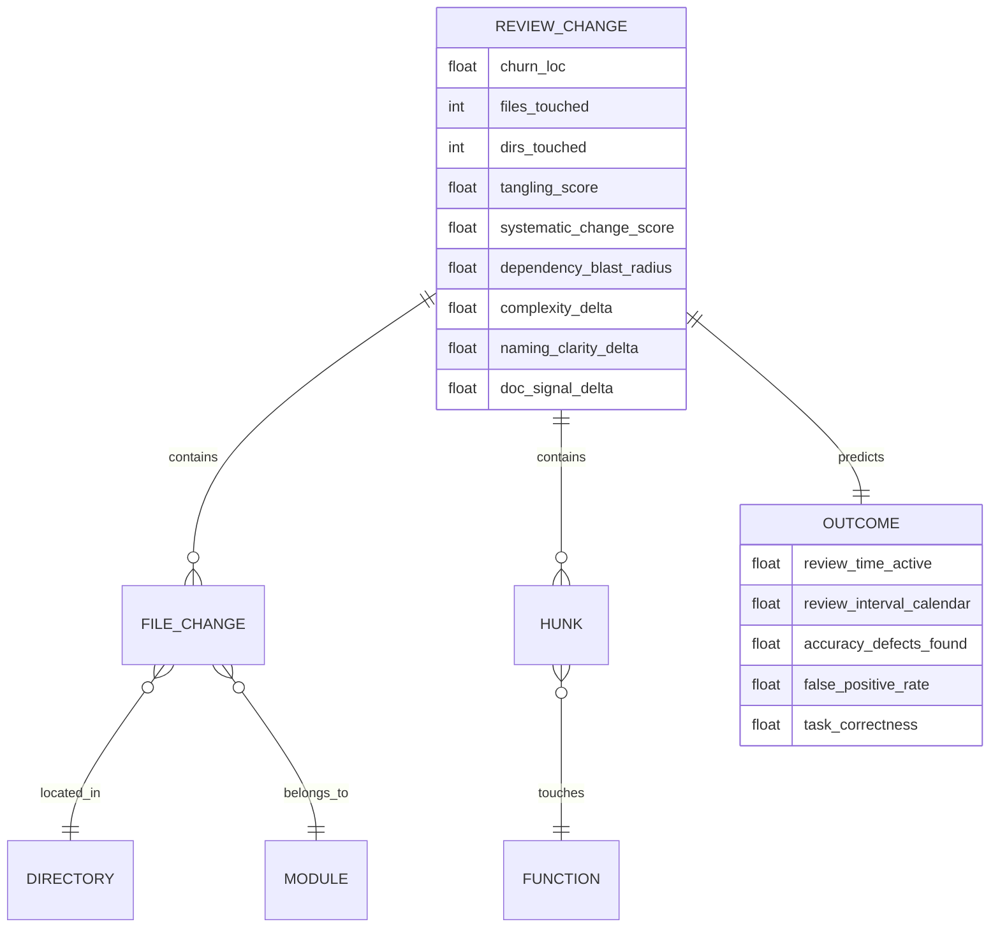

This diagram intentionally separates **review-change metrics** (what a score can measure pre-review) from **outcomes** (what you validate against), and makes explicit that “review interval” is not the same as “active review time.” citeturn20view0turn23view0  

### Timeline of key empirical results

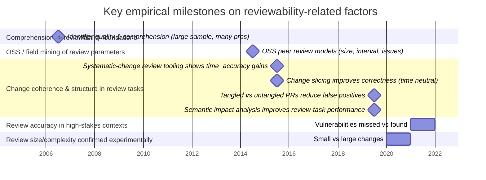

(Years reflect publication/manuscript timestamps as shown in the primary sources used here.) citeturn26view0turn17view0turn15view0turn16view0turn3view0turn24view0turn14view0turn21view0  

### Effect size charts to include in a validation report

A rigorous internal report typically benefits from two plots:

1) **Bar chart of standardized effects** (where available):  
   - small vs large change effectiveness (59% vs 35) citeturn23view0  
   - swap-defect detection probability small vs large (76% vs 36) citeturn23view0  
   - time/correctness deltas for change slicing citeturn16view0  
   - false positive effect size (Cliff’s δ) for untangling citeturn4view3  
   - OR for directory spread in vulnerability identification citeturn14view0  

2) **Scatter plots** for your own environment:  
   - churn vs active review time (or review interval) citeturn20view0  
   - directory count vs “defects found” or post-merge incident rate (if available) citeturn14view0  
   - tangling score vs false positive rate / comment rework (mirroring the “wrongly reported issues” outcome) citeturn4view3  

### Suggested next steps for validation

A review-readiness score is only as trustworthy as its fit to your ecosystem and definitions of “accurate” and “quick.” The strongest next steps are:

Define outcomes that approximate *accuracy* in your environment:
- defect classes found during review vs escaped (security or correctness labels),  
- “wrongly reported issues” rates if you can label them (or use proxies such as reverted review comments),  
- correctness on standardized review tasks (if you can run an internal controlled study). citeturn4view3turn14view0turn23view0turn16view0  

Validate in two complementary ways:
- **Retrospective modeling** on historical reviews using pre-review features (size, dispersion, cohesion proxies). citeturn20view0turn14view0  
- **Prospective evaluation / A/B interventions** that directly modify a property (e.g., enforce decomposition or encourage change slicing) and measure changes in false positives, time, and defect discovery. citeturn4view3turn16view0turn23view0  

Treat lower-evidence metrics as hypotheses:
- For hidden state, coupling metrics, and documentation deltas: introduce them as candidates, but require that they improve predictive power and remain stable across teams and codebases before including them in a production “readiness” score. citeturn14view0turn25view1turn27view0

8.
# Validated Static Indicators of Security Risk for Multi-Language Codebases

## Executive summary

Static indicators of security risk are **code-observable properties** (API uses, dataflow patterns, structural shapes, configuration choices) that have been repeatedly associated with real vulnerabilities, but **do not constitute formal security guarantees**. This report synthesizes research and industry practice on indicators that can be applied consistently across common languages (C/C++, Java, C#, JavaScript/TypeScript, Python, Go, Rust), emphasizing: high‑signal pattern detection, secure‑by‑design structure, reviewability, boundary clarity, unsafe state management, and misuse of dangerous APIs. citeturn15view1turn17view1turn18view0turn20view0

Across published evaluations, static analyzers show **meaningful but incomplete coverage**: false positives and false negatives are intrinsic (static analysis is generally undecidable in the general case), and effectiveness varies strongly by weakness class and code complexity. citeturn15view1turn17view1turn20view0turn18view0 Empirical studies report that substantial fractions of known vulnerabilities can be missed by tool sets, while other evaluations show wide dispersion in true‑positive vs false‑positive behavior across products. citeturn20view0turn21view1turn18view0

The most consistently “validated” static signals—supported by weakness taxonomies, secure coding guidance, and repeatable benchmark/test‑suite evaluations—cluster into two families:

- **Untrusted dataflow to sensitive sinks** (taint‑style indicators): OS command execution, dynamic code evaluation, unsafe deserialization, query construction, filesystem path building, and outbound URL fetching (SSRF). citeturn25search1turn22search0turn22search1turn22search2turn25search0turn22search3turn8search1  
- **Explicit dangerous primitives/configurations**: hardcoded secrets, weak crypto or insecure randomness, disabled TLS certificate validation, memory‑unsafe primitives/unsafe blocks, and unchecked error handling (fail‑open). citeturn25search2turn23search2turn26search0turn26search2turn23search3turn27search3turn23search0turn23search1turn24search2turn24search3

A practical take-away: treat these indicators as **triage accelerators and design feedback**, not proofs. Optimizing for sustained value typically requires (a) focusing on a small set of high‑impact sinks, (b) using multiple analyzers where the marginal cost is acceptable, and (c) tracking a few lightweight metrics that quantify both adoption and operational signal quality (true/false positive mix and time‑to‑fix). citeturn18view0turn17view1turn20view0turn13academia29

## What counts as a validated static indicator

**Static indicator (as used here).** A property detectable from source (or build artifacts) *without execution* that correlates with elevated vulnerability likelihood or exploitability. Examples include “untrusted input reaches `exec`,” “TLS verification is disabled,” or “unsafe deserializer used on attacker‑controlled bytes.” citeturn17view0turn17view1turn25search1turn23search3turn28search0turn28search5

**Validation (operational definition).** Because we are explicitly *not* claiming formal guarantees, “validated” means the signal is supported by at least two of the following evidence channels:

- **Taxonomy/incident grounding:** inclusion in widely used weakness catalogs and “most dangerous” aggregations (e.g., Common Weakness Enumeration entries and Top‑25 groupings). citeturn5search7turn5search3turn25search1turn22search1turn23search0  
- **Actionable secure-coding guidance:** explicit recommendations and mitigations in authoritative security guidance (e.g., OWASP cheat sheets, platform vendor security guides). citeturn8search4turn8search36turn8search1turn28search9turn28search0turn27search3  
- **Benchmark/tool evaluation evidence:** repeatable test suites and evaluation programs that measure recall/precision (e.g., NIST SATE, NSA CAS Juliet scoring, OWASP Benchmark results/scorecards, academic tool evaluation). citeturn19view1turn18view0turn17view1turn20view0turn21view1

**Why “validated” still isn’t a guarantee.** Static analysis tools necessarily approximate; false positives and negatives occur, and different tools do not find the same weaknesses due to differing models and detection strategies. citeturn15view1turn18view0turn20view0

### How to interpret rates and “signal strength”

This report uses standard information retrieval concepts:

- **Recall (sensitivity):** proportion of real weaknesses found. citeturn17view1turn19view1  
- **Precision:** proportion of reported findings that are correct. citeturn17view1turn19view1  
- **False positive / false negative tendencies:** which kinds of code patterns or modeling gaps commonly produce incorrect alarms or misses. citeturn15view1turn20view0turn13academia29

To ground “typical” ranges, this report relies on published observations showing wide dispersion in SAST behavior: examples include best‑case clusters with moderate false positives and relatively low true positive rates, and worst‑case clusters with very high false positive rates, plus empirical evidence that sizable fractions of vulnerabilities can be missed. citeturn21view1turn20view0turn18view0 Numbers in the comparative table should therefore be read as **order‑of‑magnitude expectations** for rule families—not as universal constants. citeturn15view1turn17view1turn13academia29

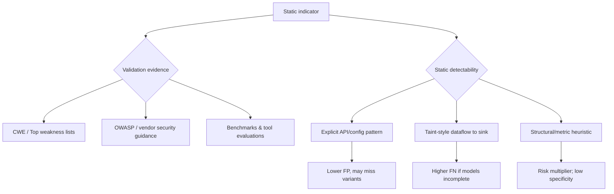

## Evidence base for cross-language indicators

### Benchmarks and evaluation programs

Large-scale evaluation efforts provide concrete grounding for what static indicators can and cannot reliably deliver:

- The entity["organization","National Institute of Standards and Technology","us standards institute"] SATE VI report documents evaluation terminology (TP/FP/FN) and common metrics (recall, precision, discrimination), and highlights that tool behavior varies by weakness and that combining tools can increase weakness finding and potentially reduce false positives in some contexts. citeturn17view0turn17view1turn18view0turn18view1  
- The NSA Center for Assured Software Juliet test suite scoring methodology (as referenced in SATE VI) is explicitly described as showing that tools differed significantly in precision/recall and that their ranking varied by weakness; SATE VI summarizes these observations and the “use multiple tools” conclusion. citeturn18view0turn19view1  
- Independent empirical evaluation work found that substantial fractions of vulnerabilities could be missed by all tested tools in the studied settings, reinforcing that “absence of findings” is not evidence of absence. citeturn20view0turn6search3  
- Benchmark scorecard reporting has been used to visualize the tradeoff between true positive rate and false positive rate; published summaries describe clusters where low false positive rates coincide with low true positive rates and vice‑versa. citeturn21view1turn21view0

### Standards and interoperability for operational use

For organizations applying indicators across many languages and analyzers, output interoperability matters:

- The entity["organization","OASIS Open","standards consortium"] SARIF specification defines a standard format for static analysis tool output, enabling consistent ingestion, triage, and metrics across tools. citeturn7search0turn7search4

### Cross-language static analysis coverage

When selecting indicators, cross-language feasibility depends strongly on tool support:

- entity["company","GitHub","code hosting company"] CodeQL documents supported languages including C/C++, C#, Go, Java/Kotlin, JavaScript/TypeScript, Python, and Rust, which aligns well with the language set assumed here. citeturn7search13turn7search1  
- entity["company","Semgrep","static analysis company"] documents broad multi-language coverage (including C/C++, C#, Go, Java, JavaScript/TypeScript, Python, Rust among others), with varying depth of dataflow capability by language. citeturn7search2turn7search26  
- entity["company","SonarSource","code quality company"] documents multi-language support in SonarQube Server, and distinguishes “dataflow/taint engine” vulnerability rules from simpler rules in some product contexts. citeturn7search3turn7search11turn7search7

## Indicator catalog

The signals below are chosen for (a) high security impact, (b) demonstrated recurrence in weakness catalogs and guidance, and (c) feasibility of consistent static detection across multiple languages. citeturn5search7turn8search24turn18view0turn15view1

### Untrusted input reaches OS command execution

**Definition.** Application constructs all or part of an OS command using externally influenced input without proper neutralization, enabling OS command injection. citeturn25search1turn25search5

**Rationale.** This sink typically executes with the privileges of the application process, so a single injection can become full host compromise or a stepping stone to lateral movement. citeturn25search5turn25search1turn5search7

**Evidence of validation.** OS command injection is a top weakness class (CWE-78/CWE-77 family appears in “most dangerous” aggregations), and is directly addressed in community vulnerability descriptions and defenses. citeturn5search7turn25search1turn2search7turn25search5 SATE VI’s discussion of Juliet and tool variability underscores that “injection” classes are benchmarked and that tool effectiveness differs widely by weakness type. citeturn18view0turn19view0

**Cross-language applicability.** Broad. Every listed language has a way to spawn external processes; the risky subset is “shell invocation” or “command line parsing by shell” driven by untrusted strings. citeturn25search1turn5search8turn25search5

**False-positive/negative tendencies.**  
False positives are usually low when the tool matches explicit “shell string” APIs (e.g., `system("...")`, `exec("...")`) but rise when the tool must model sanitization, escaping, or argument separation. False negatives are common when commands are built indirectly (builders, wrappers, config), or when the analyzer lacks framework-aware sources. citeturn15view1turn17view1turn20view0turn13academia29

**Static detection heuristics (cross-language rules).**  
Treat this as a taint-to-sink pattern:

- **Sources (taint):** HTTP parameters/headers/body, CLI args, env vars, deserialized data, database fields marked “user-controlled.” citeturn8search4turn25search5  
- **Sinks:** shell/command execution APIs; specifically, “single string executed by shell” variants. citeturn25search5turn5search8  
- **Sanitizers:** Prefer “no-shell” APIs with explicit argv arrays; if a shell must be invoked, enforce strict allowlists and escaping rules. citeturn2search7turn5search8  

Concrete static rules that scale across languages:

- Flag any call where the callee is in a **denylist** of “shell string” APIs and the argument is **non-literal** or derived from user-controlled sources. citeturn25search5turn25search1  
- Flag any invocation of `/bin/sh -c`, `cmd.exe /C`, `bash -c` where the command string is not a literal. citeturn5search8turn25search5  

**Examples (unsafe vs safer).**

```c
// C (unsafe): shell parses metacharacters
system(("ping " + user_host).c_str());
```

```python
# Python (unsafe): shell=True parses metacharacters
subprocess.run("ping " + host, shell=True, check=True)
```

```go
// Go (unsafe pattern): explicitly invoking a shell
exec.Command("sh", "-c", "ping "+host).Run()
```

```python
# Python (safer): argv list, no shell parsing
subprocess.run(["ping", "-c", "1", host], check=True)
```

```go
// Go (safer): os/exec intentionally does not invoke a shell by default
exec.Command("ping", "-c", "1", host).Run()
```

(Go’s `os/exec` documentation explicitly notes it does not invoke the system shell and advises care if calling the shell directly.) citeturn5search8

**Mitigation recommendations.**  
Prefer APIs that **do not invoke a shell** and pass arguments as an argv array; when shelling out is unavoidable, constrain inputs with allowlists and avoid concatenation into a shell command line. citeturn2search7turn5search8turn8search4

### Untrusted input reaches dynamic code execution

**Definition.** Software constructs all or part of a code segment using externally influenced input without properly neutralizing syntax or behavior-altering elements, enabling code injection (language-level). citeturn22search0turn4search0

**Rationale.** This sink can yield arbitrary code execution inside the application context (often more powerful than OS command injection because it can directly access in-process secrets and privileged objects). citeturn22search0turn5search7

**Evidence of validation.** Code injection is captured in CWE-94 and appears in top weakness aggregations; security guidance and best practices consistently advise avoiding `eval`-style facilities on untrusted input. citeturn22search0turn5search7turn4search0

**Cross-language applicability.** Broad but uneven: JavaScript/TypeScript and Python have obvious `eval`/`exec`, Java has scripting engines and reflective invocation patterns, and C# can compile/execute code via dynamic compilation or expression evaluation libraries (and reflection can approximate “dynamic execution” patterns). citeturn22search0turn4search0

**False-positive/negative tendencies.**  
False positives are generally low for direct `eval` / `Function(...)` / `exec` calls with non-literal arguments. False negatives tend to occur via indirection: wrapper functions, template engines, “expression languages,” or reflection call sites that are not recognized as sinks without framework modeling. citeturn15view1turn13academia29turn22search0

**Static detection heuristics.**

- Flag dynamic evaluation functions where the evaluated string is not a compile-time constant. citeturn22search0turn4search0  
- Taint-mode: sources → string builders/formatting → eval/compile sinks; treat “template engines with code contexts” as sinks unless proven safe. citeturn7search14turn22search0

**Examples.**

```javascript
// JavaScript (unsafe)
const result = eval(req.query.expr);
```

```python
# Python (unsafe)
value = eval(user_expr)
```

```javascript
// JavaScript (safer): evaluate only a small allowlisted grammar
if (!/^[0-9+\-*/ ().]+$/.test(expr)) throw new Error("bad expr");
// still risky; prefer a real parser for non-trivial cases
```

MDN explicitly warns against `eval()` due to security risk and recommends alternatives. citeturn4search0

**Mitigation recommendations.**  
Eliminate dynamic execution where feasible. If a “mini-language” is required, implement a **real parser/interpreter** over an allowlisted grammar and forbid access to ambient authority (filesystem/network/process) unless explicit capabilities are passed. citeturn22search0turn8search4

### Deserialization of untrusted data using unsafe deserializers

**Definition.** Application deserializes untrusted data without sufficiently verifying that resulting objects are safe/valid, enabling logic abuse, denial of service, or code execution via gadget chains depending on runtime. citeturn22search1turn28search5turn28search0

**Rationale.** Deserialization is a boundary-crossing operation that can reconstitute complex object graphs and implicitly invoke behaviors (constructors, callbacks) not intended by the developer. citeturn22search1turn28search5turn28search0

**Evidence of validation.**  
- CWE-502 defines this weakness class and it appears in top weakness aggregations. citeturn22search1turn5search7  
- entity["company","Oracle","java platform vendor"] documentation states: “Deserialization of untrusted data is inherently dangerous and should be avoided,” and provides defensive filtering guidance. citeturn28search5turn28search1turn28search9  
- entity["company","Microsoft","software company"] guidance states `BinaryFormatter` is dangerous, insecure, and “can’t be made secure,” recommending migration away. citeturn28search0turn28search29turn28search12  
- CodeQL provides query guidance that explicitly frames deserializing objects from untrusted input as a security problem. citeturn22search33

**Cross-language applicability.** Moderate-to-broad: extremely strong for Java and .NET ecosystems; strong for Python’s `pickle`; more situational for other languages depending on serializer choice (e.g., JSON is typically not equivalent to object deserialization with code execution semantics). citeturn22search1turn28search5turn28search0

**False-positive/negative tendencies.**  
False positives can arise when tools cannot prove the input is trusted (e.g., internal-only storage but modeled as “untrusted”). False negatives are common when frameworks wrap deserialization (message buses, session stores) or when sanitization/filtering is custom and not modeled. citeturn15view1turn13academia29turn6search3

**Static detection heuristics.**

- **Denylist sinks** (high signal):  
  - Java: `ObjectInputStream.readObject()` on attacker-reachable streams. citeturn28search5turn28search1  
  - .NET: `BinaryFormatter.Deserialize(...)` and similar unsafe serializers. citeturn28search0turn28search4  
  - Python: `pickle.loads(...)` / `pickle.load(...)` on untrusted bytes. citeturn4search1  
- Promote as **critical** if the call site is reachable from network/file upload boundaries (typical trust boundary). citeturn8search4turn28search5  
- Recognize *mitigation patterns*: serialization filters in Java, or migration to safer serializers in .NET. citeturn28search1turn28search29turn28search12

**Examples.**

```java
// Java (unsafe)
ObjectInputStream ois = new ObjectInputStream(socket.getInputStream());
Object obj = ois.readObject();
```

```csharp
// C# (unsafe)
var bf = new BinaryFormatter();
var obj = bf.Deserialize(networkStream);
```

```python
# Python (unsafe)
obj = pickle.loads(request.data)
```

**Mitigation recommendations.**  
Avoid unsafe deserialization for untrusted data. Where legacy constraints exist: apply **serialization filters** (Java), migrate away from `BinaryFormatter` (.NET), and use data-only formats with strict schemas. citeturn28search1turn28search9turn28search0turn22search1

### Untrusted input reaches query construction and execution

**Definition.** Untrusted input is incorporated into a database or directory query (SQL/NoSQL/LDAP/etc.) in a way that changes query structure, enabling injection. citeturn22search2turn8search36

**Rationale.** Injection often provides direct read/write access to sensitive data and can become RCE depending on DB extensions or chained weaknesses. citeturn8search36turn22search2turn5search7

**Evidence of validation.** SQL injection is CWE-89 and is consistently emphasized in OWASP guidance and top weakness lists. citeturn22search2turn8search36turn5search7 SATE VI contains empirical discussion that tool precision/recall rankings vary by weakness types and that warning overlap/combination is a useful dimension, aligning with how injection rules are typically implemented across tools. citeturn17view1turn18view0

**Cross-language applicability.** Very broad; every language has DB client libraries, and the principal risk factor is **string building of query syntax** rather than parameterization. citeturn8search36turn22search2

**False-positive/negative tendencies.**  
False positives rise when analyzers can’t model sanitizers/ORM escaping, or when query strings are partially constant and partially dynamic. False negatives are common where queries are constructed indirectly (query builders, templated SQL, string fragments across functions) beyond the analyzer’s interprocedural limits. citeturn15view1turn20view0turn13academia29

**Static detection heuristics.**

- Flag string concatenation/formatting feeding `execute`, `query`, `Statement.execute*`, etc. citeturn8search36turn22search2  
- Treat “parameterized/prepared statement APIs” as preferred sinks; downgrade severity when all user-controlled values are bound parameters. citeturn8search36  
- Taint mode: sources → string ops → query execution sink; allow known safe query builder APIs as sanitizers only if they enforce parameterization. citeturn7search14turn8search36

**Examples.**

```java
// Java (unsafe)
String q = "SELECT * FROM users WHERE name = '" + name + "'";
stmt.executeQuery(q);
```

```csharp
// C# (unsafe)
var q = "SELECT * FROM users WHERE name = '" + name + "'";
new SqlCommand(q, conn).ExecuteReader();
```

```python
# Python (safer)
cur.execute("SELECT * FROM users WHERE name = ?", (name,))
```

OWASP recommends parameterized queries / prepared statements as a primary preventive measure. citeturn8search36

**Mitigation recommendations.**  
Use parameterized queries/ORM bindings; reserve dynamic SQL for controlled, allowlisted fragments (e.g., sort columns) and validate with allowlists. citeturn8search36turn8search4

### Untrusted input reaches filesystem paths and restricted-directory operations

**Definition.** External input is used to construct a pathname intended to remain under a restricted directory, but special elements allow resolution outside that directory (path traversal). citeturn25search0turn8search0

**Rationale.** Path traversal can expose configuration secrets, source code, credentials, or enable file overwrite in upload/extraction flows (“zip slip” class). citeturn8search0turn25search0turn5search7

**Evidence of validation.** CWE-22 defines the class; OWASP provides attack descriptions and mitigations; CWE-23 mitigation guidance includes canonicalization examples across multiple languages, reinforcing cross-language generalizability. citeturn25search0turn8search0turn8search20

**Cross-language applicability.** Broad. Canonicalization and base-directory enforcement exist in all target languages (though APIs differ). citeturn8search20turn25search0

**False-positive/negative tendencies.**  
False positives occur when tools cannot prove base-directory enforcement (e.g., canonicalization + prefix check) or when path inputs are internal but modeled as external. False negatives occur when path construction spans multiple functions/files or when framework-specific “static file serving” paths aren’t modeled as sinks. citeturn15view1turn13academia29turn20view0

**Static detection heuristics.**

- Sink set: file read/write/open, archive extraction targets, static file serving root joins. citeturn25search0turn8search0  
- Pattern: `join(base, userPart)` without canonicalization+enforcement. CWE-23 explicitly recommends canonicalization functions (e.g., Java `getCanonicalPath`, .NET `GetFullPath`). citeturn8search20turn25search0  
- Positive pattern to recognize: canonicalize → verify canonical path starts with canonical base directory → operate. citeturn8search20turn8search4  

**Examples.**

```python
# Python (unsafe)
path = os.path.join(BASE_DIR, user_filename)
with open(path, "rb") as f:
    return f.read()
```

```java
// Java (safer pattern)
Path base = Paths.get(BASE_DIR).toRealPath();
Path p = base.resolve(userFilename).normalize();
if (!p.startsWith(base)) throw new SecurityException();
byte[] bytes = Files.readAllBytes(p);
```

(CWE guidance explicitly points to canonicalization approaches across languages.) citeturn8search20turn25search0

**Mitigation recommendations.**  
Prefer indirect references (IDs) instead of raw filenames; otherwise canonicalize and enforce base directory, and avoid using user-provided paths for security decisions without allowlists. citeturn8search0turn8search4turn8search20

### Untrusted input reaches outbound URL fetching

**Definition.** Server fetches a resource from a URL supplied or influenced by an attacker, enabling server-side request forgery (SSRF) to internal networks/metadata services. citeturn22search3turn8search1turn8search5

**Rationale.** SSRF exploits the server’s network position and credentials to access otherwise unreachable resources (internal services, cloud metadata endpoints), bypassing perimeter controls. citeturn22search3turn8search5

**Evidence of validation.** CWE-918 defines SSRF, and OWASP provides dedicated prevention guidance emphasizing allowlists and URL enforcement, including defenses against redirect and DNS rebinding considerations. citeturn22search3turn8search1turn8search5

**Cross-language applicability.** Broad across web-capable stacks; all target languages have HTTP clients and URL parsers, and the core indicator is identical: **user-controlled URL → fetch**. citeturn22search3turn8search1

**False-positive/negative tendencies.**  
False positives occur if tools lack context about “internal-only allowlists” or if a URL is validated elsewhere out-of-model. False negatives are common where URLs are transformed (redirectors, shorteners) or where SSRF is enabled through secondary channels (headers, open redirects). citeturn15view1turn13academia29turn8search1

**Static detection heuristics.**

- Sources: request parameters that look like URLs, hostnames, callbacks. citeturn8search1turn8search4  
- Sinks: outbound HTTP fetch APIs.  
- Required guards (static recognizers): allowlist enforcement on scheme/host/port; disable redirects; resolve DNS and verify IP ranges where feasible. citeturn8search5turn8search1  

**Examples.**

```javascript
// Node.js (unsafe)
const r = await fetch(req.query.url);
```

```python
# Python (safer-ish skeleton)
u = urllib.parse.urlparse(url)
if u.scheme not in {"https"}: raise ValueError()
if u.hostname not in ALLOWED_HOSTS: raise ValueError()
resp = requests.get(url, allow_redirects=False, timeout=3)
```

OWASP explicitly recommends positive allowlists for schema/port/destination and warns about redirects and DNS rebinding/TOCTOU considerations. citeturn8search5turn8search1

**Mitigation recommendations.**  
Enforce allowlists, block redirects, and separate network zones (egress controls) where possible; treat any “fetch arbitrary URL” feature as high risk unless strongly justified. citeturn8search1turn8search5

### Hardcoded credentials, secrets, and embedded key material

**Definition.** Software contains hardcoded credentials (passwords, API keys, cryptographic keys/tokens) used for inbound/outbound authentication or encryption. citeturn25search2turn8search6turn8search2

**Rationale.** Hardcoded secrets are extractable from source, artifacts, or client bundles, and are hard to rotate quickly and safely after exposure. citeturn25search2turn8search2turn8search6

**Evidence of validation.** CWE-798 defines this as “Use of Hard-coded Credentials” and it appears in top weakness aggregations; OWASP provides community guidance and dedicated secrets management best practices focusing on centralized storage, auditing, and rotation. citeturn25search2turn5search7turn8search2turn8search6

**Cross-language applicability.** Very broad; applies uniformly across all languages because it is fundamentally about **literal secrets in code/config**. citeturn8search6turn8search2

**False-positive/negative tendencies.**  
False positives can occur for test credentials, placeholders, or non-secret constants that look like tokens. False negatives occur when secrets are encoded, split across strings, generated during build, or stored in adjacent config files not scanned. citeturn15view1turn13academia29turn8search2

**Static detection heuristics.**

- Pattern checks: variable names (`password`, `apiKey`, `secret`) assigned string literals; high-entropy literal detectors; known key formats. citeturn8search2turn25search2  
- Cross-file include: treat `.env`, YAML, JSON, and IaC as first-class scan targets; unify results via SARIF where possible. citeturn7search0turn8search2  

**Examples.**

```python
# Python (unsafe)
API_KEY = "sk_live_ABC123..."
```

```javascript
// JavaScript (unsafe)
const password = "P@ssw0rd!";
```

```python
# Python (preferred)
API_KEY = os.environ["API_KEY"]
```

OWASP emphasizes centralized secrets storage, provisioning, auditing, and rotation as core practices. citeturn8search2turn8search38

**Mitigation recommendations.**  
Adopt managed secrets storage; enforce rotation and minimize secret reuse; treat any committed secret as a security incident requiring rotation and scope review. citeturn8search2turn8search38

### Weak crypto primitives, insecure randomness, and deprecated algorithms

**Definition.** Use of broken or risky cryptographic algorithms/protocols, insecure random number generation for security-sensitive values, or configurations that violate modern cryptographic guidance. citeturn23search2turn26search0turn26search2turn15view3

**Rationale.** Weak crypto is a “silent failure”: software often appears correct while confidentiality/integrity guarantees are degraded or void. citeturn23search2turn15view3turn8search3

**Evidence of validation.**  
- CWE-327 characterizes “broken or risky cryptographic algorithm” usage. citeturn23search2  
- entity["organization","NIST","us standards institute"] provides transition guidance for cryptographic algorithms and key lengths (SP 800‑131A Rev.2) and publishes TLS configuration guidance (SP 800‑52 Rev.2). citeturn15view3turn26search3turn26search13  
- MDN explicitly warns that `Math.random()` is not cryptographically secure and recommends Web Crypto APIs instead. citeturn26search0turn26search11  
- Python’s `secrets` module documentation positions it as suitable for security tokens. citeturn26search2  
- NIST has announced retirement guidance for SHA‑1; the IETF has deprecated MD5/SHA‑1 signature hashes for TLS 1.2 and DTLS 1.2 digital signatures. citeturn8search3turn8search19

**Cross-language applicability.** Broad; all languages have crypto libraries and PRNG APIs, and all have “easy but unsafe” primitives (non‑CSPRNG PRNGs, deprecated hashes/ciphers). citeturn23search2turn26search0turn26search2

**False-positive/negative tendencies.**  
False positives occur when risky algorithms are used for non-security purposes (e.g., MD5 for deduplication) but still violate policy. False negatives occur when algorithms are selected via indirection (config), or when wrappers obscure the primitive choice. citeturn15view1turn13academia29turn15view3

**Static detection heuristics.**

- Banned algorithm identifiers: `MD5`, `SHA1`, `DES`, `RC4`, `ECB`, etc., mapped to policy baselines (NIST/IETF/organizational). citeturn8search19turn8search3turn15view3  
- Insecure RNG: language PRNG APIs (e.g., JavaScript `Math.random`) used for tokens/session IDs/password reset links. citeturn26search0turn26search2  
- Detect “token generation” contexts: variable names or API callsites suggest auth/session/CSRF tokens. citeturn26search2turn8search38  

**Examples.**

```javascript
// JS (unsafe)
const token = Math.random().toString(36).slice(2);
```

```javascript
// JS (safer)
const bytes = new Uint8Array(32);
crypto.getRandomValues(bytes);
```

```python
# Python (safer)
token = secrets.token_urlsafe(32)
```

MDN warns against using `Math.random()` for security and points to `crypto.getRandomValues()`. citeturn26search0turn26search11 Python documents `secrets` for security tokens. citeturn26search2

**Mitigation recommendations.**  
Set a cryptographic policy baseline (e.g., NIST transition guidance for keys/algorithms; TLS configuration guidance) and enforce via static rules and code review. citeturn15view3turn26search3turn26search13

### TLS certificate validation disabled or forced-trust patterns

**Definition.** The product does not validate, or incorrectly validates, certificates—often via “trust-all” callbacks or explicitly disabling verification. citeturn23search3turn27search3turn27search13

**Rationale.** Disabling certificate validation undermines TLS authentication, enabling man-in-the-middle and endpoint impersonation. citeturn23search3turn27search3turn27search13

**Evidence of validation.**  
- CWE-295 defines improper certificate validation. citeturn23search3  
- Microsoft’s CA5359 rule explicitly flags the pattern where `ServerCertificateValidationCallback` always returns `true`, stating that any certificate will pass validation. citeturn27search3  
- Node’s TLS documentation explains `rejectUnauthorized` controls whether server certificates are verified and defaults to true, making `false` a clear “disable verification” signal. citeturn27search13

**Cross-language applicability.** Broad: each ecosystem has a way to disable verification (callbacks, flags, environment variables). citeturn27search3turn27search13

**False-positive/negative tendencies.**  
False positives are typically very low for explicit “always trust” patterns, because they are unambiguous. False negatives occur when trust is weakened indirectly (custom trust stores misconfigured) or when the analyzer does not inspect deep config wiring. citeturn27search3turn13academia29turn15view1

**Static detection heuristics.**

- .NET: flag callbacks that return constant `true` or ignore `sslPolicyErrors`. citeturn27search3  
- Node: flag agents/options setting `rejectUnauthorized: false` or global `NODE_TLS_REJECT_UNAUTHORIZED=0` in production paths. citeturn27search13turn27search33  
- Python: flag `verify=False` where requests are security-sensitive (even if sometimes used for scraping). citeturn28search2turn27search16  

**Examples.**

```csharp
// C# (unsafe)
ServicePointManager.ServerCertificateValidationCallback =
  (sender, cert, chain, errors) => true;
```

```javascript
// Node.js (unsafe)
const agent = new https.Agent({ rejectUnauthorized: false });
```

**Mitigation recommendations.**  
Disallow “trust-all” in production; support internal/self-signed deployments by distributing a proper CA chain and pinning/allowlisting where appropriate, rather than disabling verification. citeturn27search3turn27search13turn26search3

### Memory-unsafe primitives and unsafe blocks

**Definition.** Operations that can write out of bounds, use memory after free, or otherwise trigger memory corruption and undefined behavior. citeturn23search0turn23search1turn5search5turn28search24

**Rationale.** Memory corruption often enables control-flow hijack or privilege escalation when an attacker controls inputs; it remains a dominant class in “most dangerous” weakness lists. citeturn5search7turn23search0turn23search1

**Evidence of validation.** CWE-787 (out-of-bounds write) and CWE-416 (use-after-free) are defined in CWE and commonly appear in top weakness aggregations. citeturn23search0turn23search1turn5search7 The entity["organization","Software Engineering Institute","cmu software engineering center"] CERT C coding standard provides guidance on safer string/formatting functions and broader secure C/C++ practices. citeturn28search7turn28search24turn28search35 entity["organization","OpenSSF","open source security org"] additionally publishes a hardening guide for compiler/linker options in C/C++ toolchains to improve resilience. citeturn28search17

**Cross-language applicability.** Highest for C/C++; meaningful for Rust via `unsafe` blocks (which allow operations the compiler can’t verify). Lower but not zero for managed languages (native interop, unsafe code, buffer APIs). citeturn23search0turn5search5turn5search1turn28search24

**False-positive/negative tendencies.**  
False positives can be high when analyzers conservatively approximate pointer aliasing, lifetimes, and bounds; false negatives occur in highly complex control/data flows or when the bug is emergent (requires deep semantic reasoning). Tool evaluations and comparative studies repeatedly show that no tool finds all issues, especially those requiring deep understanding. citeturn6search3turn20view0turn15view1

**Static detection heuristics.**

- Denylist “historically unsafe” C APIs (`gets`, `strcpy`, `sprintf`, etc.) and enforce safer counterparts with explicit bounds. citeturn28search20turn28search7turn28search11  
- Rust: treat any `unsafe` block as requiring justification and ensure pointer arithmetic or transmute-like operations are localized and reviewed. citeturn5search5turn5search1  
- Pattern: integer overflow used in allocation/length → buffer write; treat as compound risk where analyzers support it. citeturn25search3turn23search0  

**Examples.**

```c
// C (unsafe)
char buf[16];
strcpy(buf, user_input);
```

```rust
// Rust (review hotspot)
unsafe {
    *ptr.add(i) = value;
}
```

**Mitigation recommendations.**  
Prefer memory-safe languages or safe subsets where feasible; otherwise, harden by (a) banning unsafe APIs, (b) enabling compiler hardening options, and (c) enforcing strict review for unsafe blocks/hot functions. citeturn28search7turn28search17turn5search5

### Unchecked return values, swallowed exceptions, and fail-open control flow

**Definition.** Software fails to check return values or mishandles exceptional conditions, potentially continuing in an unsafe state (“fail open”), losing security invariants. citeturn24search2turn24search3turn24search15

**Rationale.** Security checks and validation are often implemented as “must succeed” operations. Ignoring failures turns them into advisory checks, enabling bypasses. citeturn24search2turn24search3

**Evidence of validation.**  
- CWE‑252 (“Unchecked Return Value”) and CWE‑703 (“Improper Check or Handling of Exceptional Conditions”) define these behaviors as weakness classes. citeturn24search2turn24search3  
- OWASP’s Top 10 (2025) introduces “Mishandling of Exceptional Conditions” as a category emphasizing that failures to prevent/detect/respond to unusual situations can lead to vulnerabilities. citeturn24search15  
- CERT guidance and secure C/C++ discussions emphasize detecting and handling input/output errors and avoiding related undefined behaviors. citeturn28search24turn28search7

**Cross-language applicability.** Very broad: all languages have error/exception channels, and all can suffer from ignored failures, empty catches, and “continue anyway” logic. citeturn24search2turn24search3turn24search15

**False-positive/negative tendencies.**  
False positives are moderate: not every ignored return is security relevant, and some errors are deliberately ignored. False negatives happen when “error significance” is semantic (only dangerous for certain operations), which many analyzers approximate imperfectly. citeturn15view1turn13academia29turn24search2

**Static detection heuristics.**

- Flag ignored return values from security-sensitive APIs (auth checks, signature verification, permission setting, file operations, network calls). CWE‑252 explicitly frames unchecked returns as preventing detection of unexpected states. citeturn24search2  
- Flag empty catch blocks or blanket exception suppression around security-critical operations. citeturn24search3turn24search15  
- Require “fail closed” semantics for authorization and verification functions (error → deny). citeturn24search3turn24search15  

**Examples.**

```go
// Go (unsafe): ignoring error can skip security enforcement
_ = os.Chmod(path, 0600)
```

```java
// Java (unsafe): swallow exception -> proceed anyway
try { verifySignature(data); } catch (Exception e) { }
process(data);
```

**Mitigation recommendations.**  
Make security checks explicit and non-optional: propagate failures, log with context, and default to denial/abort in sensitive pathways. citeturn24search2turn24search15turn24search3

### Missing authentication and missing authorization gates

**Definition.** Critical functions are reachable without authentication (CWE‑306) or without authorization checks (CWE‑862), often due to missing middleware, missing policy checks, or confusion over trust boundaries. citeturn24search0turn24search1turn5search7

**Rationale.** These issues are “design-to-implementation boundary failures”: they may not look like low-level bugs but can enable direct access to privileged actions or data. citeturn24search0turn24search1turn18view0

**Evidence of validation.** Missing authentication/authorization classes appear in top weakness lists. citeturn5search7turn24search0turn24search1 OWASP emphasizes validation and boundary controls as foundational secure development practices (e.g., allowlist validation at input boundaries). citeturn8search4turn8search38

**Cross-language applicability.** Broad conceptually, but detection is often framework-aware (routing/middleware patterns differ). Still, the static indicator can be applied via two consistent approaches: framework-specific rule packs and architectural boundary assertions. citeturn24search0turn24search1turn7search13

**False-positive/negative tendencies.**  
False positives can be high if tools don’t model auth middleware correctly or if authorization is centralized in unusual patterns. False negatives are common where authorization is dynamic (policy engines) or enforced out-of-band (API gateways), unless integrated into the analysis model. citeturn15view1turn13academia29turn6search3

**Static detection heuristics.**

- Identify “entry points” (route handlers, RPC methods, controllers).  
- Require an authentication/authorization precondition (decorator/annotation/middleware call) before privileged sinks (DB write, admin action, secret read). citeturn24search0turn24search1turn8search4  
- For “privileged functions,” enforce that all call paths originate from authenticated contexts (“capability threading” design). citeturn24search0turn18view0  

**Examples.**

```javascript
// Express (unsafe): missing auth middleware
app.post("/admin/deleteUser", (req, res) => deleteUser(req.body.id));
```

```javascript
// Express (safer)
app.post("/admin/deleteUser", requireAdmin, (req, res) => deleteUser(req.body.id));
```

**Mitigation recommendations.**  
Centralize authentication and authorization enforcement; apply least privilege and separate anonymous vs privileged areas as CWE guidance suggests. citeturn24search12turn24search0turn8search4

### Reviewability hotspots as a risk multiplier

**Definition.** Code regions whose structure makes human review and tool reasoning difficult (high cyclomatic complexity, deep nesting, high coupling, large functions, heavy indirection). These are not “vulnerabilities,” but are statistically associated with vulnerability presence and with analyzer misses. citeturn6search0turn6search28turn15view1turn13academia29

**Rationale.** Complexity increases the chance of missing boundary checks, mishandling errors, and creating unanticipated dataflows; it also stresses static analyzers’ approximation limits and developer comprehension. citeturn6search0turn15view1turn13academia29

**Evidence of validation.** Shin & Williams report that complexity metrics can predict vulnerabilities with low false positives but high false negatives. citeturn6search0 Microsoft research on vulnerability prediction highlights key challenges such as class imbalance (vulnerabilities are rarer than defects), making prediction difficult and emphasizing that such models are best used as prioritization aids rather than definitive detectors. citeturn6search28

**Cross-language applicability.** Very broad; metrics like cyclomatic complexity, nesting depth, and function length exist across languages and can be computed consistently. citeturn6search0turn6search28

**False-positive/negative tendencies.**  
By design, this indicator has high “false positives” if interpreted as “this is a vuln”; it should be used only as a **prioritization overlay**. False negatives occur because vulnerabilities also exist in simple code (e.g., a single unsafe API call). citeturn6search0turn20view0turn15view1

**Static detection heuristics.**

- Set policy thresholds (example starting points): cyclomatic complexity > 15, nesting depth > 4, function length > 150 LOC (tune per codebase). Treat as “security review required” when combined with sensitive sinks (crypto, auth, deserialization, process execution). citeturn6search0turn15view1  
- Merge with other findings: prioritize taint-sink findings in high-complexity files/functions first. citeturn6search0turn17view1  

**Examples (conceptual).**

```python
# Python (reviewability hotspot)
def handle(req):
    if cond1:
        if cond2:
            if cond3:
                # ... many branches ...
                return do_sensitive_thing(req.user_input)
```

```python
# Refactor idea: isolate parsing/validation, isolate sensitive sink, reduce branching
def handle(req):
    user = authenticate(req)
    validated = validate_request(req)
    return do_sensitive_thing(validated)
```

**Mitigation recommendations.**  
Refactor hotspots to isolate security-critical sinks behind small, testable, auditable functions; reduce implicit control flow and consolidate validation/auth checks at boundaries. citeturn8search4turn24search0turn6search0

## Comparative table of indicators

The ranges below are **practitioner-oriented expectations** for the indicator family, grounded in published observations of wide variability in static tool precision/recall and benchmark scorecard clusters. They are not universal constants and should be calibrated in each organization by sampling/triage. citeturn15view1turn21view1turn20view0turn13academia29

| Signal name | Detection difficulty | Cross-language coverage | Validation strength | Typical false-positive rate | Typical false-negative rate | Recommended tooling |
|---|---|---|---|---|---|---|
| Untrusted input → OS command exec | Medium | High | Strong | Medium (10–40%) | Medium–High (30–70%+) | Taint-capable SAST (CodeQL, Semgrep, Sonar taint), plus strict API denylist rules |
| Untrusted input → dynamic code exec | Low–Medium | High | Strong | Low–Medium (5–25%) | Medium (20–60%) | AST pattern rules + taint (CodeQL/Semgrep); policy bans on `eval`-class sinks |
| Untrusted input → unsafe deserialization | Medium | Medium–High | Strong | Medium (10–40%) | Medium–High (30–80%) | Platform analyzers (MS rules CA2300*), CodeQL queries, taint rules; migrate away from unsafe serializers |
| Untrusted input → query execution | Medium | High | Strong | Medium (10–40%) | Medium–High (30–70%+) | Taint-capable SAST; ORM-aware rules; enforce parameterization |
| Untrusted input → filesystem path | Medium | High | Strong | Medium (10–40%) | Medium–High (30–70%+) | Taint-capable SAST; path canonicalization rules; review of file-serving/extraction code |
| Untrusted input → outbound URL fetch (SSRF) | Medium–High | High | Moderate–Strong | Medium (15–50%) | High (40–80%+) | Taint SAST with URL parsing models; HTTPS client config scanners; SSRF policy rules |
| Hardcoded secrets/credentials | Low | High | Strong | Medium (10–40%) | Medium (20–60%) | Secret scanners + SAST literal/entropy rules; repo pre-receive hooks |
| Weak crypto / insecure randomness | Medium | High | Strong | Medium (10–40%) | Medium (30–70%) | Crypto-specific rule packs; policy baselines from NIST/IETF; linters |
| TLS certificate validation disabled | Low | High | Strong | Low (<5–10%) | Medium (20–60%) | Platform analyzers (e.g., CA5359), Node/Python config rules, grep-based enforcement |
| Memory-unsafe primitives / unsafe blocks | High | Medium | Strong (for C/C++) | High (30–70%+) | High (40–80%+) | C/C++ analyzers (clang tools), CodeQL C/C++ packs, strict API bans, compiler hardening |
| Unchecked errors / swallowed exceptions | Medium | High | Moderate–Strong | Medium (15–50%) | Medium (30–70%) | Lints (Go/Java/C#), CWE-focused checkers, “fail closed” policy rules |
| Missing authn/authz gates | High | Medium | Strong | High (30–70%+) | High (40–80%+) | Framework-aware SAST query packs, route/middleware rule sets, architectural guardrail checks |

(“Validation strength” reflects combined grounding in CWE/Top-25 style prioritizations, OWASP/vendor guidance, and measurable tool/benchmark targeting. citeturn5search7turn8search24turn18view0turn28search0turn28search9)

## Prioritized actionable checklist and lightweight metrics

### Practitioner checklist

1. **Standardize your trust boundary model**: enumerate entry points (HTTP handlers, RPC methods, CLI, file import), and define which inputs are “untrusted” by default; treat boundary validation as a required step. citeturn8search4turn18view0turn25search0  
2. **Adopt a small, enforced sink policy** for the riskiest APIs: command execution, dynamic code execution, unsafe deserialization, and “trust-all TLS.” Make exceptions explicit, reviewed, and local. citeturn25search1turn28search5turn28search0turn27search3turn4search0  
3. **Prefer safe-by-default APIs** (argv execution, parameterized queries, schema-based parsing, canonicalization checks) and ban known-dangerous calls where practical. citeturn5search8turn8search36turn8search20turn28search11turn28search7  
4. **Run multi-language SAST with taint capabilities** and calibrate rule packs per language/framework; accept that no single tool excels across all weakness types. citeturn18view0turn17view1turn7search13turn7search2  
5. **Unify outputs in SARIF** so severity, ownership, triage state, and metrics can be aggregated across tools and languages. citeturn7search0turn7search4  
6. **Treat `unsafe` (Rust) and native/FFI (managed languages) as audit boundaries**: require justification, tests, and focused review. citeturn5search5turn5search1turn23search0  
7. **Enforce cryptographic baselines** (approved primitives, secure RNG, TLS configuration) and block insecure primitives in CI. citeturn15view3turn26search13turn8search19turn26search0turn26search2  
8. **Make failure handling explicit** in security-sensitive pathways: unchecked return values and swallowed exceptions should be treated as high-priority cleanup, especially around auth, crypto, and I/O. citeturn24search2turn24search15turn24search3turn28search24  
9. **Prioritize reviewability hotspots** for security review when they contain sensitive sinks; use complexity only as an overlay, not a “vulnerability detector.” citeturn6search0turn15view1turn17view1  
10. **Continuously sample findings** to recalibrate precision/recall expectations for your environment; published work shows wide variance and substantial misses, so on-the-ground calibration is indispensable. citeturn20view0turn21view1turn13academia29turn6search3

### Lightweight metrics to track adoption and effectiveness

These metrics are intentionally low-cost and tool-agnostic; most can be computed from SARIF+repo metadata and a small amount of triage labeling. citeturn7search0turn17view1turn19view1

**Adoption metrics**
- **Scan coverage:** % of repos / services shipping code that have SAST enabled per language; % of LOC scanned per release. citeturn7search13turn7search2turn7search3  
- **Policy coverage:** count of “banned sink” rule violations per repo (command execution, unsafe deserialization, trust-all TLS, eval). citeturn25search1turn28search0turn27search3turn4search0  
- **Boundary coverage:** fraction of entry points confirmed to pass through validation/auth middleware (via framework-aware checks). citeturn24search0turn24search1turn8search4  

**Effectiveness metrics**
- **Finding quality:** sampled precision = TP / (TP+FP) for top 10 rules by volume; update quarterly. citeturn17view1turn15view1turn13academia29  
- **Time-to-triage / time-to-fix:** median days from finding introduction to resolution for high-severity sinks (deserialization, authz, cert validation). citeturn28search0turn24search1turn27search3  
- **Recurrence rate:** % of fixed findings that reappear within N releases (indicates missing root cause or insufficient guardrails). citeturn13academia29turn15view1  

**Risk-reduction proxies (use with caution)**
- **Dangerous-sink density:** number of critical sinks per KLOC, tracked over time (target downward). citeturn5search7turn25search1turn28search0  
- **Hotspot exposure:** fraction of sensitive sinks located in high-complexity functions (reducing this indicates improved reviewability around critical code). citeturn6search0turn15view1  

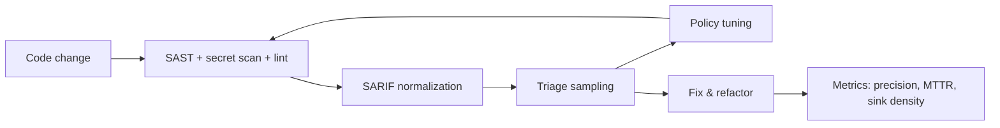
9.
# Software Metrics and Structural Signals Predictive of Safe Automated Transformation and Large-Scale Refactoring

## Executive summary

Across decades of empirical software engineering, the most consistently supported predictors of *regression risk* and *nontrivial refactoring effort* are: (a) **change magnitude** (diff “size,” churn, and diffusion across files/modules); (b) **evolutionary/change coupling** (what tends to co-change, including hidden dependencies not visible in static structure); and (c) **dependency locality / modularity** (how far a change can propagate through dependency reachability and cross-boundary edges). citeturn35view3turn37view0turn19view1turn29view3turn17view3

A recurring pattern in the evidence base is that **structural information alone is not enough**: studies comparing dependency types find that *logical dependencies (co-change relationships)* can have low overlap with syntactic dependencies and can explain substantial variance in defect proneness beyond what static structure captures. citeturn19view1turn16view3

For *safe automated transformation* (including AI-assisted rewriting), the research collectively suggests treating refactoring as a **risk-managed, externally verifiable process** rather than a one-shot rewrite. Mature automation systems (semantic patching, large-scale AST-aware migration, translation validation) emphasize (i) constraining change via explicit rules, (ii) preserving maintainability/readability, and (iii) validating results with machine-checkable or test-based evidence. citeturn43view1turn41view8turn41view4turn41view0

Concrete effect sizes and “rules of thumb” that recur in the literature include:

- **Churn/change size matters**: relative churn measures correlate strongly with defect density and can discriminate fault-prone artifacts with ~**89%** accuracy in an industrial study. citeturn35view3turn35view0  
- **Change complexity beyond raw counts helps**: entropy-based change-complexity models reduce fault-prediction error by **13–42%** (≈32% on average) versus using modifications alone in multiple OSS systems. citeturn36view3  
- **Effort-aware triage is real**: with “20% effort” (review budget defined by churn), an effort-aware model detects ~**35%** of defect-inducing changes on average; in one example project it detects **50%** at the same effort. citeturn37view5  
- **Refactoring is not risk-free**: in one multi-project study, ~**15%** of detected refactorings were associated with later bug fixes; some refactoring types (notably hierarchy-related) were much more likely to be followed by fixes (reported up to **40%** in that dataset). citeturn24view0  
- **Realistic AI code editing tasks are typically multi-location but not enormous**: SWE-bench solutions average editing ~**1.7 files**, ~**3 functions**, and ~**32.8 lines** added/removed, but can also involve nontrivial test dynamics. citeturn41view1turn46view7  

## Metric definitions and formalizations

This section formalizes the requested dimensions—edit distance, change coupling, dependency locality, semantic cohesion, and module boundaries—in a way that makes them *operational* for automated refactoring and AI-assisted rewriting.

### Edit distance and change magnitude

**Edit distance (string/token level).** A standard formalization treats code as a sequence (characters, tokens) and measures distance as the minimum number of primitive edits to transform one sequence into another (classically: insert, delete, substitute). citeturn15search0

**Edit distance (tree / AST level).** For structured representations, a common formalization is **tree edit distance**: the minimum-cost sequence of node-level operations (insert, delete, relabel/modify; some variants include move) that transforms one ordered labeled tree into another. The classic definition explicitly frames distance as the weighted number of edit operations, with costs forming a metric, and defines distance as the minimum total cost over all edit scripts. citeturn44view2turn44view3

**Software-evolution “edit distance” proxies used in empirical work.** Many large-scale studies operationalize change magnitude through *diff size* and *churn* features rather than computing exact edit distance:

- **Lines added (LA), lines deleted (LD), churn** (often LA+LD), sometimes normalized by other quantities (“relative churn”). citeturn37view0turn35view3  
- **Diffusion**: number of files touched (NF) and related spread factors; these are often among the strongest “risk-increasing” factors in just-in-time defect-prediction studies. citeturn37view0  

For automated transformation, these proxies matter because they approximate (i) the surface area for regression, and (ii) the amount of review/verification work required.

### Change coupling

**Core idea.** *Change coupling* (also “logical coupling,” “evolutionary coupling”) measures implicit dependency between items A and B by how often they change together across version-control transactions. A widely used rationale is: if entities co-changed in the past, they are likely to co-change again (and thus should be analyzed together). citeturn16view6

**Operationalizations.**

1. **Co-change frequency / support (association-rule view).** A simple measure is support count: how often a pair (or set) appears in the same transaction. Some tools convert this into association rules with **support** and **confidence**, i.e., support of \(x_1 \Rightarrow x_2\) equals frequency of \(x_1 \cup x_2\), and confidence equals \(\text{frq}(x_1 \cup x_2)/\text{frq}(x_1)\). citeturn17view0  

2. **Support-count thresholds as “strength.”** In a classic impact-analysis tool, the authors explicitly argue that a **support count of ~10** represents “rather strong” evolutionary coupling and is relatively reusable across projects (while noting normalization considerations). citeturn16view1  

3. **Fine-grained logical coupling.** Some research argues that commit-transaction granularity is too coarse (all files in a commit contribute equally), and proposes measures that weight co-change by *how much* or *what kind* of change occurred. citeturn16view6  

4. **Change sequences across releases.** Earlier work proposed analyzing “change sequences” (release numbers where a module’s version changes) and then seeking long shared subsequences as evidence of coupling; longer shared subsequences are argued to imply higher probability of real dependency. citeturn18view1turn18view2  

### Dependency locality

Here “dependency locality” is treated as a *design and evolution property*: changes and dependencies should mostly stay within a module/cluster; cross-boundary relationships are costly because they increase change propagation, coordination needs, and verification radius.

**A graph-based formalization.** Let a system be a directed graph \(G=(V,E)\) over entities (files, packages, classes, functions). Let a module partition \(\Pi=\{M_1,\dots,M_k\}\) split \(V\). Basic locality measures include:

- **Boundary-crossing ratio:** \(|\{(u,v)\in E : u\in M_i, v\in M_j, i\neq j\}|/|E|\)  
- **Locality-weighted cut:** same numerator but weighted by edge types (imports, calls, shared state, etc.)  

**Propagation-based locality (Design Structure Matrix lineage).** A rigorous and widely cited approach computes reachability in the dependency graph and summarizes how widely a change can spread:

- Build a dependency matrix; compute a **visibility matrix** capturing direct and indirect dependency reachability (via matrix powers and summation).  
- Define **fan-out visibility** and **fan-in visibility** from the visibility matrix.  
- Define system-level **Propagation Cost** as the average proportion of elements that could be affected by a change to one element. citeturn29view3turn29view4  

**Cluster-aware locality.** A complementary measure assigns low cost to dependencies within clusters and higher cost across clusters, comparing designs against an “idealized modular form” (tightly connected clusters, minimal cross-cluster edges). citeturn29view4  

**Evolutionary locality via co-change.** Recent work adapts DSM-style propagation ideas to *co-change graphs* by constructing a weighted co-change matrix and using matrix exponential to dampen long walks, yielding weighted propagation/clustering costs that track how co-changes propagate through the system over time. citeturn30view2  

### Semantic cohesion

**Concept.** Semantic cohesion measures whether the elements within a module/class “belong together” conceptually (shared vocabulary, shared topics, consistent intent), which affects refactorability and auditability: cohesive modules localize reasoning, review, and invariants.

**A classic formalization: Conceptual Cohesion of Classes (C3).** One approach extracts identifiers/comments as a text corpus, embeds methods as vectors (via LSI), computes conceptual similarity as cosine similarity, and defines a class cohesion metric in \([0,1]\). The paper gives explicit definitions for method similarity and average similarity within a class. citeturn20view0turn20view1  

**Semantic coupling as boundary signal.** Empirical work comparing coupling measures finds that semantic coupling can capture relationships not visible in structural call relations, because interactions may be “encapsulated in the source code vocabulary.” citeturn21view0turn21view3  

**Topic-model formulations for refactoring recommendations.** A refactoring-recommendation technique models methods as documents and uses **Relational Topic Models (RTM)** (topics + relationships) to recommend Move Method targets, explicitly aiming to reduce low cohesion / high coupling scenarios. citeturn45view0turn45view3  

### Module boundaries

**Foundational criterion: information hiding.** A seminal modularity argument is that modules should be organized around “secrets” (design decisions likely to change), so that changes can be confined to one module. The paper contrasts decompositions and shows cases where, under an information-hiding decomposition, a change is confined to a single module that hides representation details. citeturn39view2  

**Boundary quality as an empirical discrepancy problem.** A practical, evolution-based interpretation is: boundaries are good when *structural coupling* and *change coupling* agree (what depends should co-evolve, and what should be independent should not repeatedly co-change). Discrepancies can reveal “modularity violations” and design erosion. citeturn17view1turn17view3  

## Empirical evidence linking metrics to refactorability, automated transformability, and regression risk

Empirical studies rarely measure “refactorability” directly; instead they use proxies: defect proneness, prediction accuracy, impact-scope correctness, maintenance effort, developer perception alignment, ability to localize redesign, or success of automated refactoring at scale. This section emphasizes effect sizes and thresholds when reported.

### Comparative study table

| Study (first author) | Year | Dataset / context | Metrics / signals | Methods | Key findings and effect sizes (where reported) |
|---|---:|---|---|---|---|
| **entity["people","David L. Parnas","software modularity pioneer"]** | 1972 | Conceptual design exemplar (KWIC) | Module boundaries via information hiding; change confinement | Comparative decomposition argument | Information-hiding modularization confines certain representation changes to a single module (“entirely hidden”), improving independent development and comprehension; no numeric effect sizes (design rationale). citeturn39view2turn39view0 |
| **entity["people","William G. Griswold","software refactoring researcher"]** & **entity["people","David Notkin","program analysis researcher"]** | 1993 | Restructuring prototype + conceptual examples | “Structural degradation” as need for consistent nonlocal change; transformation safety constraints | Model + prototype; formalizes when transformations abort (side effects, multiple defs) | Frames nonlocal change as key characteristic of degradation and motivates meaning-preserving restructuring; emphasizes explicit validation stages and conditions that prevent unsafe rewrites; limited effect-size reporting in the excerpted material. citeturn43view5turn42search3 |
| **entity["people","Harald C. Gall","software evolution researcher"]** | 1998 | Telecom Switching System (~10M LOC, thousands of files) | Logical coupling via shared change sequences/subsequences | Change Sequence Analysis + Change Report Analysis | Longer shared subsequences imply higher probability of coupling; intended to guide restructuring; no explicit quantitative thresholds beyond this principle in the excerpted sections. citeturn18view0turn18view2 |
| **entity["people","Thomas Zimmermann","software engineering researcher"]** | 2005 | Eclipse plugin change history | Evolutionary coupling rules; support-count thresholds; precision/recall | Association rule mining + tool evaluation (ROSE) | Argues support count is easier for developers; suggests support count ~10 is “rather strong” coupling. Reports precision ≈0.30 and recall ≈0.34 under evaluated settings; feedback ≈0.64 (suggestions returned in ~2/3 queries). citeturn16view1turn16view2turn16view0 |
| **entity["people","Marcelo Cataldo","software process researcher"]** | 2009 | Two industrial projects (8 years, 154 devs); customer-reported defects | Syntactic deps vs logical deps vs workflow deps; clustering of logical deps | Logistic regression (odds ratios); network measures | Many syntactic dependencies were not logical dependencies (74.3% in project A; 97.3% in project B). Logical dependencies explain substantial variance and complement syntactic. Workflow-dependency odds ratios reported (e.g., log-unit increase → odds ×2.011 in project A; ×6.527 in project B). citeturn19view1turn19view2turn16view3 |
| (Same first author as above) | 2011 | Hadoop + Eclipse JDT; releases + modification requests | Modularity violations = recurring discrepancies between structural and change-coupling impact scopes | Threshold sweeping + frequent-pattern mining | The tool detects confirmed violations on average ~6 releases early in Hadoop and ~5 in Eclipse JDT. A large share are “hidden” (co-change without explicit dependency): 66/152 confirmed in Hadoop; 25/161 in Eclipse. citeturn17view2turn17view3 |
| **entity["people","Alan MacCormack","software architecture researcher"]** | 2004–2006 | DSM analysis of Linux vs Mozilla; Mozilla redesign | Propagation Cost; Clustered Cost; structural modularity | Static call extraction → DSM; longitudinal & cross-sectional comparison | Redesign reduced propagation cost from ~15–18% down to ~2–6% and clustered cost by an order of magnitude (trend claim). A specific comparison reports propagation cost 2.78% (Mozilla after redesign) vs 5.65% (Linux 2.1.88) at similar file counts. citeturn28view0turn28view1turn29view3turn29view4 |
| **entity["people","Nachiappan Nagappan","software analytics researcher"]** | 2005 | Windows Server 2003 SP1 binaries | Relative churn metrics; defect density | Regression + discriminant analysis | Reports R² ≈ 0.811 for regression fit and strong Pearson/Spearman correlations (e.g., Pearson 0.889, Spearman 0.929). Discriminates fault-prone vs not with ~89% accuracy (test data reported up to ~90.1%). citeturn35view3turn35view0 |
| **entity["people","Ahmed E. Hassan","software evolution researcher"]** | 2009 | NetBSD, FreeBSD, OpenBSD, Postgres, KDE, KOffice (5-year windows) | Change complexity via entropy (HCM variants) | Statistical linear regression; prediction error comparison + t-tests | Entropy-based models outperform “modifications-only,” reducing prediction error by ~13–42% (≈32% avg) in stated comparison. A decay variant can outperform “prior faults” predictors by ~15–38% depending on system (significance varies). citeturn36view3 |
| **entity["people","Hirotaka Kamei","software quality researcher"]** | 2013 | Multiple OSS + commercial systems; JIT quality assurance | NF, relative churn (LA/LT, LT/NF), AGE, FIX etc. | Logistic/effort-aware models; AUC; effort-based lift charts | Identifies NF and relative churn as key risk-increasing factors; AGE risk-decreasing (recently changed → higher risk). With 20% effort, effort-aware prediction detects ~35% of defect-inducing changes on average; one example reports 50% at 20% effort. Best ROI often at 10% effort (project-dependent). citeturn37view0turn37view5 |
| **entity["people","Jean-Rémy Falleri","program transformation researcher"]** | 2014 | 12,792 file-pair differencing scenarios; Jenkins + jQuery; manual rating dataset 공개 | AST edit scripts; script-size minimization; move detection | Manual study (agreement) + large-scale automatic comparisons | Manual rating: reports substantial agreement and kappa 0.426 for one question; dataset released. Automatic evaluation: GumTree better than ChangeDistiller in many cases—e.g., at fine-grained JDT AST level, “script size” better in 80.97% of cases and mappings better in 65.49%. citeturn34view0turn34view0 |
| **entity["people","Beat Fluri","software change mining researcher"]** | 2007 | 1,064 manually classified changes; 219 revisions; 3 OSS projects (8 methods) | Fine-grained AST edit scripts; change taxonomy | Benchmarking tree differencing | Reports 45% improvement vs baseline algorithm and mean absolute percentage error of 34% vs minimum conforming edit script; focuses on enabling risk-aware evolution tooling. citeturn32view4 |
| **entity["people","Roland Benkoczi","software modularity researcher"]** | 2018 | GNU Octave evolution across years/phases | Co-change DSM; weighted propagation cost via matrix exponential | Time-sliced mining + DSM analytics | Defines co-change DSM with off-diagonal entries = times committed together; weighted propagation = sum of matrix exponential entries; shows measure distinguishes dependency structures that plain propagation cost cannot (example numeric contrasts provided). citeturn30view2turn30view1 |
| **entity["people","Gabriele Bavota","software maintenance researcher"]** | 2013 | ArgoUML, JHotDraw, jEdit; participants + project devs | Structural vs dynamic vs semantic vs logical coupling; MoJoFM modularization distance | Human study + statistical testing | Finds semantic coupling better matches developers’ perceived coupling; reports statistically significant differences (p < 0.01) with medium/high effect sizes in some comparisons (e.g., highly coupled classes). citeturn21view0turn21view3 |
| (Same first author as above) | 2012 | Multiple OSS systems; refactorings across releases; SZZ linkage | Refactoring types; bug-fix induction rate | Ref-Finder + manual validation + SZZ-style linking | Reports overall ~15% of refactorings associated with later bug fixes; some refactoring types much higher (e.g., hierarchy-related reported 40% in their data). citeturn24view0turn24view2 |
| (Same first author as above; Methodbook) | 2013–2014 | Multiple OSS; dev evaluation on jEdit and JFreeChart | Structural + textual (RTM) for Move Method; coupling/cohesion proxies; human scoring | Comparative tool study + Wilcoxon + Cliff’s delta | Methodbook recommends moving ~2% of methods vs another tool at ~4% in their evaluated corpus. External-dev study reports significant comparisons with Cliff’s delta magnitudes (e.g., d = -0.61 Large; -0.37 Medium; -0.22 Small for a jEdit comparison) with p < 0.0001. citeturn46view0turn46view2turn45view0 |
| **entity["people","Julia Lawall","program transformation researcher"]** | 2018 | Linux kernel automation practice | SmPL semantic patches; maintainability-preserving transformation | Longitudinal/qualitative + tool-design analysis | Defines SmPL structure (rules/hunks; concrete syntax, metavariables; “…”). Notes design requirement that transformed code retain original structure (comments/whitespace) for maintainability; argues correctness is managed by embedding invariants in semantic patches and developer review of false positives. citeturn43view0turn43view1turn43view2 |
| **entity["people","George C. Necula","program verification researcher"]** | 2000 | GNU C compiler optimizations; realistic programs (incl. GCC itself, Linux kernel) | Translation validation (per-compilation checking) | Validator infrastructure based on equivalence checking | Claims translation validation infrastructure can be implemented with effort comparable to a compiler pass; intended to isolate transformation errors during testing/maintenance, supporting “check each compilation” goal. citeturn41view4turn41view6 |
| **entity["people","Hyrum K. Wright","large-scale refactoring researcher"]** | 2013 | Large internal C++ codebase at entity["company","Google","technology company"] | Semantically-aware large-scale refactoring; AST matching & rewrite | MapReduce-parallel compilation/AST extraction + rewrite | Describes AST matcher producing textual-level transformation instructions; reports practical ability to migrate bulk code while repeatedly rerunning on evolving codebase (experience report; effect sizes not in excerpt). citeturn41view8turn41view9 |
| **entity["people","John Yang","machine learning researcher"]** (SWE-bench paper team; first author in the PDF) | 2024 | SWE-bench: 2,294 real issues/PRs across 12 Python repos from entity["company","GitHub","code hosting platform"] | Multi-file edit scope; edited files/functions/lines; test transitions | Benchmark construction + evaluation framework | Benchmark targets “revisions in multiple locations of a large codebase.” Reference solutions average ~1.7 files, ~3 functions, ~32.8 lines edited. Table-level repo-specific means show variability (e.g., lines edited). citeturn41view0turn41view1turn46view7 |
| **entity["people","Qian Guo","software engineering researcher"]** | 2024 | Code review/refinement datasets (CodeReview + new datasets); evaluates ChatGPT settings | Prompt + temperature sensitivity; error taxonomies | 25 prompt×temperature combos; quantitative + qualitative analysis | Reports need to avoid data contamination, builds “CodeReview-New.” Root-cause categories include “model fallacy” vs vague comments; provides underperformance breakdown (e.g., majority due to lack of domain knowledge among incorrect answers in a cited table excerpt). citeturn45view4turn46view4 |
| **entity["people","Nils Peitek","software comprehension researcher"]** | 2026 | 230 Java snippets; 5 iterative refactor rounds; different prompting strategies | DiffParser change-type distributions (rename/syntax-only/code change, etc.) | Large-scale experiment + change analysis | Observes convergence trend: early iterations dominated by systematic renaming; later iterations concentrate into smaller code changes and minor adjustments, indicating stabilization behavior under iterative refactoring. citeturn45view7turn46view5turn46view6 |

### What the evidence implies for each metric

**Edit distance / churn / diffusion → regression risk and verification cost.** Multiple studies show that larger and more dispersed changes are associated with increased defect proneness or reduced cost-effectiveness of inspection. The strongest “portable” lesson is not a universal threshold of “N lines,” but that *relative measures* and normalization (e.g., churn normalized by size) predict better than absolute counts, and that coupling with diffusion (NF) matters. citeturn35view3turn35view0turn37view0

**Change coupling → hidden dependency discovery and impact-scope completeness.** Change coupling repeatedly appears as (i) a guide to what must be changed together, and (ii) a signal of boundary problems when it contradicts structural dependency expectations. Evidence includes low overlaps between syntactic and logical dependencies and concrete defect-risk odds ratios tied to dependency structures. citeturn19view1turn16view3turn17view3

**Dependency locality / modularity → ability to localize redesign and reduce propagation.** DSM-derived propagation cost changes dramatically after redesign, consistent with the idea that modularity improvements reduce the average “blast radius” of a change. Such reductions are large enough (e.g., ~15–18% to ~2–6%) to be operationally meaningful for safe automated transformation planning (smaller expected verification scope per change). citeturn28view0turn29view3turn29view4

**Semantic cohesion / semantic coupling → auditability and “human-aligned boundaries.”** Human studies suggest semantic coupling better matches developers’ mental models than purely structural coupling in many cases, which is relevant when building AI tools intended to be auditable and reviewable by humans (the model should surface the relationships humans expect). citeturn21view0turn21view3

**Module boundaries → change confinement and evolvability.** The core “information hiding” claim is that when modules hide likely-to-change decisions, changes remain localized. Empirical toolwork operationalizes boundary quality via discrepancies between expected structural evolution and observed co-change clusters. citeturn39view2turn17view3

## Measurement methods and key tools

This section focuses on *how* to compute the metrics robustly at scale and what measurement pitfalls matter for automated transformation and AI-assisted editing.

### Computing edit distance and change magnitude

1. **Line-level diff and churn** is cheap and common. For large-scale risk models, LA/LD and churn (LA+LD) are standard, often normalized for comparability (e.g., dividing by LT, total lines) and used as effort proxies. citeturn37view0turn35view3  

2. **Tree/AST differencing** improves semantic alignment: rather than “add/delete line,” AST differencing yields edit scripts closer to developer intent, including move actions. GumTree reports evaluation metrics tied to mapping quality and script size across thousands of scenarios, and ChangeDistiller provides a benchmark showing improved accuracy relative to earlier methods. citeturn34view0turn32view4  

   Practical note: minimum edit scripts with move actions are NP-hard in general; tool implementations therefore use heuristics and hybrid approaches. citeturn34view1  

3. **Choice of representation matters**: even the GumTree evaluation explicitly distinguishes coarser ASTs (“CD” / ChangeDistiller-like) and finer-grained ASTs (Eclipse JDT), and performance comparisons shift with granularity. citeturn34view0  

### Computing change coupling

1. **Transaction reconstruction** is a core method issue: systems with true atomic commits (e.g., modern DVCS) are easier than CVS-like histories. Tools and papers explicitly define transactions as atomic commits and use heuristics when needed. citeturn17view0turn16view0  

2. **Association-rule measures (support/confidence)** are common, and some systems argue for support count as a developer-friendly strength measure with reusable thresholds (e.g., ~10). citeturn16view1  

3. **Fine-grained change data** can improve coupling measurement compared to coarse commit-level increments by weighting how entities changed. citeturn16view6  

### Computing dependency locality and module boundary signals

1. **Static dependency extraction → graphs/DSMs.** One DSM approach builds dependencies from static call extraction at source-file granularity and then computes visibility/propagation and cluster-aware measures; the study explicitly selected a commercial static analysis tool for call extraction (chosen for multi-language support and automation). citeturn29view2turn29view3  

2. **Propagation cost via reachability (visibility matrix).** Propagation cost summarizes average reachability—how many nodes can be affected by a change. This is directly aligned with safe transformation planning because it approximates verification scope. citeturn29view3turn29view4  

3. **Boundary discrepancy diagnostics.** If structural coupling predicts impact scope but co-change predicts a different and recurring scope, recurring discrepancies can be mined as modularity violations; thresholds are tuned empirically (the cited tool varies weight thresholds and support/confidence thresholds). citeturn17view1turn17view0  

4. **Co-change modularity over time** can be captured by co-change DSMs and matrix exponential–based propagation measures, which dampen long walks and distinguish dependency structures that a plain transitive-closure propagation cost cannot. citeturn30view2turn30view1  

### Computing semantic cohesion

1. **IR-based semantic cohesion (LSI)**: extract identifiers/comments; build corpus; embed methods; compute cosine similarity; aggregate into cohesion measures like C3. citeturn20view0turn20view1  

2. **Topic models + relations (RTM)**: treat methods as documents and model link probabilities between documents in a logistic-regression link function over topic distributions (Hadamard product); used to recommend Move Method targets. citeturn45view3turn45view0  

## Interactions among metrics

The strongest practical signals emerge not from any single metric but from **metric interactions**—especially mismatches between structural and evolutionary views.

### Structural coupling × change coupling

A high-impact pattern is **low overlap between syntactic dependencies and logical dependencies**. In one industrial comparison, most syntactic dependencies were not mirrored by logical dependencies (large differences in overlap percentages), and logical dependencies explained more variance in failure proneness than syntactic ones. citeturn19view1turn16view3  

This mismatch has two transformation-relevant interpretations:

- **Hidden dependencies**: code that “shouldn’t” depend structurally may still co-evolve, implying semantic or process coupling that automation must respect (e.g., encoded conventions, shared protocol decisions). citeturn17view3turn16view3  
- **Boundary erosion**: repeated cross-module co-change suggests boundaries are misdrawn or have eroded; large-scale refactoring is often warranted to realign structure with evolution. citeturn17view3turn39view2  

### Change magnitude × coupling × locality

Large edits are not uniformly risky; risk spikes when large edits are **diffuse** or touch **high-coupling / high-propagation** areas:

- JIT models highlight **NF** (number of files) and **relative churn** as key risk-increasing factors, indicating that magnitude and diffusion interact. citeturn37view0turn37view5  
- Propagation cost (reachability) provides a structural analog: a change to a high fan-out-visible element has large expected impact scope even if the patch is small. citeturn29view3turn29view4  

### Semantic cohesion × boundary selection

Semantic coupling’s better alignment with developer perception suggests that *semantically coherent clusters* may be more reviewable/auditable units than syntactic containers alone, especially for AI-assisted editing where the reviewer must validate intent, not just compilation. citeturn21view0turn21view3  

### Diagram: structural dependencies, co-change edges, and a boundary cut

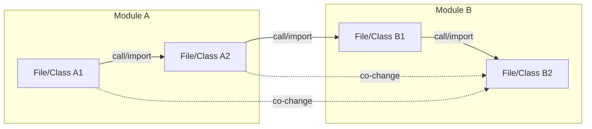

Interpreting this diagram operationally: cross-boundary structural edges (A2→B1) increase propagation cost; persistent cross-boundary co-change edges (A1↔B2, A2↔B2) can indicate hidden dependencies or modularity violations that should influence how an automated refactoring chunks work and how verification is scoped. citeturn29view3turn17view3turn19view1  

## Implications for AI-assisted code rewriting

This section maps the metric landscape to concrete design choices for AI-assisted editing when the goals include **safety**, **auditability**, and **evolvability**—not only functional correctness.

### Chunking and context selection guided by coupling and boundaries

**Why chunking must be dependency-aware.** SWE-bench explicitly frames repository-scale editing as multi-location changes in a large codebase and reports that reference fixes on average touch multiple files/functions. citeturn41view1turn41view0  

A practical AI system should therefore treat “what context to include” as an algorithmic decision, using:

- **Top-N change-coupled neighbors** of edited entities (evolutionary coupling). This is directly aligned with ROSE-style recommendations and with the finding that logical dependencies can dominate in explanatory power. citeturn16view2turn16view3turn19view1  
- **Boundary-aware scoping**: prioritize keeping an AI edit within a module boundary unless the coupling graph indicates cross-boundary co-change is required—because cross-boundary edits amplify verification scope and reviewer burden. citeturn39view2turn17view3turn37view0  

### Prompting strategies as a controllable risk factor

Empirical AI-refinement work shows performance depends strongly on **prompt and temperature**, and it explicitly builds new datasets to mitigate training contamination risk. citeturn45view4turn45view5  

Root causes for incorrect outputs include ambiguous/vague human comments (model cannot infer exact change) and “model fallacy” cases where comments are clear to humans yet the model fails—suggesting that safety and auditability require **explicit, structured intent specifications** (e.g., invariants, pre/postconditions, do-not-change constraints). citeturn46view4turn45view4  

### Using edit distance to enforce “minimal change” and staged refactoring

Large-scale transformations can be decomposed into smaller, reviewable steps. Two empirical lines support this:

- Defect and QA studies show that change size/diffusion is risk-increasing, and that cost-effectiveness peaks at relatively small inspection budgets (often 10–20% effort), reinforcing that a refactoring pipeline should produce **small, high-confidence deltas** first. citeturn37view5turn35view3  
- Iterative refactoring experiments observe a stabilization pattern: early iterations dominated by systematic renaming, later iterations converge toward smaller changes—suggesting that “multi-pass refactoring” can be a viable control strategy for AI systems (rename pass → structure pass → cleanup pass). citeturn46view5turn46view6  

### Verification: from test-only to multi-layer validation

**Tests remain central** in real-world benchmarks: SWE-bench uses test outcomes as the execution ground truth, and reports test-transition counts (fail→pass, pass→pass) and change statistics by repository. citeturn46view7turn41view0  

But for large-scale refactoring and automated transformation, tests alone are often insufficient for auditability/evolvability. The mature automation literature suggests layering:

- **Rule-constrained transformations (semantic patches).** SmPL semantic patches embed developer invariants directly, preserve code structure/readability, and give developers control over false positives—supporting auditability at scale. citeturn43view0turn43view1turn43view2  
- **Semantically-aware, compiler-grade rewriting.** Large-scale tools extract ASTs and use matchers to produce edits, enabling systematic migrations and repeated re-runs on evolving codebases. citeturn41view8turn41view9  
- **Translation validation / equivalence checking where feasible.** Translation validation proposes “check each compilation” rather than proving the compiler correct, arguing practical infrastructure costs comparable to a compiler pass; conceptually, this is a blueprint for validating transformation steps (including refactoring) rather than trusting the transformer. citeturn41view4turn41view6  

### Provenance and audit artifacts as first-class outputs

A key observation from tool-centric research is that *understandability* and *maintainability* constraints must be preserved (e.g., retaining whitespace/comments in Coccinelle-generated patches). For AI tools, this generalizes into a provenance contract:

- Store the model’s “edit intent” boundaries (what was supposed to change, what must not change). citeturn43view1turn39view2  
- Store the metric deltas: churn, diffusion, impacted dependency scopes, and coupling-based neighbor sets used for context. citeturn37view0turn29view3turn16view1  
- Store verification evidence: tests run, static checks, and any equivalence arguments/validators used. citeturn41view0turn41view4  

### Diagram: a metric-driven, verification-centered AI refactoring pipeline

```mermaid
flowchart TD
  A[Extract metrics\n(churn/edit size, diffusion,\nco-change, propagation cost,\nsemantic cohesion)] --> B[Plan change\n(chunk by module boundaries + coupling)]
  B --> C[Generate transformation\n(LLM edit or rule-based codemod)]
  C --> D[Verify\n(build + tests + static analysis\n+ targeted checks on coupled areas)]
  D -->|fail| B
  D --> E[Audit package\n(diff + rationale + metrics + provenance\n+ reproducible commands)]
  E --> F[Human review + merge]
  F --> G[Post-merge monitoring\n(regressions, rollback path)]
```

This flow is directly motivated by: (i) churn/diffusion-driven risk and effort-aware evaluation; (ii) discrepancy and hidden-dependency findings; and (iii) established transformation systems that privilege validation and maintainability. citeturn37view5turn17view3turn41view4turn43view1  

### Practical recommendations table

| Target | Recommendation | Metric triggers / thresholds (from literature when available) | Rationale tied to safety/auditability/evolvability |
|---|---|---|---|
| Engineers | Prefer refactoring PRs that are **small and staged**, separating semantics-preserving refactors from behavior changes | Use churn (LA+LD) and NF as review-budget proxies; effort-aware results suggest ROI peaks often at ~10–20% effort cutoffs (project-dependent) | Smaller deltas reduce regression surface area and make code review and rollback more reliable. citeturn37view5turn35view3 |
| Engineers | Treat **cross-module edits** as “high ceremony” changes | Use propagation-like reachability or boundary-crossing ratios; large redesign reduced propagation cost dramatically, showing how impactful boundary work is | Cross-boundary edits multiply impacted invariants and required review scope. citeturn29view3turn28view0 |
| Engineers | Mine **co-change neighbors** before starting a refactor; update them in the same change or add explicit contracts/tests | A support count around ~10 is argued as “strong” in one tool; tune per repo | Prevent partial migrations that leave latent inconsistencies. citeturn16view1turn16view2 |
| Engineers | Use modularity-violation discovery to prioritize architectural refactors | Violations can be detected ~5–6 releases before refactor; large fractions can be “hidden” (no explicit deps) | Targets high-leverage architectural debt that drives repeated nonlocal change. citeturn17view2turn17view3 |
| Engineers | Increase semantic cohesion before large refactors (rename/structure cleanup) | Track semantic cohesion (e.g., C3-style) or semantic coupling; validate naming/doc quality | Higher cohesion improves understandability and reduces brittle cross-cutting edits. citeturn20view0turn21view0 |
| AI tool designers | Use **metric-driven context selection** rather than “current file only” | Include top change-coupled neighbors; include boundary/interface files; include tests in impacted scope | Addresses multi-location nature of realistic tasks; reduces omission errors. citeturn41view1turn16view2turn19view1 |
| AI tool designers | Constrain edits toward **minimal AST/script changes** and produce structured edit scripts | Use AST differencing (e.g., GumTree); compare generated patch vs minimal-edit baselines | Improves provenance, reviewability, and reduces unintended drift. citeturn34view0turn35view3 |
| AI tool designers | Prefer **rule-based / semantic-patch** transformations for repetitive or safety-critical patterns; fall back to LLM only where rules fail | SmPL-style patches encode invariants and preserve code layout for maintainability | Maximizes auditability, reproducibility, and controlled false-positive rates. citeturn43view0turn43view1 |
| AI tool designers | Make verification multi-layer: tests + static rules + equivalence-style validation where feasible | Translation validation shows per-transformation checking can be practical in compiler setting | Compensates for model fallacies and ambiguous intent; improves safety claims. citeturn41view4turn46view4 |
| AI tool designers | Log and expose **prompting and settings** (prompt templates, temperature) as part of provenance | Refactoring/refinement outcomes depend on prompts/settings; datasets attempt to avoid contamination | Supports reproducibility and audit trails in regulated environments. citeturn45view4 |
| AI tool designers | Support **iterative refactoring** with stabilization gates | Iterative study shows early rename-heavy passes and later stabilization into smaller edits | Allows controlled convergence; each iteration has smaller diff and clearer review. citeturn46view5turn46view6 |

## Limitations and open problems

### Limitations in the current evidence base

**Proxy mismatch: “defect proneness” is not the same as “refactorability.”** Many results connect metrics to defects, effort, or prediction performance, which are informative but indirect proxies for “ease of automated transformation.” Causal direction can be confounded (e.g., complex modules both change more and have more defects). citeturn35view3turn37view0turn19view1  

**Measurement instability across representations and projects.** Tool and representation differences (line diff vs AST diff; coarse vs fine AST) can change conclusions about edit-script size and “closeness to developer intent.” citeturn34view0turn32view4  

**Thresholds are rarely universal.** Even where a threshold is proposed (e.g., support count ~10 as strong), authors typically acknowledge normalization and project dependence; Clio-style tools seek thresholds by maximizing accuracy per dataset. citeturn16view1turn17view1  

**Historical coupling depends on adequate history and clean transactions.** Co-change signals can be noisy (mega-commits, formatting-only commits, mixed-purpose commits), and some studies explicitly treat history sufficiency and threshold selection as open concerns. citeturn17view3turn16view6  

**AI evaluation threats: contamination and specification ambiguity.** AI/refinement studies explicitly worry that datasets might be in training data and create new datasets; they also show that vague comments and model fallacies drive failures—limitations that are orthogonal to code metrics but interact with them (semantic cohesion can reduce ambiguity, but cannot remove it). citeturn45view4turn46view4turn21view0  

### Open problems especially relevant to AI-assisted, safe refactoring

**Metric-aware equivalence checking for general refactorings.** Translation validation is compelling as a paradigm (“verify each transformation”), but extending practical equivalence checking beyond compiler transformations to refactoring rewrites across languages and frameworks remains difficult. citeturn41view4turn43view5  

**Combining semantic cohesion with dependency locality into robust “refactor chunks.”** We have strong evidence that semantic signals align with human perception and that propagation/locality measures capture structural blast radius; building stable chunking algorithms that jointly optimize these objectives—and that remain robust under code evolution—is still largely a research frontier. citeturn21view0turn29view4turn30view2  

**Auditable agentic workflows.** Early evidence from iterative refactoring experiments shows convergence behavior, but we lack standardized, widely accepted audit formats that record prompt settings, metric deltas, artifact selection, and verification evidence in a way that is interoperable across tools and organizations. citeturn46view6turn45view4turn41view0  

**Regression risk prediction under refactoring vs behavior change.** Refactoring-specific bug association rates (e.g., 15% overall with strong variation by refactoring type) indicate the need for models that differentiate “pure refactor” from “tangled change,” but reliable automated labeling remains challenging and sensitive to detection tooling. citeturn24view0turn32view4  

## Source links

```text
Foundational modularity & boundaries
- Parnas (1972) “On the Criteria To Be Used in Decomposing Systems into Modules” (PDF):
  https://wstomv.win.tue.nl/edu/2ip30/references/criteria_for_modularization.pdf

Dependency locality / propagation metrics (DSM lineage)
- MacCormack, Rusnak, Baldwin (HBS WP 05-016; forthcoming Management Science 2006) (PDF):
  https://www.hbs.edu/ris/Publication%20Files/05-016.pdf

Change coupling and dependency/defect links
- Zimmermann et al. (2005) “Mining Version Histories to Guide Software Changes” (PDF):
  https://thomas-zimmermann.com/publications/files/zimmermann-tse-2005.pdf
- Cataldo et al. (2009) “Software Dependencies, Work Dependencies, and Their Impact on Failures” (PDF):
  https://herbsleb.org/web-pubs/pdfs/cataldo-software-2009.pdf
- Clio modularity violations (ICSE 2011) (PDF):
  https://web.cs.ucla.edu/~miryung/Publications/icse11-modularityviolation.pdf

Edit distance / AST differencing
- Zhang & Shasha (1989) Tree edit distance (PDF mirror):
  https://scispace.com/pdf/simple-fast-algorithms-for-the-editing-distance-between-2tkcv0qmd9.pdf
- GumTree (ASE 2014) (PDF):
  https://www.labri.fr/perso/xblanc/data/papers/ASE14.pdf
- ChangeDistiller (IEEE TSE 2007) (PDF mirror):
  https://notes.billmill.org/images/Change_DistillingTree_Differencing_for_Fine-Graine.pdf

Churn / change size and defect risk
- Nagappan & Ball (ICSE 2005) “Use of Relative Code Churn Measures to Predict System Defect Density” (PDF):
  https://www.st.cs.uni-saarland.de/edu/recommendation-systems/papers/ICSE05Churn.pdf
- Hassan (ICSE 2009) change complexity/entropy (PDF):
  https://sailresearch.github.io/sail-website/data/pdfs/ICSE2009_PredictingFaultsUsingTheComplexityOfCodeChanges.pdf
- Kamei et al. (IEEE TSE 2013) JIT quality assurance (PDF):
  https://das.encs.concordia.ca/pdf/Kamei_TSE2013.pdf

Semantic cohesion / coupling and refactoring recommendation
- Marcus & Poshyvanyk conceptual cohesion (C3) (PDF):
  https://www.cs.wm.edu/~denys/pubs/marcusa-Cohesion.pdf
- Bavota et al. (ICSE 2013) developers’ coupling perception (PDF):
  https://people.lu.usi.ch/bavotg/papers/icse2013_Coupling.pdf
- Methodbook (TSE preprint) (PDF):
  https://www.cs.wm.edu/~denys/pubs/TSE-MethodBook-PREPRINT.pdf

Refactoring-induced bugs
- “When does a Refactoring Induce Bugs?” (SCAM 2012) (PDF):
  https://people.lu.usi.ch/bavotg/papers/scam2012.pdf

Safe automated transformation & validation
- Necula (PLDI 2000) translation validation (PDF):
  https://people.eecs.berkeley.edu/~necula/Papers/tv_pldi00.pdf
- Coccinelle impact & design (USENIX ATC 2018) (PDF):
  https://www.usenix.org/system/files/conference/atc18/atc18-lawall.pdf
- Coccinelle semantic patching example (EDCC 2010 OpenSSL paper) (PDF):
  https://lig-membres.imag.fr/palix/papers/edcc10-lawall-PID1147373.pdf
- ClangMR large-scale refactoring (PDF):
  https://research.google.com/pubs/archive/41342.pdf

AI-assisted code editing / refactoring evaluation datasets
- SWE-bench (ICLR 2024) (PDF):
  https://proceedings.iclr.cc/paper_files/paper/2024/file/edac78c3e300629acfe6cbe9ca88fb84-Paper-Conference.pdf
- ChatGPT code refinement (ICSE 2024) (PDF):
  https://homepages.dcc.ufmg.br/~figueiredo/disciplinas/papers/icse2024guo.pdf
- Iterative readability refactoring with LLMs (arXiv 2026) (PDF):
  https://arxiv.org/pdf/2602.21833
```

10.
# Empirical Evidence on Module, File, and Token Size vs Software Quality

## Executive summary

Across decades of empirical software engineering, “size” (module/file/method length; lines changed; sometimes token-based proxies) is consistently associated with quality outcomes—but **the association is not a single monotone “smaller is always better” law**. Strong studies show three recurring patterns:

First, **larger units tend to contain more *absolute* faults**, and size often remains a strong predictor even after controlling for other factors in industrial release studies. A canonical example is a file-level fault-count model on two large industrial systems where the coefficient on log(LOC) is near 1, consistent with faults roughly proportional to LOC once other factors are controlled; change status and history still matter strongly. citeturn22view0

Second, **size frequently loses explanatory power once you condition on change/process history** (how often code is touched, how big and recent changes are, etc.). In an unusually detailed industrial change-history study, change history variables dominate; once the number of changes is accounted for, LOC provides little extra predictive power for future faults. citeturn21view0

Third, many “size is bad” claims are **highly sensitive to (a) the outcome definition (fault *count* vs fault *density* vs change-induced defects vs build failures), (b) the unit of analysis (file/class/module vs change/commit vs build), and (c) confounding/collinearity**. A widely cited demonstration shows that many OO metrics appeared predictive until controlling for size; afterward, their associations disappeared—an explicit caution that practitioners can mistake “metric correlates with size” for “metric independently predicts quality.” citeturn25view0turn26view3

Recent large-scale MSR work strengthens the case that **“change size” (lines/files touched) is a practical, robust risk signal** for short-term quality outcomes (defect-inducing commits, CI build failures). In a large multi-project just-in-time quality assurance study, size-related change factors (e.g., lines added/deleted; lines of code in file before change; number of files touched) show statistically significant, context-dependent odds ratios across OSS and commercial systems. citeturn2view0turn30view0turn30view1 A separate MSR study on 1,090 projects and 3.6M builds finds that higher changed-lines and changed-files measures correlate with unsuccessful builds with small-to-medium standardized effects. citeturn38view0turn39view3

Practical wording that best matches the evidence is: **“Size is a useful risk proxy, but it is not a standalone quality goal. Prefer reviewable change sizes and keep local units small enough to understand—while monitoring coupling, churn, and fragmentation costs.”** This phrasing aligns with both the strongest industrial observational studies and controlled maintenance/comprehension experiments. citeturn21view0turn22view0turn40view0turn44view0

## Scope, definitions, and evidence standards

This report focuses on **empirical** (measured) relationships between (a) *module/file/method size* and related size proxies and (b) quality outcomes: defects/faults, maintainability and maintenance effort, comprehension and activity cost, and change failure (e.g., build failures; defect-inducing changes). citeturn46view0turn21view0turn2view0turn44view0

### What “size” means in the cited studies

“Size” is operationalized in multiple ways:

- **Static size of a code unit**: LOC/SLOC per file or class; method SLOC; sometimes “lines of code in file before the change.” citeturn22view0turn26view2turn30view0turn40view0  
- **Change size**: lines added/deleted/modified; number of files/directories/subsystems touched; churn ratios. citeturn30view0turn32view0turn2view0turn38view0  
- **Token-count proxies**: often captured indirectly through Halstead-style counts or similar token-based complexity measures; these are discussed as part of the broader “size/complexity correlated” family and sometimes embedded in composite indices (e.g., maintainability index variants). citeturn40view0turn20view0turn46view0  

### Evidence-strength rubric used here

The “strongest” studies emphasized below generally have one or more of:

- **Large, longitudinal datasets** (multi-release industrial systems; many projects/builds). citeturn22view0turn21view0turn38view0turn39view3  
- **Explicit statistical modeling with controls** (e.g., negative binomial / Poisson GLMs; logistic regression with odds ratios; survival models). citeturn22view0turn21view0turn2view0turn16view0  
- **Clear threats-to-validity discussion and/or replication artifacts** (public datasets, code, or at least repeatable pipeline on public repositories). citeturn40view0turn39view3turn30view0  

## Defects and fault-proneness evidence

### File/class/module size and fault counts in large systems

A classic industrial result models **expected fault counts per file** using **negative binomial regression** to handle overdispersed count data, incorporating file code attributes and history-based predictors. The study spans **two large industrial systems** (one with **17 quarterly releases over 4 years**, another with **9 releases over 2 years**) and evaluates predictive concentration: the top 20% most fault-prone files (by prediction) contain **71%–92%** of observed faults, averaging **83%**. citeturn22view0

Importantly for “size”:

- The coefficient on **log(LOC)** is reported as **1.047**, with a confidence interval including 1.0—interpretable as being **consistent with faults proportional to LOC** once controlling for other variables, i.e., (approximately) **constant fault density** in that model’s sense. citeturn22view0  
- Change status has large multiplicative effects: “changed files” and “new files” are estimated at about **2.9×** and **6.4×** the expected faults, respectively, all else equal (via exponentiated coefficients). citeturn22view0  

This study is strong for external validity within “large industrial release engineering,” but its **unit is file**, its defect definition is aligned to that environment, and its predictive aim is “where faults will be,” not causal mechanism. citeturn22view0

### When size “stops mattering” after you control for process history

A similarly influential industrial analysis predicts future faults from **software change history** in a large, long-lived system. The dataset includes a **1.5M LOC subsystem**, **80 modules**, about **130,000** recorded changes, and predicts faults in a future **two-year interval** using only information available before that interval. citeturn21view0

Key size-related findings:

- Process measures (e.g., how often modules changed) outperform product snapshot measures (like LOC) in predicting fault incidence; the paper explicitly notes that **LOC is not helpful once number-of-changes information is included**, and that many complexity metrics add little because they correlate strongly with LOC in this dataset. citeturn21view0  
- The “best” model weights **large, recent changes** more heavily, implying that *change size* interacts with time (recency) and is central to fault potential. citeturn21view0  

This is one of the clearest cases where “module/file size” alone is **not** the main actionable predictor once you have rich process data. citeturn21view0

### Nonlinear and “counter-intuitive” size–defect relationships

A major thread in the literature challenges simplistic linear thinking (“bigger ⇒ worse density”). A multi-project TSE study explicitly investigates the **functional form** of the size–defect relationship using class-level data from **four large OO products** (including **Mozilla, Cn3d, JBoss, Eclipse**) and argues that the relationship is **logarithmic**: defect proneness increases with size but at a slower rate, making **smaller classes proportionally more problematic**. citeturn16view0

Two methodological contributions from this line of work are especially relevant:

- It critiques inference based on **defect density vs size** plots as potentially misleading (ratio/“reciprocal” artifacts) and emphasizes modeling approaches that work with evolving entities and recurrent events rather than one snapshot. citeturn16view0  
- It provides a concrete cost-effectiveness illustration (e.g., allocating inspection resources to smaller classes can outperform focusing only on large classes in some projects), which is a stronger “decision framing” than a raw correlation. citeturn16view0  

Complementing that, a major industrial case study on faults and failures in two releases dedicates a full hypothesis set to size metrics (LOC) and discusses prior counter-intuitive findings: fault density can appear to **decrease with module size**, plausibly due to interface-fault distribution and the prevalence of small modules, while also warning that making modules “too small” can push complexity into interfaces. citeturn47view1turn46view0

### Confounding and collinearity: size as the “hidden driver”

A seminal confounding demonstration analyzes a **C++ telecommunications framework** with **174 classes**, **192 field-failure faults**, and **14 programmers** as the development population, evaluating CK and related OO metrics against **fault-proneness**, with **LOC as the size covariate**. citeturn26view1turn26view3turn25view0

Two results are central:

- Many OO metrics are strongly correlated with size (example Spearman ρ values: WMC 0.88, RFC 0.88; others moderate), meaning that univariate validation can be “optimistic” by rediscovering size. citeturn26view3  
- After controlling for class size, the study reports that the previously “validated” associations disappear (in this dataset), implying that some metric→defect claims are actually size→defect in disguise. citeturn25view0turn26view1  

This doesn’t show “size causes defects,” but it strongly supports a practical recommendation: **any empirical study (or internal dashboard) claiming a metric predicts defects must show what happens when size is controlled.** citeturn25view0turn26view3

## Maintainability and change outcomes

### Method size and longitudinal maintenance effort proxies at scale

A recent MSR study directly targets “what method size is maintainable” in **Java**, using **49 open-source projects** and extracting **785,606 methods**, excluding getters/setters and controlling for method age by excluding revisions/bugs after the first two years of a method’s life. citeturn40view0turn41view2turn42view3

Study design highlights:

- **Maintenance outcomes / proxies**: multiple method-level indicators such as number of revisions, added lines, diff size, edit distance, and bug-related commits (used as bug-proneness proxy). citeturn42view3turn40view0  
- **Statistics**: nonparametric Kendall’s τ for correlation, Wilcoxon rank-sum for distribution differences, and Cliff’s delta as effect size (with explicit thresholds for negligible/small/medium/large). citeturn42view1turn42view2turn42view3  

Core results relevant to “size”:

- Method SLOC correlates with both change- and bug-proneness indicators across projects (distributional evidence shown via CDFs of Kendall τ). citeturn42view3turn40view0  
- A data-driven thresholding approach yields a practical recommendation: **keep methods ≤ 24 SLOC**; differences between “small” and “medium” methods are frequently statistically significant and often medium-to-large effect sizes, while differences at higher size bands tend to compress to negligible/small. citeturn42view2turn42view3  
- The study also constructs an inference about decomposition: groups of small methods (merge candidates) tend to be collectively less change/bug-prone than an equivalent-size single large method, supporting refactoring toward smaller methods—while explicitly acknowledging coupling trade-offs. citeturn41view0turn42view3turn40view0  

This paper is unusually actionable because it combines scale, explicit thresholds, and effect-size reporting; its biggest validity risk is that “maintenance effort” is proxied (change/bug proneness) rather than directly measured as human-hours. citeturn40view0turn42view3

### Change size and defect density (industrial, large-scale binaries)

A rigorous industrial study of **relative code churn** shows how “size of change” relates to defects, using Windows binary-level granularity with defect density (defects/KLOC). Dataset size is **2,465 binaries**, trained/test split methods are used, and multiple statistical approaches are compared. citeturn32view1turn32view1turn32view1

Key results:

- **Relative churn measures** show strong positive correlations with defects/KLOC (e.g., a churn ratio measure M1 has correlation **0.883** with defects/KLOC; other ratios are smaller but still positive). citeturn32view0  
- Regression using relative measures achieves high fit (e.g., **R² ≈ 0.821** in one reported regression fit table), while **absolute churn measures** perform poorly in their PCA regression comparison (reported R² ≈ 0.026). citeturn31view2turn32view1  

Interpretation for practitioners: “how big the change is relative to the component” can matter more than raw churn totals, and many churn metrics are strongly intercorrelated—so feature selection and careful interpretation are necessary. citeturn32view0turn32view1

### Change-induced defects across OSS and commercial projects

A large, multi-project “just-in-time quality assurance” study examines **defect-inducing changes** using **11 projects**: six well-known OSS projects (Bugzilla, Columba, Mozilla, Eclipse JDT, Eclipse Platform, PostgreSQL) plus five commercial projects (C-1…C-5), mined from CVS history, in **C/C++ and/or Java**. citeturn27view1turn2view0turn30view0

Size-related independent variables include:

- Lines added (LA), lines deleted (LD), and file size before change (LT). citeturn30view0turn27view2  
- Diffusion/“scope” size such as number of files touched (NF), plus entropy-based spread metrics. citeturn30view0turn30view0  

Statistical approach:

- Logistic regression with odds ratios (including stepwise selection), plus an “effort-aware” modeling variant that accounts for inspection/review effort. citeturn29view0turn28view0turn30view1  

Main findings about “size” are nuanced:

- Odds-ratio patterns differ by OSS vs commercial context; nevertheless, factors like **number of files (NF)** and **relative churn metrics** are repeatedly highlighted as influential for defect-inducing changes, with age effects differing across contexts. citeturn29view0turn30view1  
- The paper explicitly warns that effect direction and meaning depend on what other covariates are in the model and on defect-definition differences between OSS vs commercial reporting. citeturn29view0turn27view1  

## Comprehension cost and human factors evidence

Direct causal evidence linking “file size” to comprehension cost is rarer than defect modeling, because it requires controlled tasks and fine-grained measurement. One of the more informative controlled designs reanalyzes a prior dataset from professional maintenance tasks and decomposes effort into **activity-level costs**: reading, editing, searching, navigating. citeturn44view0

### Activity-level effort: file size vs change size vs smells

In a controlled maintenance experiment:

- **Participants and systems**: six professional developers; three maintenance tasks; four functionally equivalent Java systems; activity logs collected via an IDE plugin; activities inferred via annotation scheme. citeturn44view0  
- **Modeling**: multiple linear regression used to assess how smells, file size, and change size affect effort by activity type. citeturn44view0  
- **Main size-related result**: the **size of the changes performed** impacts the effort of *all* activities more than code smells and file size; additionally, **file size impacts reading and searching effort more than smells**, while smells can dominate file size for editing/navigating effort in that dataset. citeturn44view0  

This provides a practical “comprehension cost” framing: **big changes are expensive across the board; large files primarily tax reading/searching**, even when other structural issues are present. citeturn44view0

## Causality, confounders, and replication

### What counts as “causal” evidence here

Most high-impact studies in this area are **observational** (mining historic repositories; industrial defect logs). They can estimate associations with controls but cannot fully establish causality because developers adapt behavior based on risk (e.g., more testing or scrutiny for large components), and because many determinants co-evolve (size, churn, coupling, ownership). citeturn21view0turn22view0turn2view0turn25view0

Controlled experiments exist (maintenance tasks with professionals), but they are typically small and context-specific, trading external for internal validity. citeturn44view0

### Recurrent confounders and why “small is best” can flip sign

The strongest empirical papers repeatedly surface these confounder classes:

- **Change history / churn**: frequency and size of edits can dominate fault prediction beyond static size. citeturn21view0turn47view1  
- **Prior faults and age**: prior defects and entity age influence future defects (sometimes older code has fewer faults once other factors are controlled). citeturn21view0turn22view0turn30view0  
- **Collinearity with other metrics**: OO metrics, complexity and token measures often correlate strongly with LOC, producing spurious “validation” unless size is controlled. citeturn26view3turn25view0turn40view0  
- **Outcome definition**: fault *count* vs fault *density* vs defect-inducing *changes* vs CI build failures can yield different directional conclusions. citeturn22view0turn32view0turn38view0turn46view0  

This is why the literature contains apparently conflicting claims such as “bigger modules have more faults” and “smaller modules are proportionally more problematic.” Both can be true simultaneously depending on whether one looks at totals or rates and how work is distributed. citeturn22view0turn16view0turn47view1

### Replication status and data accessibility

Replication is uneven:

- Several influential industrial system studies rely on proprietary data (e.g., multi-release industrial fault prediction; Windows binaries churn study; some commercial projects in JIT defect prediction), limiting independent replication. citeturn22view0turn32view1turn27view1  
- Some newer MSR work provides explicit replication hooks via public datasets or code packages: the CI build-failures-at-scale study uses a named TravisTorrent snapshot and documents dataset composition; the maintainable-method-size study points to a public dataset repository. citeturn39view3turn40view0turn41view2  

## Evidence table, charts, and practical language

### Study summary table

| Citation | Year | Dataset (language, scale, time) | Size metric(s) | Quality / outcome metric(s) | Method | Reported effect size(s) | Key limitations / threats |
|---|---:|---|---|---|---|---|---|
| Quantitative analysis of faults and failures in a complex software system (IEEE TSE) citeturn46view0turn47view1turn47view2 | 2000 | Industrial system; **two releases**; modules **~37 to 8,458 LOC**; faults tracked across multiple phases including postrelease operation citeturn47view2turn47view1 | LOC per module; discusses size intervals and density pitfalls citeturn47view1turn47view3 | Fault counts and fault density; prerelease vs postrelease faults; failure-proneness framing citeturn47view2turn47view0 | Hypothesis-driven analysis; scatter plots / Alberg diagrams; correlation checks; explicit validity critique citeturn47view3turn47view0 | Operational faults highly concentrated (e.g., large share of faults in small share of size); highlights counter-intuitive density trends noted in prior work and warns density-vs-size can mislead citeturn47view1 | Proprietary context; some results are interpretive; emphasizes measurement pitfalls; limited generalization without replications citeturn47view1turn47view3 |
| Predicting fault incidence using software change history (IEEE TSE) citeturn21view0 | 2000 | Industrial telephone switching subsystem; **~1.5M LOC**, **80 modules**, **~130k changes**; predicts faults in a **2-year** future window citeturn21view0 | Module LOC; change size/recency proxy via deltas citeturn21view0 | Fault incidence counts per module over time citeturn21view0 | GLM with log link (Poisson); compares product vs process measures citeturn21view0 | “#times changed” beats module length; LOC not helpful after controlling change counts; older module ≈ fewer faults (conditional) citeturn21view0 | Proprietary; module defined as collection of files; causal direction unclear (changes may respond to defects) citeturn21view0 |
| Predicting the location and number of faults in large software systems (IEEE TSE) citeturn22view0 | 2005 | Two industrial systems: **17 quarterly releases (4 yrs)** and **9 releases (2 yrs)**; file-level data citeturn22view0 | LOC (log); file age; change status; historical faults; file type/language citeturn22view0 | Fault counts in next release; also discusses fault density targeting citeturn22view0 | Negative binomial regression; prospective release-by-release evaluation citeturn22view0 | log(LOC) coefficient **1.047** (≈ proportional); changed files ≈ **2.90×**, new files ≈ **6.4×** expected faults; top 20% predicted files contain **71–92%** of faults citeturn22view0 | Proprietary; defect definition tied to process; focuses on prediction, not causal mechanism; risk of “more testing on big files” feedback citeturn22view0 |
| Confounding effect of class size in OO metric validation (tech report / TSE-aligned) citeturn25view0turn26view1turn26view3 | 2001 | C++ telecom framework; **174 classes**, **192 field-failure faults**, **14 programmers** citeturn26view1 | Class size in LOC; OO metrics strongly correlated with LOC citeturn26view3 | Class fault-proneness (field failure) citeturn26view1turn25view0 | Univariate vs size-controlled analyses; presents a confounding methodology citeturn25view0turn26view1 | Example correlations: WMC ρ=0.88, RFC ρ=0.88 with LOC; after controlling for size, previously significant metric associations disappear in this dataset citeturn26view3turn25view0 | Not proving size causes faults; one system; risk that “control for size” model form affects conclusions; nevertheless a strong warning about biased validation citeturn25view0turn26view3 |
| Module size effects in defect prediction (PROMISE) citeturn14view0 | 2005 | Five NASA datasets (CM1, JM1, KC1, KC2, PC1); thousands of modules; reports LOC distribution summaries citeturn14view0 | LOC per module; partitions by module size citeturn14view0 | Defective module (binary: ≥1 defect) citeturn14view0 | Multiple ML algorithms; evaluates prediction on size-partitioned subsets citeturn14view0 | Prediction performance higher on subsets containing larger modules; highlights that many modules are very small, affecting learning citeturn14view0 | NASA PROMISE datasets have known labeling/representativeness concerns; focuses on predictor performance, not causal size effects citeturn14view0 |
| Functional form of size–defect relationship (IEEE TSE) citeturn16view0 | 2009 | Four large OO products (Mozilla, Cn3d, JBoss, Eclipse); long-lived histories citeturn16view0 | Class LOC; explores transforms / link functions citeturn16view0 | Defect proneness via defect fixes over time (recurrent events framing) citeturn16view0 | Cox proportional hazards with recurrent events; investigates functional form, critiques density plots citeturn16view0 | Size effect significant but **sublinear/logarithmic**; smaller classes proportionally more problematic; resource-allocation example indicates focusing QA on smaller units can be >2× cost-effective in cited cases citeturn16view0 | Still observational; defect-fix mapping issues; assumes defect-fix events represent proneness; project-specific mechanisms plausible citeturn16view0 |
| Relative code churn and defect density in Windows binaries (ICSE) citeturn32view0turn32view1turn31view2 | 2005 | Industrial (Windows) dataset: **2,465 binaries**; reports data splits for validation citeturn32view1 | Relative churn ratios (e.g., churned LOC / total LOC); compares against absolute churn measures citeturn31view2turn32view0 | Defects/KLOC (defect density) citeturn32view0 | Spearman/Pearson correlation; regression (incl. stepwise; PCA comparison); data splitting citeturn32view1turn32view0 | Spearman with defects/KLOC: M1 **0.883**, M2 **0.798**, M3 **0.868**; regression fit R² ≈ **0.821**; absolute measures PCA regression R² ≈ **0.026** citeturn32view0turn32view1turn31view2 | Proprietary + binary-level unit; correlation among churn metrics high; risk of process confounds (hot code churns more and has more defects) citeturn32view0turn31view2 |
| Large-scale just-in-time QA (IEEE TSE) citeturn2view0turn30view0turn30view1 | 2013 | **11 projects**: 6 OSS + 5 commercial; CVS history; C/C++/Java citeturn27view1turn2view0 | Change size (LA/LD/LT); diffusion scope (NF/ND/NS); entropy; experience; history citeturn30view0turn30view1 | Defect-inducing change probability (commit-level) citeturn2view0 | Logistic regression with odds ratios; effort-aware modeling variant; stepwise selection citeturn29view0turn28view0turn2view0 | Table-level odds ratios show NF and relative churn metrics often risk-increasing; AGE often risk-decreasing in OSS; patterns vary by project and OSS vs commercial context citeturn30view1turn30view0turn29view0 | Commercial projects not replicable; defect-inducing identification assumptions; odds ratios conditional on chosen covariates; CVS-era extraction limits on modern workflows citeturn29view0turn2view0 |
| CI build failures at scale (MSR) citeturn38view0turn39view3 | 2017 | TravisTorrent snapshot; **1,090** Java/Ruby projects; **3.6M builds** analyzed citeturn39view3turn39view1 | Task/build size proxies: source code churn (SCC), changed files (FLC), built commits (BCB) citeturn38view0 | Build result: successful vs unsuccessful citeturn38view0turn39view3 | Mann–Whitney–Wilcoxon; chi-squared; Cohen’s d; large-scale comparative analysis citeturn38view0 | SCC d≈**0.34** (medium); FLC d≈**0.36** (medium); TCC d≈**0.213** (small); all statistically significant for SCC/FLC differences citeturn38view0 | Build failure ≠ production failure; build data quality and filtering choices; task definition (push→task) may be imperfect citeturn39view1turn38view0 |
| Maintainable method size in Java (MSR) citeturn40view0turn41view2turn42view3 | 2022 | **49 OSS Java projects**; **785,606 methods**; controls for age, removes getters/setters citeturn41view2turn42view3 | Method SLOC; size categories derived from benchmark-threshold method citeturn42view3turn41view0 | Change & bug-proneness proxies (#revisions, diff/edit metrics, buggy commits); also examines other quality metrics under size control citeturn42view3turn40view0 | Kendall τ; Wilcoxon; Cliff’s δ; cross-project distributional reporting citeturn42view3turn42view1turn42view2 | Recommends **≤24 SLOC**; small↔medium differences often medium/large effect sizes; larger band differences compress; decomposition analysis suggests refactoring large methods helps overall maintenance indicators citeturn42view3turn41view0 | Proxy outcomes; bug labeling via commit heuristics has error; decomposition inference is indirect; OSS-only external validity caveat citeturn40view0turn42view3 |
| Code smells and maintenance activities at activity level (SANER) citeturn44view0 | 2016 | Controlled setting: 4 functionally equivalent Java systems; 6 professionals; activity logs via IDE plugin citeturn44view0 | File size; **change size** (size of changes made); compares with smell presence citeturn44view0 | Activity effort (reading, editing, searching, navigating) as comprehension/maintenance cost citeturn44view0 | Multiple linear regression; compares relative contribution of predictors citeturn44view0 | Change size impacts all activities more than file size; file size impacts reading/searching more than smells; some smells surpass file size for edit/navigate citeturn44view0 | Small-N; task/system specificity; effort measurement depends on logging/annotation; not generalizable alone but strong mechanistic insight citeturn44view0 |

### Charts

#### Timeline of key studies

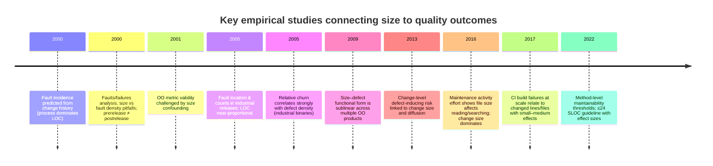

(See the cited primary papers for each point.) citeturn21view0turn46view0turn25view0turn22view0turn32view0turn16view0turn2view0turn44view0turn38view0turn40view0

#### Effect-size “distribution” examples

These are not directly comparable across study designs (correlation vs standardized mean difference), but they give a concrete feel for magnitude in two common reporting families.

**A. Spearman ρ for (relative churn metric → defects/KLOC)** (industrial binaries study)

```
M1 churned LOC / total LOC   0.883 |█████████████████████████████
M2 deleted LOC / total LOC   0.798 |██████████████████████████
M3 files churned / file ct   0.868 |████████████████████████████
M5 weeks of churn / file ct  0.729 |███████████████████████
M4 churn count / files chg   0.288 |█████████
M6 lines worked / weeks      0.374 |███████████
M7 churned LOC / deleted     0.288 |█████████
M8 lines worked / churn ct   0.262 |████████
```

All correlations shown as statistically significant at 0.01 in the table. citeturn32view0

**B. Cohen’s d for (task/build size proxy → unsuccessful build)** (CI builds at scale)

```
Changed lines (SCC)          0.34  |█████████████
Changed files (FLC)          0.36  |██████████████
Changed test lines (TCC)     0.213 |████████
```

Differences are statistically significant for SCC/FLC and accompanied by the reported d values. citeturn38view0

### Mermaid model of relationships between variables

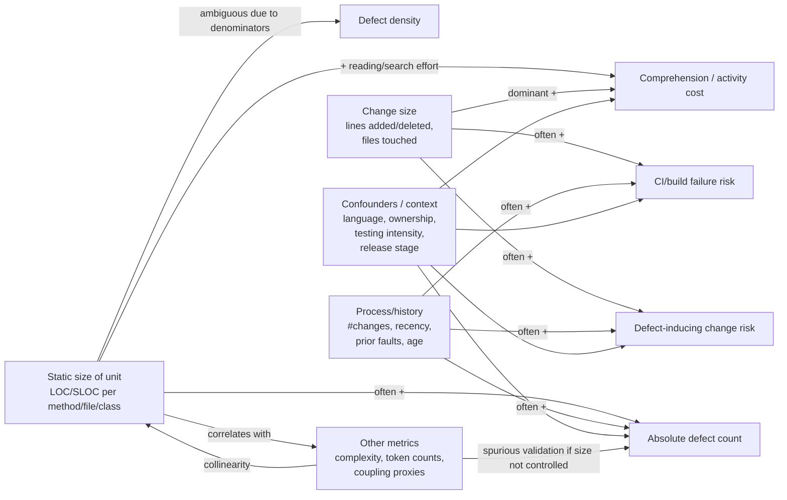

This structure is directly motivated by empirical findings where (i) LOC predicts fault counts in some settings, (ii) churn/change history dominates in others, and (iii) size confounds many metrics unless modeled explicitly. citeturn22view0turn21view0turn25view0turn2view0turn44view0turn38view0

### Practical framing and recommended wording

The most defensible, non-dogmatic guidance is conditional:

When “smaller” tends to help:

- When the unit is a **method** or similarly local unit, evidence supports that keeping it below a practical threshold can reduce change/bug-proneness proxies, with reported medium-to-large effect sizes at small→medium transitions (e.g., ≤24 SLOC in one large Java study). citeturn42view3turn42view2turn40view0  
- When the unit is a **change/PR/build task**, smaller scope (fewer lines/files/commits) is repeatedly associated with lower defect-inducing and build-failure risk in large MSR datasets. citeturn30view0turn30view1turn38view0  

When “smaller” does **not** reliably mean better:

- For **defect density**, several influential analyses argue the size–density relationship can be counter-intuitive or artifact-prone; conclusions depend heavily on denominators and on where complexity is placed (interfaces vs bodies). citeturn47view1turn16view0turn46view0  
- For **metric dashboards**, a major validity threat is that many “quality metrics” are proxies for size; without controlling for size, you may mistakenly treat size as a separate causal factor (or vice versa). citeturn25view0turn26view3turn42view3  

Trade-offs to state explicitly:

- Splitting code can reduce local reasoning load, but may increase **navigation and coupling/interface load**; empirical work on activity effort suggests file size impacts reading/searching, while other structural factors can dominate editing/navigating and change size dominates across activities. citeturn44view0turn41view0  
- “Make files tiny” may increase total number of artifacts and dependency edges; the best evidence supports **purposeful decomposition** (e.g., “keep methods small enough to reason about; avoid giant changes”), not universal minification. citeturn40view0turn44view0turn16view0  

Recommended wording (evidence-aligned):

- **Avoid:** “Large files are bad; always split.”  
- **Prefer:** “Size is a useful *risk signal*. Keep units small enough to review/understand, but evaluate in context (churn, coupling, history, ownership). Use size thresholds as guardrails, not absolutes.” citeturn21view0turn25view0turn40view0turn44view0turn38view0  

### Links to primary sources

```text
Key primary sources used in this report (URLs / DOIs)

Ostrand et al., “Predicting the Location and Number of Faults in Large Software Systems” (IEEE TSE, 2005)
DOI: https://doi.org/10.1109/TSE.2005.49

Graves et al., “Predicting Fault Incidence Using Software Change History” (IEEE TSE, 2000)
PDF: https://cs.uwaterloo.ca/~m2nagapp/courses/CS846/1179/papers/graves_tse98.pdf

El Emam et al., “The Confounding Effect of Class Size on the Validity of Object-Oriented Metrics” (TSE-era tech report / paper lineage, 1999–2001)
ResearchGate full text landing: https://www.researchgate.net/publication/3188171_The_Confounding_Effect_of_Class_Size_on_the_Validity_of_Object-Oriented_Metrics

Koru et al., “An Investigation into the Functional Form of the Size-Defect Relationship for Software Modules” (IEEE TSE, 2009)
ResearchGate full text landing: https://www.researchgate.net/publication/220069337_An_Investigation_into_the_Functional_Form_of_the_Size-Defect_Relationship_for_Software_Modules

Kamei et al., “A Large-Scale Empirical Study of Just-in-Time Quality Assurance” (IEEE TSE, 2013)
PDF: https://das.encs.concordia.ca/pdf/Kamei_TSE2013.pdf

Nagappan & Ball, “Use of Relative Code Churn Measures to Predict System Defect Density” (ICSE 2005)
PDF: https://www.st.cs.uni-saarland.de/edu/recommendation-systems/papers/ICSE05Churn.pdf

Islam et al., “Insights into Continuous Integration Build Failures” (MSR 2017; via ResearchGate mirror)
ResearchGate full text landing: https://www.researchgate.net/publication/318124591_Insights_into_Continuous_Integration_Build_Failures

Chowdhury et al., “An Empirical Study on Maintainable Method Size in Java” (MSR 2022)
PDF: https://arxiv.org/pdf/2205.01842

Soh et al., “Do Code Smells Impact the Effort of Different Maintenance Programming Activities?” (SANER 2016; PDF)
PDF: https://www.ptidej.net/publications/documents/SANER16a.doc.pdf

Coleman et al., “Using metrics to evaluate software system maintainability” (IEEE Computer, 1994; PDF)
PDF: https://www.ecs.csun.edu/~rlingard/comp589/ColemanPaper.pdf

Fenton & Ohlsson, “Quantitative analysis of faults and failures in a complex software system” (IEEE TSE, 2000; PDF mirror)
PDF: https://www.openu.ac.il/home/wiseman/2os/bugs/fenton.pdf
```

11.
# Scientific Validation of a Proprietary Software Architecture Metric

## Executive summary

A software architecture metric becomes *scientifically credible* when it is (a) explicitly tied to a theoretical construct and information need, (b) specified with enough precision that independent researchers can implement it, and (c) supported by a *portfolio of validation evidence*—not just correlations on a convenient dataset. This view aligns with established measurement-process standards (measurement definition, application, and evaluation of validity) and software-metrics methodology guidance. citeturn0search0turn0search4turn0search3turn9search0

For a metric intended to distinguish **clean modular systems** from **architecture drift/erosion** and from **AI-generated low-quality code**, scientific credibility hinges on three technical requirements that are often missing in proprietary metrics: (1) a *construct model of modularity and drift* that makes falsifiable claims about what the metric should do, (2) a benchmark strategy that yields defensible labels (including inter-rater reliability and leakage controls), and (3) discriminative evaluation that reports *effect sizes, uncertainty, and robustness to confounders* (size, language, domain, toolchain, and provenance). These requirements are consistent with software measurement theory’s insistence that empirical correlations alone are not sufficient without theoretical support, and with software-engineering literature emphasizing construct validity and threats to validity. citeturn1search14turn9search2turn2search3turn2search23turn1search23

A practical “validation program” for such a metric should proceed in stages: (i) **specification and theoretical grounding** (define entities, scale types, invariances, and expected monotonic relationships), (ii) **labeling and reliability** (human and tool-assisted labels with agreement measurement), (iii) **large-scale discriminative power** (ROC/AUC and precision/recall; multi-class analyses; matched baselines), (iv) **sensitivity to change** (longitudinal version analysis and drift injection), and (v) **reproducibility and independent replication** (artifact packaging, versioned pipelines, CI checks, and public benchmark releases). This staged approach maps well to established software measurement processes and to community expectations around artifacts and replication packages. citeturn0search0turn1search24turn14search0turn14search34turn13search10

The benchmark landscape already contains strong building blocks: curated open-source corpora for architectural and code-structure studies (e.g., Qualitas Corpus), massive archival sources for controlled sampling (Software Heritage), modularity/architecture reference metrics (e.g., Decoupling Level and DSM-based coupling), and public datasets for architectural smells and AI-vs-human code provenance. The key scientific gap is rarely “lack of data”; it is the lack of *defensible labels* for “clean vs drifted vs AI-generated low-quality,” plus rigorous controls against confounding and dataset leakage. citeturn3search0turn3search6turn2search7turn11search0turn11search23turn10view1

## Scope and terminology

**Unspecified details (must be treated as unspecified unless you define them):** the mathematical definition of the proprietary metric; its unit of analysis (file/class/package/service/system); supported languages; target architectural styles (layered monolith, plug-in, microservices, etc.); whether the metric consumes static dependencies, dynamic traces, repository history, or build artifacts; and the intended decision use (quality gate, trend monitoring, regression detection, procurement, research). These affect the correct validation design and sampling frame. citeturn0search0turn9search0

**Measurement process terms (software engineering):** The core idea in the measurement-process standards is that measures exist to satisfy *information needs*, and a measurement process must define, apply, and evaluate measures—including checking whether analysis results are valid for their intended use. citeturn0search0turn8search2turn0search4

**Construct validity (software engineering):** Construct validity concerns whether operational indicators justify claims about an underlying concept (e.g., “modularity,” “architecture drift,” “structural quality”). In software engineering, threats include missing or inadequate construct definitions, poor operationalization, and confounding indicators. citeturn9search2turn9search38turn1search24

**Architecture drift and erosion:** A common framing in software-architecture literature is that systems can deviate from intended/prescriptive architectures over time, producing “erosion” phenomena with maintenance and evolution consequences; surveys classify approaches to detect and mitigate such erosion. Practitioners also recognize erosion as a real phenomenon with identifiable causes and consequences. citeturn2search3turn2search23turn2search26

**Working operational categories for your target classification task (recommended):**
- **Clean modular:** architecture consistent with its modular decomposition; low cross-module coupling relative to plausible decomposition; few architectural smells; stable boundaries across versions.
- **Drift/erosion:** measurable divergence from modular boundaries or prescriptive constraints, observable through dependency cycles, unstable hubs, scattered functionality, layering violations, or rising architecture-smell indicators over versions.
- **AI-generated low-quality:** code with provenance indicating AI generation (or heavy AI contribution), combined with objective quality deficits (e.g., elevated structural weaknesses, duplication, insecure patterns, or maintainability issues), depending on your intended “low-quality” definition.

These operationalizations should be explicitly declared as *study definitions* and treated as potentially imperfect labels requiring reliability measurement and sensitivity analysis. citeturn2search3turn2search17turn11search23turn4search3turn8search34

## Validation framework and metric design best practices

**Best practice is to treat “validation” as a portfolio of evidence across multiple dimensions** rather than a single test. Software-engineering metrics literature has repeatedly highlighted the need for explicit validation criteria and has cataloged diverse philosophies and criteria used in the field. citeturn9search1turn9search36turn9search0turn1search8

**Goal alignment and metric design:** In software engineering, goal-oriented measurement approaches (e.g., Goal–Question–Metric) formalize the idea that metrics must be derived from goals and questions, then tied to operational measures and interpretation models. This is essential to prevent “arbitrary” metrics that optimize what is easy to compute rather than what matters. citeturn8search1turn0search0

**Measurement theory requirement (non-negotiable for scientific credibility):** A key warning from measurement-theory work in software engineering is that *exploratory correlations alone are not a scientific validation method* unless supported by a solid theory explaining why the metric should relate to the target attribute. This is especially relevant for architecture metrics, where “modularity” and “drift” are multi-faceted and can be proxied poorly. citeturn1search14turn1search3

**Standards grounding (useful for credibility and terminology):**
- The entity["organization","International Organization for Standardization","standards body"] (ISO) SQuaRE family provides quality models and measurement framing (e.g., ISO/IEC 25010 quality models; ISO/IEC 25023 measurement of product quality; ISO/IEC 25000 overview). citeturn0search1turn0search2turn9search3turn9search23
- ISO/IEC automated source code quality measures (ISO/IEC 5055) explicitly frame code-level measurement for quality characteristics and can be used as an external anchor for “structural quality” aspects relevant to AI-generated low-quality code. citeturn8search34turn8search11turn8search14
- The entity["organization","IEEE","professional association"] software quality metrics methodology standard (IEEE 1061) is explicitly about identifying, implementing, analyzing, and validating software quality metrics across the lifecycle, supporting the expectation that “validation” is an explicit methodological step. citeturn0search3turn0search7
- ISO/IEC/IEEE measurement-process standards emphasize defining measurement information needs, selecting measures, applying them, and evaluating whether results are valid for use. citeturn0search0turn8search2turn0search4

### Definitions and goals for validation dimensions

The table below is designed as a *validation blueprint* you can apply to your proprietary metric. Each dimension should be explicitly stated in your validation plan and then mapped to evidence.

| Validation dimension | Definition (goal) | Typical evidence | Recommended designs for architecture metrics |
|---|---|---|---|
| Theoretical grounding | Define the construct(s) (modularity, drift/erosion, AI low-quality) and prove the metric operationalizes them, including scale type and invariances | Formal definition; monotonicity expectations; counterexamples; assumptions | Specify entity boundaries; show behavior under refactorings; demonstrate invariance to renaming/formatting; define what the metric must ignore |
| Content validity | Measure covers the domain of the construct (no major omissions) | Expert review of construct coverage; mapping to a construct taxonomy | Expert panels of architects; compare to architecture-smell catalogs; coverage matrix |
| Construct validity | Metric supports justified conceptual claims from operational results | Convergent/discriminant/known-groups evidence; causal arguments | Multi-method triangulation: dependency-based metrics + smell-based metrics + human modularity ratings |
| Convergent validity | Correlates with established measures of similar constructs (where theory predicts) | Correlations with known modularity/decay indicators | Compare to Decoupling Level / Propagation Cost; smell counts via a tool |
| Discriminant validity | Does *not* correlate with unrelated constructs (or does so only as expected via theory) | Low correlations; regression controls | Show limited dependence on LOC/language/formatting; isolate style signals from architecture signals |
| Criterion validity | Predicts/aligns with an external criterion (maintenance cost, defect proneness, refactoring effort) | Predictive models; time-to-event; association with outcomes | Link to co-change intensity, architectural smell refactoring impact, or maintenance proxies |
| Reliability | Stability/consistency of measurement and labels | Inter-rater agreement; test–retest; internal consistency where applicable | Double annotation of drift labels; rerun metric across tool versions; assess stability across random seeds |
| Discriminative power | Ability to separate classes (clean vs drift vs AI-low-quality) | AUC/PR-AUC; macro-F1; effect sizes | Multi-class evaluation with leakage controls; ablation studies; calibration |
| Sensitivity to change | Detects meaningful architectural change without overreacting to noise | Pre/post refactoring; longitudinal trends | Version-series analysis; drift injection; difference-in-differences with refactoring interventions |
| Reproducibility/replicability | Independent teams can reproduce results with your artifacts | Public datasets/code; artifact badges; CI | Release a replication package; containerize pipeline; publish benchmark splits |

This “portfolio” approach reflects the measurement-validation framing in software engineering (measurement-process models; construct-validity emphasis) and the broader literature on defining validation criteria for software metrics. citeturn9search0turn9search1turn9search2turn1search24

### Special considerations for modularity, drift, and AI-generated low-quality

**Clean modular vs drift/erosion:** Architectural smells are widely used as indicators of architectural technical debt and degradation; tool ecosystems exist for detecting smells from dependency graphs and tracking them across versions. However, smell detection is itself a measurement instrument with false positives/negatives; treating smells as ground truth requires reliability checks and sensitivity analyses (e.g., use multiple smell types, or multiple tools, or manual confirmation subsets). citeturn2search17turn2search2turn2search9turn11search0

**Anchoring “modularity” with established metrics:** “Decoupling Level (DL)” is an example of an architecture maintainability metric explicitly intended to assess decouplability into replaceable modules; DSM-based “Propagation Cost” is a coupling proxy used to study architectural complexity. These can serve as convergent anchors (not as gold standards) when theory predicts alignment. citeturn2search7turn5search32turn5search4

**AI-generated code:** Peer-reviewed studies report meaningful rates of security weaknesses in AI-assisted code contributions or AI-generated snippets, motivating “structural weakness” measures as relevant external anchors for “low-quality” when defined in terms of vulnerabilities or maintainability issues. For provenance and detection benchmarking, public datasets now exist with labeled human vs AI-generated code samples. citeturn4search3turn4search11turn4search25turn11search23turn10view1

## Experimental designs and benchmark construction

A credible validation program should combine *controlled*, *observational*, and *longitudinal* designs—because each design mitigates different threats to validity (construct, internal, external, conclusion). Guidance on empirical methods and threats to validity in software engineering strongly supports designing validity considerations into the study, not adding them after analysis. citeturn1search23turn13search10turn1search31

### Recommended experimental designs

**Controlled “drift injection” experiments (strong for internal validity):** Start from a set of “clean modular” codebases, then apply controlled transformations that introduce drift. Examples:
- Introduce cross-module dependency cycles, break layering constraints, or create hub-like dependencies.
- Copy/paste or move functionality across modules to create scattered functionality.
- Introduce “shortcut” dependencies across bounded contexts (microservices) or packages (monoliths).

Because you know the injected transformation, you can test whether the metric responds monotonically to drift severity and whether it is robust to superficial changes (rename/format). This directly supports claims about sensitivity and specificity to architectural violations. Drift/erosion surveys emphasize detection and prevention approaches; injection experiments complement them with controlled ground truth. citeturn2search3turn2search25turn2search17

**Longitudinal version-series studies (strong for construct + external validity):** Sample many versions per project, compute the metric per version, and model trends and change points. Public studies have analyzed architectural smells at scale across versions and linked smells to maintenance signals such as co-changes, with datasets released for reuse. Version-series designs also allow testing whether the metric is sensitive to architectural “events” (major refactors) rather than mere growth. citeturn2search9turn11search0turn2search34turn11search25

**Quasi-experimental refactoring intervention studies (useful for actionability):** Identify refactoring episodes intended to remove architectural smells or improve modularity, then evaluate pre/post changes and compare to matched control projects/periods. This supports interpretability (“what should engineers do when the score is bad?”) and criterion validity (“does improving the score align with maintenance improvements?”). citeturn11search7turn2search9

**AI-generated code integration experiments (provenance + quality):**
- **Provenance-controlled patches:** For each baseline project (clean and drifted), generate feature patches using multiple LLMs and prompt styles; create “AI-only,” “human-only,” and “hybrid edited” patch sets.
- **Quality labeling:** Define “low-quality” either (a) as high structural-weakness counts (aligning with standardized code-quality measures) or (b) as expert-judged maintainability/security issues. ISO/IEC automated source code quality measures provide a standards-based backbone for structural weaknesses as a quality operationalization. citeturn8search34turn8search14turn4search3turn4search25

**Multi-method triangulation study (strong for construct validity):** Combine (i) your metric, (ii) established modularity metrics (DL, PC), (iii) architecture-smell indicators, and (iv) expert architecture ratings. Construct validity in software engineering is strengthened when multiple distinct indicators align as theory predicts, and when threats such as inadequate construct definitions are explicitly addressed. citeturn9search2turn2search7turn5search32turn2search2

### Mermaid workflow for a validation study

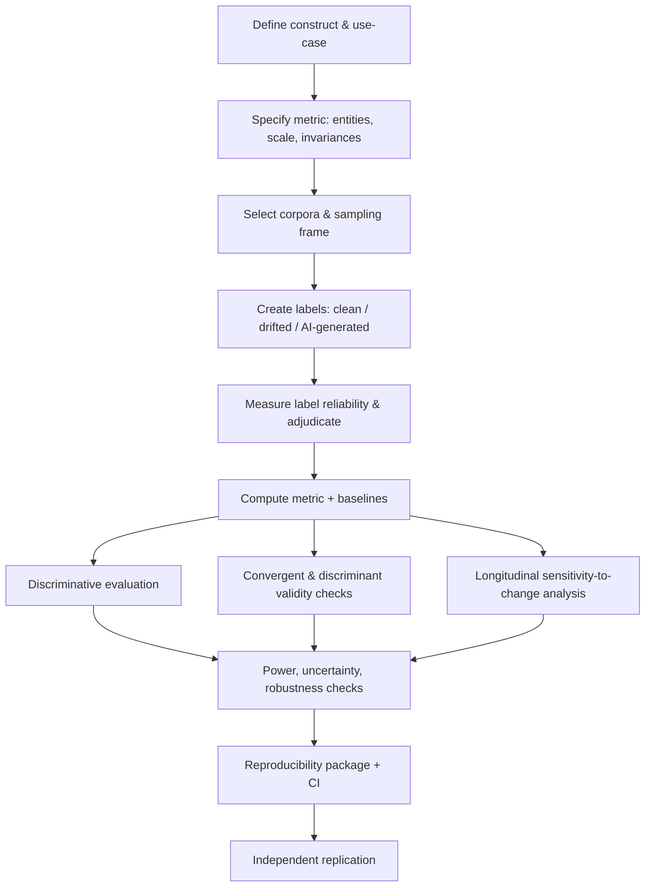

This workflow follows the spirit of measurement-process standards (define information needs, select measures, apply measures, evaluate validity) and empirical SE expectations for explicit validity analysis. citeturn0search0turn1search24turn14search0

### Candidate benchmark datasets and how to construct labeled datasets

The best practice is to combine **public corpora** (for reach and replicability) with **constructed labeled benchmarks** (for defensible class labels and controlled comparisons). Large archival sources help with scale but require strong controls on licensing, sampling bias, and leakage. citeturn3search6turn3search7turn9search1

**Comparative table of benchmark sources (with primary/official URLs)**  
URLs are shown in inline code per your request.

| Benchmark / source | What it provides | Why it’s useful for your validation | Primary/official URL |
|---|---|---|---|
| Qualitas Corpus | Curated corpus of software systems for empirical studies | Architecture and code metrics on real systems; lower selection bias than ad-hoc GitHub scraping | `https://qualitascorpus.com/` citeturn3search0 |
| PROMISE SE Repository / tera-PROMISE | Public SE datasets (defects, effort, etc.) | Auxiliary criterion-validity anchors (defects/maintenance proxies) | `https://promise.site.uottawa.ca/SERepository/` and `https://openscience.us/repo/` citeturn3search1turn3search9 |
| Software Heritage datasets | Large-scale archival graph + APIs | Controlled sampling across ecosystems; reproducible snapshots | `https://docs.softwareheritage.org/devel/swh-export/index.html` citeturn3search6 |
| BigCode “The Stack” | Large permissively-licensed code dataset | Scale for controlling confounders by language/domain; AI-era baseline | `https://www.bigcode-project.org/docs/about/the-stack/` citeturn3search7 |
| Project CodeNet | Large dataset of code solutions with metadata | Useful for creating controlled “task-matched” human/AI comparisons | `https://github.com/IBM/Project_CodeNet` citeturn11search2 |
| HumanEval | Small set of coding problems + tests | Functional correctness anchor for generated code; controlled tasks | `https://github.com/openai/human-eval` citeturn4search2 |
| Human vs AI code provenance dataset | 10,000 labeled human vs AI code samples (multi-language) | Baseline for AI provenance detection and stylometry; label availability | `https://data.mendeley.com/datasets/kjh95n54f8/1` citeturn10view1turn11search23 |
| Architectural smells tool | Static smell detection producing smell instances | Drift proxy; produce labels/scores across versions | `https://github.com/mining-software-repositories/arcan` citeturn2search2 |
| Architectural smells longitudinal dataset | Smells + co-change pipeline dataset on Zenodo | Public drift proxy labels at scale; version-based analyses | `https://zenodo.org/records/13827946` citeturn11search0turn11search4 |
| “Code smells” dataset (multi-project) | Smells mined from many projects | Alternative smell-based proxies; supports robustness checks | `https://zenodo.org/records/3596299` citeturn11search24 |
| DeathStarBench | Microservices benchmark suite | Architectural boundaries explicit; good for modular vs drifted in microservices | `https://github.com/delimitrou/DeathStarBench` citeturn12search0 |
| Train Ticket microservices benchmark | Benchmark microservice system | Large service graph; supports controlled drift injection and smell studies | `https://github.com/FudanSELab/train-ticket` citeturn12search2 |

### Constructing a labeled dataset for clean vs drifted vs AI-generated low-quality

A scientifically defensible labeled dataset should be built as follows:

**Labeling framework (recommended):**
1. **Define labels operationally** with explicit decision rules, examples, and exclusion criteria (a labeling manual). Construct-validity work emphasizes that inadequate concept definition is a major threat. citeturn9search2  
2. **Sampling plan**: stratify by language, domain, and project size; predefine inclusion criteria (e.g., buildable, minimum number of modules/services, minimum history). Use curated corpora where possible to avoid selection bias. citeturn3search0turn3search6turn1search8  
3. **Label sources** (triangulate rather than relying on one):
   - *Human expert labels* (architects) for “clean modular” vs “drifted” with a structured rubric.
   - *Tool-assisted drift proxies* (architecture smells) providing candidate drifted episodes; then manually validate a sample to estimate false positives.
   - *Provenance labels* for AI-generated code: generate code with controlled logging + watermarking of generation pipeline, or use an existing provenance dataset (human vs AI). citeturn2search2turn11search0turn10view1turn11search23  

**Constructing the three classes:**

**Clean modular (positive “good architecture” class):**
- Select stable releases (e.g., tagged releases) with low architecture-smell density and stable dependency structure across at least *N* prior versions (N unspecified—choose by your risk tolerance).
- Require explicit modular boundaries (packages/modules/services), either inherent (microservices repo) or derived (clustering + expert confirmation).
- Optionally “gold-label” a smaller subset via expert panel review to serve as a high-precision benchmark. citeturn2search17turn2search25turn12search0  

**Drifted/eroded (architecture decay class):**
- Use version histories to identify rising smell counts, emerging dependency cycles, or boundary violations; architectural smells datasets released for research can seed candidate selections.
- Create a stratified “severity ladder” (mild drift, moderate drift, severe erosion) so you can test monotonicity and threshold behavior.
- Include both naturally occurring drift (observed history) and injected drift (controlled transformations) to separate realism from internal validity. citeturn2search3turn11search0turn2search34turn2search17  

**AI-generated low-quality (provenance + quality deficit):**
- Provenance: create patches through controlled generation pipelines (logging prompts, model, temperature, seed, post-edit status) or use public provenance datasets.
- “Low-quality” definition: explicitly choose whether it means (a) **structural weaknesses** (security/maintainability/performance/reliability weaknesses) as in standardized automated source code measures, or (b) expert-rated maintainability, or (c) both.
- Ensure your benchmark includes *hybrid* cases (AI-generated but human-edited), because pure AI vs pure human classification can overstate real-world performance. The public AI-vs-human dataset explicitly lists limitations around using a single model source, which motivates multi-model generation for robustness. citeturn8search34turn10view1turn4search25turn4search3  

**Leakage controls (absolutely required):**
- **Repository-level splits**: never allow different versions or forks of the same project to appear in both train and test when evaluating discriminative models.
- **Task-level grouping** for snippet datasets: if multiple solutions correspond to the same problem, group-split by problem ID; public datasets already include grouping fields for leakage control. citeturn10view1  

## Statistical analysis, power analysis, reliability, and discriminative evaluation

Software engineering experiments frequently suffer from low statistical power and incomplete reporting; systematic reviews have emphasized the need to design studies with adequate power and to report effect sizes and uncertainty. citeturn13search6turn9search2turn1search24

### Reliability measures (labels and metric stability)

Reliability is crucial because your discriminative evaluation cannot exceed the label reliability ceiling.

**Inter-rater reliability (for human labels of drift/clean/low-quality):**
- Use chance-corrected agreement for categorical labels (kappa family) and multi-rater measures (e.g., alpha family).
- Use practices from reliability literature and make your agreement model explicit (number of raters, categories, prevalence, training). citeturn6search17turn6search26turn6search37  

**Test–retest reliability (for the metric itself):**
- Rerun metric computation across time/toolchain versions and measure stability via intraclass correlation approaches when the metric is continuous and repeated on the same targets. citeturn7search1turn7search6  

**Internal consistency (only if the metric is a composite index):**
- If your metric is an index built from multiple sub-measures intended to reflect a single latent construct, report coefficient alpha *with caveats* (alpha can be misused; report assumptions and consider alternatives). citeturn7search16turn7search20  

### Discriminative power and evaluation metrics

For your three-way objective (clean vs drifted vs AI-low-quality), treat discriminative evaluation as a **multi-class classification** problem and report class-conditional performance, not just a single scalar.

**Core discriminative metrics:**
- ROC curves and AUC are standard for binary discrimination; interpret AUC carefully and always report uncertainty (confidence intervals). citeturn6search11turn6search28  
- Precision/recall and PR-AUC are important under class imbalance (likely in real deployments); report macro and micro averages (methodological best practice).
- Confusion matrices + per-class precision/recall/F1 are necessary to reveal whether the metric confuses drift with AI-low-quality (a key risk for your use case).

**Effect sizes (recommended in addition to p-values):**
- For continuous metric differences between groups, report standardized and robust effect sizes (e.g., standardized mean differences or rank-based effect sizes) plus confidence intervals, because statistical significance is not practical significance.

**Calibration and thresholds:**
- If you will use the metric operationally (quality gate), evaluate calibration: does a “risk score” meaningfully map to observed drift/low-quality probability? Calibration assessment is crucial when turning discrimination into decisions. (This is a methodological requirement even when not treated as a formal “test.”)

### Comparative table of statistical tests and power approaches

URLs are primary/official sources as requested.

| Purpose | Recommended technique | When to use | Key assumptions / cautions | Primary URL |
|---|---|---|---|---|
| Compare ROC AUCs on the same items | entity["people","DeLong","auc test author 1988"] nonparametric correlated-AUC test | When you evaluate two scoring methods on the same labeled set | Can be misapplied for nested models; consider alternatives/bootstraps as needed | `https://pubmed.ncbi.nlm.nih.gov/3203132/` citeturn6search28turn6search8 |
| Interpret AUC & estimate variance | entity["people","Hanley","roc author"]–entity["people","McNeil","roc author"] ROC AUC interpretation/variance work | When AUC is central; helps interpret what AUC means and supports variance estimates | Ensure paired vs unpaired setting is handled correctly | `https://pubmed.ncbi.nlm.nih.gov/7063747/` citeturn6search11turn6search15 |
| Paired classifier comparison | entity["people","McNemar","statistician 1947"] test for matched pairs | When comparing two binary decisions on the same items (e.g., thresholded metric vs baseline) | Small discordant counts reduce power; mid-p variants exist | `https://pmc.ncbi.nlm.nih.gov/articles/PMC3716987/` citeturn7search23 |
| Inter-rater reliability (2 raters, categorical) | entity["people","Cohen","psychologist 1960"] kappa | Agreement for categorical labels with two raters | Sensitive to prevalence and marginal distributions; report operating conditions | `https://journals.sagepub.com/doi/10.1177/001316446002000104` citeturn6search17turn6search1 |
| Inter-rater reliability (multi-rater, multiple data types) | entity["people","Krippendorff","content analysis author"] alpha | Multiple raters; nominal/ordinal/interval; missingness | Choose appropriate distance function; report coder training & adjudication | `https://repository.upenn.edu/entities/publication/034a6030-c584-4d14-9d3d-7b7e8d16df20` citeturn6search26 |
| Test–retest / rater reliability (continuous) | ICC forms by entity["people","Shrout","icc author"] & entity["people","Fleiss","icc author"] | Continuous scores with repeated rating/runs | Must select correct ICC model and report it | `https://pubmed.ncbi.nlm.nih.gov/18839484/` citeturn7search1 |
| Internal consistency of composite index | coefficient alpha by entity["people","Cronbach","psychometrician 1951"] | Composite metric intended to measure one latent property | Alpha can be overused/misinterpreted; consider reporting additional diagnostics | `https://cda.psych.uiuc.edu/psychometrika_highly_cited_articles/cronbach_1951.pdf` citeturn7search16turn7search20 |
| Sample size & power for AUC comparisons | AUC power methods (e.g., Hanley–McNeil / Obuchowski–McClish comparisons) | Pre-study planning for discriminative evaluation | Power depends on ΔAUC, correlation structure, prevalence | `https://pmc.ncbi.nlm.nih.gov/articles/PMC12924612/` citeturn6search3turn6search11 |

### Power analysis methods (practical recommendations)

Because your validation involves multiple evidence types, you need multiple power strategies:

**For known-groups differences (metric values differ across clean/drift/AI):**
- Decide a *minimum practically important effect* (e.g., effect size threshold that matters operationally), not just “any difference.”
- Use pilot estimates to plan sample sizes and report both effect sizes and confidence intervals; systematic reviews in SE have criticized underpowered studies and insufficient reporting. citeturn13search6turn9search2  

**For ROC/AUC discrimination:**
- Plan sample size based on target ΔAUC (or PR-AUC) and expected correlation (paired comparisons) and prevalence; recent methodological work provides comparative evaluation of AUC power methods and shows large sample needs for small ΔAUC. citeturn6search3  

**For longitudinal sensitivity-to-change:**
- Use mixed-effects models or time-series change point analyses; power depends on number of projects, number of versions per project, and expected slope changes. (Report the model and assumptions explicitly; treat versions as repeated measures.)

## Interpretability and actionable thresholds

Interpretability is not an afterthought; it is a validation dimension because stakeholders need to understand *why* the metric changes and *what actions* it implies. Measurement standards explicitly emphasize defining how measures and analysis results will be applied—meaning interpretability and operational decision logic must be specified and validated. citeturn0search0turn0search4turn0search3

### Making the metric interpretable

**Decompose the metric into “explanatory factors”:** If the metric is computed from dependency graphs, expose which edges/nodes contribute most (e.g., cycles, hubs, cross-layer dependencies). If it is computed from history, expose which files or modules drive coupling propagation. This mirrors the practice of architectural smell tooling, which ties metrics to concrete architectural anti-patterns. citeturn2search2turn2search25turn2search17

**Provide construct-to-observation mapping:** For each construct component (e.g., “decouplability,” “boundary stability,” “architecture rule compliance”), provide:
- a formal definition,
- an expected direction of metric change,
- at least one “positive” and one “negative” example from real codebases,
- and counterexamples where the metric should *not* change (robustness).  
This directly mitigates construct-validity threats from inadequate definitions and poor operationalization. citeturn9search2turn1search14

**Differentiate architecture drift from AI-generated style artifacts:** A common failure mode is a metric that accidentally detects “AI style” (naming, formatting, boilerplate repetition) rather than architecture. To prevent this:
- include invariance tests to formatting/renaming,
- include AI-generated *high-quality* samples and human *low-quality* samples to avoid conflating provenance with quality,
- and run discriminant-validity checks against surface-level features (LOC, token entropy, comment ratios). Peer-reviewed AI code studies emphasize that generated code quality varies and security issues can be present, motivating careful definitions of “low-quality.” citeturn4search25turn4search3turn4search11

### Defining actionable thresholds (quality gates)

Thresholds are your biggest “arbitrariness” risk. Recommended threshold strategies:

**Data-driven thresholds (preferred when you have labels):**
- Choose thresholds based on ROC operating points (cost-sensitive): e.g., maximize Youden’s J, optimize F1 for “drift detection,” or pick thresholds that cap false positives at an acceptable rate.
- Always report confidence intervals for thresholded performance and assess stability across projects/languages (threshold transferability).

**Standards-anchored thresholds (useful for “low-quality” structural weaknesses):**
- If you use ISO/IEC 5055-style weakness counts or similar standardized measures as anchors for “structural quality,” thresholds can align with standardized weakness categories or severity groupings rather than arbitrary numeric cutoffs. citeturn8search34turn8search14  

**Expert-driven thresholds (for still-immature datasets):**
- Use structured elicitation with experts and iterate thresholds as you collect outcome data; empirical work proposes processes for defining thresholds when data is limited, emphasizing cyclic refinement rather than one-shot arbitrary numbers. citeturn9search29  

**Interpret threshold decisions as hypotheses:** Treat each threshold as a testable claim (“Systems below T have materially higher drift risk”) and revalidate periodically as ecosystems change (new languages, frameworks, AI tools).

## Reproducibility, confounders, threats to validity, and reporting templates

### Reproducibility procedures

To ensure your metric’s credibility beyond your organization, design for external reproduction:

**Artifacts and packaging:**
- Follow artifact review/badging expectations used across computing venues: provide runnable code, fixed dataset references, and an artifact appendix explaining installation and execution. citeturn14search0turn14search8  
- Use stable archival hosting for datasets and releases (e.g., DOI-based repositories). Public architectural-smell datasets demonstrate the pattern of releasing on repositories like entity["organization","Zenodo","open research repository"] with versioned records. citeturn11search0turn11search7  

**Versioning and CI (continuous verification):**
- Pin toolchain versions (parser, dependency extractor, language server).
- Add CI tests that recompute metric values on a small “canary corpus” and fail if outputs drift unexpectedly.
- Publish container images to make runs deterministic.

**Data governance and reuse principles:**
- Apply FAIR-style practices (findable, accessible, interoperable, reusable) to datasets and workflows; these principles explicitly apply to algorithms and workflows as well as data. citeturn14search1turn14search28  

**Community empirical standards:**
- The entity["organization","Association for Computing Machinery","professional society"] SIGSOFT Empirical Standards provide method-specific checklists for empirical studies and can be used to structure reporting and artifact completeness. citeturn1search24turn14search15  

### Confounders and threats to validity with mitigation strategies

Use the classic adequacy frame: **construct validity**, **internal validity**, **external validity**, **conclusion validity**, plus measurement-instrumentation risks. Empirical SE literature emphasizes addressing these in planning, not retrofitting. citeturn1search23turn1search31turn9search2turn9search0

**Major confounders for architecture metrics (and mitigations):**

**Size and growth (LOC, number of modules):** Large systems can look “worse” on raw coupling counts even if architecture is healthy.  
Mitigate with normalization strategies, matched sampling, and regression controls; report whether discrimination holds under size-matched subsets.

**Language and framework effects:** Dependency extraction quality and idioms differ; metric may be language-biased.  
Mitigate via stratified evaluation by language and explicit instrumentation validation per language (measurement validation frameworks call out unit definition and instrumentation models). citeturn9search0turn3search6  

**Repository/process maturity:** Projects with rigorous reviews may have less drift independent of architecture.  
Mitigate by sampling across governance levels and including process covariates (PR review intensity, release cadence).

**AI provenance mixture:** Real code often involves hybrid AI/human contributions.  
Mitigate by including hybrid-labeled data and testing whether the metric’s interpretation is stable across provenance categories; public AI provenance datasets note limitations when only one model source is used, motivating multi-source robustness. citeturn10view1turn4search25  

**Tool false positives (smell detectors, parsers):** Smell tools are imperfect.  
Mitigate with manual validation subsets, multi-tool triangulation, and reporting of instrument reliability.

**Dataset leakage:** Versions or near-duplicates across splits inflate performance.  
Mitigate with repository-level splits and deduplication; large corpora like “The Stack” explicitly discuss near-deduplication and terms of use, highlighting the need for careful dataset management. citeturn3search7turn3search15  

### Reporting checklist and templates

Below is a concise checklist designed to be compatible with empirical standards and artifact-review expectations.

**Reporting checklist (recommended minimum):**
- Metric specification: formal definition; unit of analysis; scale type; invariances; computational pipeline. citeturn0search3turn0search0  
- Construct model: explicit definitions of modularity, drift/erosion, and AI-generated low-quality used in the study. citeturn9search2turn2search3  
- Benchmarks: dataset sources, licenses, sampling methodology, inclusion/exclusion criteria, leakage controls. citeturn3search6turn1search8turn14search1  
- Labeling: labeling manual; rater training; adjudication; inter-rater reliability metrics and uncertainty. citeturn6search26turn6search17  
- Baselines: at least one established modularity metric and one smell-based indicator (if relevant), plus trivial baselines (e.g., LOC) to demonstrate discriminant validity. citeturn2search7turn2search2turn1search14  
- Discrimination results: per-class precision/recall/F1; ROC/AUC and PR-AUC; calibration if thresholds are used; confidence intervals. citeturn6search11turn6search28  
- Statistical testing: effect sizes; multiple-comparison handling; power analysis or at least power discussion. citeturn13search6turn6search3  
- Robustness: sensitivity analysis to confounders (size, language), drift injection controls, and toolchain versions. citeturn9search0turn3search6  
- Threats to validity: structured discussion (construct/internal/external/conclusion) with mitigations. citeturn1search23turn1search31turn9search2  
- Artifacts: replication package (data + code + environment); CI “canary” tests; archival DOI if possible; instructions sufficient for independent reproduction. citeturn14search0turn14search34  

**Result template (drop-in outline)**

```text
Title: Validation of <MetricName> for Detecting Modularity, Architecture Drift, and AI-Generated Low-Quality Code

1. Metric specification
   - Formal definition and unit of analysis
   - Required inputs (static deps / history / AST / build)
   - Scale type and invariances
   - Computational complexity and toolchain

2. Construct model & hypotheses
   - Definitions: modularity, drift/erosion, AI-generated low-quality (study definitions)
   - Hypotheses:
     H1 (Known-groups): Clean modular > Drifted (direction specified)
     H2 (Known-groups): Clean modular > AI-low-quality (direction specified)
     H3 (Monotonicity): Drift severity increases -> metric worsens monotonically
     H4 (Discriminant): Metric is not primarily explained by LOC/language

3. Datasets and labeling
   - Public sources + constructed benchmarks
   - Sampling criteria, stratification, leakage controls
   - Labeling protocol, inter-rater reliability, adjudication

4. Baselines and anchors
   - Modularity anchors (e.g., DL / coupling proxies)
   - Smell detectors (if used)
   - Trivial baselines (LOC, file count)

5. Statistical analysis plan
   - Primary discrimination metrics + confidence intervals
   - Tests for AUC or paired comparisons
   - Effect sizes
   - Power analysis assumptions

6. Results
   - Discriminative performance (multi-class + per-class)
   - Construct validity evidence (convergent/discriminant)
   - Sensitivity-to-change (longitudinal)
   - Robustness checks

7. Threats to validity and mitigations

8. Reproducibility package
   - Artifact appendix
   - Versioned data splits, scripts, container, CI checks
```

### Mermaid timeline for validation stages

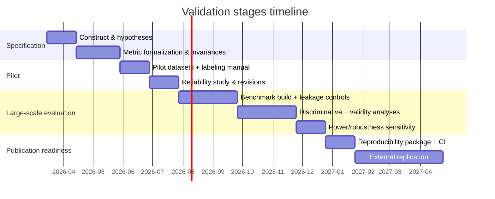

This staged approach matches the idea that measurement must be prepared, performed, evaluated, and improved, and it aligns with artifact-centered reproducibility expectations in software engineering venues. citeturn0search0turn14search0turn14search34turn1search24

12.
# Benchmarking and Comparative Evaluation for a Static Architecture-Governance Tool

## Executive summary

A “static architecture-governance tool” sits in an awkward evaluation space: it is judged like a static analyzer (precision, noise, reproducibility), but its value proposition is architectural (conformance, drift avoidance, modularity, and developer trust). Because the *target languages, rule inventory, severity model, and intended deployment context* are **unspecified**, the most defensible evaluation strategy is a **multi-track** program that combines (a) high-ground-truth benchmarks for measuring false positives and sensitivity, (b) real-world, high-prestige repositories for credibility and practical insight, and (c) language-portability stress tests for front-end correctness and cross-language rule semantics. citeturn16search4turn19search13turn5view0turn20search0

The overarching goal should **not** be to “win a leaderboard,” but to produce results that are (1) statistically justified, (2) reproducible, (3) non-dogmatic, and (4) publishable without reputational risk. This aligns with long-running evaluation guidance from the **Static Analysis Tool Exposition** tradition—explicitly aimed at methodology rather than ranking—and with documented pitfalls (“benchmarking crimes”) such as selective benchmarking and unfair baselines. citeturn16search4turn10search1turn10search12

A concise, defensible evaluation architecture:

- **Ground-truth track (noise/coverage)**: Use **NIST Juliet** and **NIST SARD** (precise bug locations; many weakness categories; multi-language) plus **OWASP Benchmark** (scoring tools; realistic web-app context) to measure false positives, recall proxies, and category-by-category precision. citeturn19search4turn19search13turn16search0turn19search0  
- **Real-repository track (credibility/usefulness)**: Run on a *pre-registered*, representative set of respected projects (e.g., Linux kernel, Kubernetes, LLVM, PostgreSQL, Spring Framework, Django, VS Code). Publish results as **case studies + aggregates**, not as “X project is bad.” citeturn13search0turn13search1turn13search3turn14search4turn14search0turn14search2turn14search3  
- **Rule-taxonomy track (trust)**: Measure **precision per rule category** with stratified sampling and confidence intervals; highlight which categories are reliable vs brittle. This avoids embarrassing overgeneralizations and helps stakeholders decide what to gate in CI. citeturn16search4turn10search1  
- **Portability track (front-end correctness)**: Compare parsing/AST/semantic-resolution across languages using multilingual corpora and standardized front-end tools (e.g., Tree-sitter, srcML, CodeQL database tooling) and quantify “same rule semantics, different language” drift. citeturn20search0turn2search33turn17search6  
- **Ethics/disclosure track (reputational safety)**: Predefine processes for handling sensitive findings, following coordinated disclosure norms (e.g., CERT CVD guidance; ISO/IEC 29147; GitHub private advisories). citeturn12search4turn12search1turn12search6  

Prioritized primary/official sources used throughout (high-level): **Defects4J** and **ManySStuBs4J** (bug/fix corpora), **NIST Juliet** and **NIST SARD** (ground truth), **NIST SATE V** (evaluation methodology), **OWASP Benchmark** (scoring + test suites), **CodeQL** docs/databases (industrial baseline + scalable corpora), foundational statistics (Clopper–Pearson; Brown–Cai–DasGupta; Benjamini–Hochberg), and annotation reliability standards (Cohen; Krippendorff). citeturn5view0turn4view0turn19search4turn19search13turn16search4turn17search6turn7search5turn7search16turn18search0turn1search9turn1search17

## Benchmark datasets and corpora suited for architecture-governance evaluation

A static architecture-governance tool needs datasets that support **two different questions**:

- **Correctness / trustworthiness**: “When the tool flags something, how often is it truly a violation?” and (harder) “What does it miss?”  
- **Usefulness**: “Do the results remain meaningful across real systems, over time, and across languages (without becoming dogmatic)?”

Because architecture conformance is rarely labeled at scale, you typically combine:  
(1) **benchmarks with explicit ground truth** (great for false positives and controlled recall proxies) and  
(2) **real repositories** (high external validity but require human labeling protocols). citeturn16search4turn19search13turn10search1

### Recommended benchmark datasets and corpora (with URLs and relevance)

The table below emphasizes **size**, **language coverage**, **label/ground-truth quality**, and suitability for **rule-category precision** (because your report must break precision down by rule category).

| Dataset / corpus | Primary purpose & label type | Language coverage | Size (as reported by primary source) | Labeling / ground truth quality | Suitability for rule-category precision |
|---|---|---|---|---|---|
| Defects4J | Reproducible real Java bugs; curated bug/fix pairs + triggering tests | Java | 854 active bugs (+ deprecated) across multiple projects (v3.0.1) | High: maintainers prune irrelevant changes; reproducibility constraints documented | Medium: categories not architectural; good for “real code + tests” evaluation |
| ManySStuBs4J | Large corpus of *single-statement* bug fixes; includes “SStuB” template categories | Java | “Large” variant: 86,771 bug commits; 51,537 SStuBs (templates) | Medium: mined with heuristics (SZZ + filtering), with reported sampling accuracy on commit classification | High for **category breakdown** (16 syntactic templates) |
| Bugs.jar | Real-world Java bugs & patches; reproducible bug branches | Java | 1,158 bugs from 8 large OSS Java projects | High-ish: designed for reproducibility; still subject to environment drift | Medium: not architecture-specific; useful “real projects” track with tests |
| BEARS | Extensible Java bug benchmark (CI-mined) | Java | 251 reproducible bugs from 72 projects (reported) | Medium: CI-based mining; reproducibility can degrade over time | Low–Medium for architecture categories |
| BugsInPy | Reproducible bugs + fixes + tests for Python | Python | 493 bugs from 17 programs (reported) | Medium–High: benchmark-style packaging; reproducibility requires careful environments | Low for architecture rules; good for Python toolchain realism |
| BugsJS | Manually validated JS bugs + tests + reports | JavaScript | 453 bugs from 10 Node.js server-side programs; ~444k LOC reported | High: “manually validated” bugs with artifacts | Low for architecture; good for JS ecosystem + project realism |
| QuixBugs | Parallel (Java/Python) program-repair corpus | Java, Python | 40 buggy programs in both languages | High for matching pairs; limited realism | Medium for portability experiments (same spec across languages) |
| NIST Juliet Test Suite | Synthetic test cases with known weaknesses by CWE | C/C++, Java (and others via variants) | Juliet 1.1: >81,000 C/C++ & Java programs; Juliet C/C++ 1.3 test suite organized under 118 CWEs | Very high for ground truth; public-domain | High for **category precision** (CWE families) |
| NIST SARD | Large corpus with precisely located bugs; includes test suites and full apps | C, C++, Java, PHP, C# | >170,000 programs; >150 weakness classes; includes >7,000 full apps | Very high for labeled bug locations; mixed synthetic + real apps | High for category precision and language coverage |
| OWASP Benchmark | Runnable test suites + scoring tools for vulnerability detection accuracy/coverage/speed | Multiple languages (notably Java; also others via subprojects) | Thousands of test cases (explicitly designed for scoring) | High for repeatable scoring; sophistication varies by category | High for category precision and “tool scoring hygiene” |
| Big-Vul (MSR’20 C/C++ CVE dataset) | Vulnerability-fix commits & derived vulnerable/non-vulnerable functions | C/C++ | CVE-linked entries 2002–2019 with commit/patch metadata | Medium: CVE linkage + mining; label noise risks | High for CWE/category analyses; not architecture governance per se |
| DiverseVul | Large-scale vulnerable/non-vulnerable functions labeled via vulnerability-fixing commits | C/C++ | 18,945 vulnerable + 330,492 non-vulnerable functions; 150 CWEs; 7,514 commits | Medium–High: curated and documented; still mining-derived | Very high for category precision and generalization tests |
| CodeQL databases + query packs | Industrial-strength security/code analysis baseline and scalable corpus | Multiple (per CodeQL language support) | GitHub-hosted CodeQL DBs for >200,000 OSS repos (stated) | High for reproducible extraction; findings quality depends on queries | High for large-scale comparative baselines |
| CodeSearchNet | Multilingual corpus of functions + annotations (for code search) | Go, Java, JS, PHP, Python, Ruby | ~6 million functions; 99 NL queries; ~4k expert relevance annotations | High for its task, not for architecture | Medium as portability stress test (parsing + metadata at scale) |
| Software Heritage | Massive archival corpus (for reproducible sampling) | Many (archive-wide) | As of Aug 2023: >16B unique source files; >250M sources (reported) | High provenance; but not labeled for violations | High for unbiased sampling / cherry-pick avoidance scaffolding |

Sources: Defects4J repository documentation and reproducibility notes. citeturn5view0 ManySStuBs4J Zenodo record and mining tool README (counts and templates). citeturn4view0turn4view1 Bugs.jar paper and repo. citeturn19search3turn19search7 BEARS paper. citeturn3search28 BugsInPy paper. citeturn3search16 BugsJS paper and dataset repo. citeturn3search14turn3search6 QuixBugs paper. citeturn3search15 NIST Juliet publication and SARD test-suite page. citeturn19search4turn19search0 NIST SARD article (precise bug locations, languages, sizes). citeturn19search13turn19search5 OWASP Benchmark project page and repo. citeturn16search0turn16search3 Big-Vul repo (MSR’20 dataset metadata). citeturn6view1 DiverseVul paper / PDF and ACM page. citeturn19search6turn19search18 CodeQL database scale and process. citeturn2search18turn17search6 CodeSearchNet corpus stats. citeturn9search5turn9search29 Software Heritage corpus size statement (UNESCO page) and mission. citeturn9search16turn9search24

### URL index for the recommended datasets and corpora

```text
Defects4J: https://github.com/rjust/defects4j
ManySStuBs4J (Zenodo): https://zenodo.org/records/3653444
ManySStuBs4J mining tool: https://github.com/mast-group/mineSStuBs
Bugs.jar (paper PDF): https://mir.cs.illinois.edu/winglam/publications/2018/bugs-dot-jar.pdf
Bugs.jar (repo): https://github.com/bugs-dot-jar/bugs-dot-jar
BEARS: https://arxiv.org/pdf/1901.06024
BugsInPy: https://arxiv.org/pdf/2401.15481
BugsJS: https://www.ece.ubc.ca/~astocco/pubs/2019-Gyimesi-ICST19.pdf
BugsJS dataset repo: https://github.com/BugsJS/bug-dataset
QuixBugs: https://jkoppel.github.io/QuixBugs/quixbugs.pdf
NIST Juliet 1.1 publication: https://www.nist.gov/publications/juliet-11-cc-and-java-test-suite
NIST Juliet C/C++ 1.3 suite page: https://samate.nist.gov/SARD/test-suites/112
NIST SARD (article): https://pmc.ncbi.nlm.nih.gov/articles/PMC7339570/
OWASP Benchmark (project): https://owasp.org/www-project-benchmark/
OWASP Benchmark Java repo: https://github.com/OWASP-Benchmark/BenchmarkJava
Big-Vul (MSR’20 dataset repo): https://github.com/ZeoVan/MSR_20_Code_vulnerability_CSV_Dataset
DiverseVul (paper PDF): https://surrealyz.github.io/files/pubs/raid23-diversevul.pdf
CodeQL (docs): https://docs.github.com/code-security/code-scanning/introduction-to-code-scanning/about-code-scanning-with-codeql
CodeSearchNet (paper): https://arxiv.org/pdf/1909.09436
CodeSearchNet (repo): https://github.com/github/CodeSearchNet
Software Heritage (UNESCO corpus size): https://www.unesco.org/en/open-science/inclusive-science/archiving-open-software-human-heritage
Software Heritage (mission): https://www.softwareheritage.org/mission/
```

## False-positive measurement and ground truth protocols

### What “false positive” means for architecture-governance tools

A false positive is not always “the tool is wrong.” In architecture governance, the right question is often:

- **Is the finding a real *policy* violation under the stated rule definition?**
- **Is the finding *actionable* (the warning is understandable, fixable, and aligned with team intent)?**
- **Is the finding stable across minor refactors / build changes?**

This distinction matters because static analysis adoption is often undermined not just by incorrect findings, but by findings that are technically correct yet non-actionable—leading to suppressions and loss of trust. citeturn10search29turn10search22turn16search4

### Ground truth creation playbook: three tiers

**Tier A: Existing ground truth (best for defensible FP/recall)**  
Use corpora where weaknesses/bugs are explicitly embedded and located, e.g., **NIST Juliet** (CWE-organized test cases, public domain), **NIST SARD** (precisely located bugs across C/C++/Java/PHP/C#), and **OWASP Benchmark** (scoring tools and runnable suites). These enable direct counting of true positives, false positives, and (for certain rule types) recall. citeturn19search0turn19search13turn16search0turn16search3

**Tier B: Derived ground truth via “oracle tests” inside real repos (best for architecture rules)**  
Where available, treat a project’s *existing conformance mechanisms* (e.g., layer tests via ArchUnit/Deptrac, build-enforced constraints such as Maven Enforcer rules) as partial ground truth:  
- If the repo already encodes architecture constraints as tests/config, compare your tool’s findings to those constraints.  
- Report coverage limits honestly: these oracles define only what the project bothers to specify. citeturn11search1turn11search3turn17search3turn17search7

**Tier C: Human-labeled truth set on real repositories (best for “usefulness”)**  
For rules that reflect intent (“controllers shouldn’t depend on infra,” “no cross-module imports”), you often must manually label a sample of findings. Several architecture conformance research evaluations explicitly create manual ground truth in multi-case studies, then compare detectors to that truth, illustrating that manual truth creation is accepted when clearly scoped and documented. citeturn10search6turn10search28turn10search9

### Labeling protocol (human triage) that survives scrutiny

Define and freeze these items **before** looking at results:

**Unit of annotation**  
Use a canonical key: `(repo, commit, language, rule_id, normalized_location, normalized_symbol)`; deduplicate repeats caused by formatting or multi-pass analyzers. This is essential to avoid inflating sample sizes and to keep confidence intervals meaningful. citeturn10search1turn10search12

**Annotation guidelines**  
Write a short rubric per rule category: “what constitutes a violation,” permissible exceptions, and how to treat generated code/vendor code/test fixtures. Pilot the rubric on ~50 findings and revise once (document the revision). citeturn1search17turn10search1

**Double annotation + adjudication**  
Have at least two annotators independently label an overlap set; keep an adjudication log of disagreements and rule clarifications. This mirrors how high-stakes benchmarking work mitigates evaluator error and is consistent with reliability-focused methodology. citeturn10search1turn1search17

**Inter-annotator agreement (IAA)**  
- For two raters on nominal labels (TP/FP), compute **Cohen’s kappa** as a baseline. citeturn1search9  
- Prefer **Krippendorff’s alpha** if you have >2 raters or missing labels; it is designed for broader coding settings. citeturn1search17turn18search7  
- Report **bootstrap confidence intervals** for IAA; bootstrapping procedures for alpha are available and explicitly recommended in methodological discussions of reliability. citeturn18search3turn18search7  
- Include a short note about the “kappa paradox” (prevalence effects) and consider reporting a complementary agreement statistic where appropriate. citeturn8search3turn8search15  

### Metrics: precision/recall/F1 with confidence intervals

**Core definitions** (treat warnings as “retrieved items” in an information-retrieval sense): precision = TP/(TP+FP), recall = TP/(TP+FN), F1 = harmonic mean of precision and recall. citeturn8search2turn8search30

**Critical nuance for architecture governance**  
- Precision is typically estimable from labeled samples of findings.  
- Recall requires knowledge of *all* real violations (FNs), often unavailable on real repos. Therefore, report recall primarily on benchmarks with complete ground truth (Juliet/SARD/OWASP Benchmark), and treat recall on real repositories as **bounded or proxy-based** unless you can define an oracle. citeturn19search13turn16search0turn16search4

**Confidence intervals (CIs)**  
Precision on a labeled sample is a binomial proportion. Report a 95% CI using either:  
- **Wilson score interval** (often recommended for good coverage behavior), discussed in depth in the binomial CI literature; or citeturn7search16turn7search4  
- **Clopper–Pearson “exact” interval** (conservative but defensible in small samples), originating from the classic binomial limits paper. citeturn7search5turn7search9  

If you aggregate across repositories or categories, use **bootstrap CIs** (resampling at the repo level or warning cluster level) to reflect clustering and heterogeneity. citeturn7search3turn7search11turn10search1

### Reporting format for auditability (and tool integration)

Adopt a standard machine-readable output such as **SARIF** (OASIS standard for static analysis results) so the evaluation pipeline is reproducible and results can be re-scored. This also makes it easier to provide artifacts without forcing others into your native format. citeturn2search31turn2search30turn17search10

## Rule-category precision analysis

### Defining rule categories without gaming the outcome

To evaluate “precision broken down by rule category” without cherry-picking, define a rule taxonomy that is:

- **Semantically meaningful**: categories correspond to distinct intents (e.g., layering vs dependency version governance).  
- **Mutually exclusive where possible**, with a documented tie-break rule (or allow multi-label warnings but define how they count).  
- **Stable across languages**, at least at the conceptual level (“no cyclic dependency among modules” exists in many ecosystems). citeturn10search1turn11search1turn11search3turn17search3

A practical taxonomy that maps to governance use cases and to available benchmarks:

1. **Dependency direction / layering / forbidden edges** (architecture conformance)  
2. **Cycle and structural smell rules** (e.g., cyclic dependencies, “instability” smells)  
3. **API boundary & package/module encapsulation** (who may import what)  
4. **Build & dependency governance** (version constraints, banned dependencies)  
5. **Security-adjacent governance rules** (dangerous patterns, sensitive flows)  
6. **Naming and structural conventions** (package naming, placement constraints)

This taxonomy naturally aligns with existing categories in benchmarks: Juliet/SARD/OWASP Benchmark (CWE families) for security-adjacent categories, and tooling like ArchUnit/Deptrac/Arcan for architecture categories. citeturn19search0turn19search13turn16search0turn11search1turn11search3turn11search0

### Sampling strategies that support per-category metrics

Per-category precision is easy to distort if some categories produce far more findings. Use **stratified sampling**:

- Draw a minimum sample per category (e.g., n=100 labeled findings/category if feasible; otherwise report wider CIs).  
- Allocate additional samples proportional to category volume, but cap dominance (to prevent “one noisy category” from defining overall conclusions).  
- Sample across multiple repositories and modules per category to avoid local idiosyncrasies. citeturn10search1turn7search3

If your tool emits confidence/severity, stratify within category by severity band so you can show whether “high confidence” warnings are actually higher precision (a direct trustworthiness measure). Calibration concepts and reliability diagrams are standard for assessing whether predicted confidences match observed accuracy. citeturn8search1turn8search0

### Per-category metrics to report (and how to aggregate)

For each category, report:

- **Precision** with 95% CI (Wilson or Clopper–Pearson). citeturn7search16turn7search5  
- **Yield**: findings/KLOC or findings/1k files (report as descriptive; do not treat as “badness”).  
- **Actionability proxy**: fraction labeled “fixable within policy scope,” or median time-to-triage (if measured). Actionability is central to adoption concerns in static analysis literature. citeturn10search29turn10search22  

For cross-category aggregation, report both:

- **Macro-average precision** (treat categories equally; good for policy decisions)  
- **Micro-average precision** (weights by number of findings; good for operational workload)

### Visualization types (recommended) + an example chart

Recommended charts for rule-category precision reporting:

- **Bar chart of precision by category with CI error bars** (primary)  
- **Heatmap** of category × language (precision, yield, or FPR)  
- **PR curves** where recall is definable (Juliet/SARD/OWASP Benchmark)  
- **Calibration / reliability diagram** if the tool outputs confidence scores  
- **UpSet plot** for overlap among tools/baselines (which warnings are unique vs shared)

Below is a mermaid example you can adapt for a simple “precision by category” visualization (replace values with measured results):

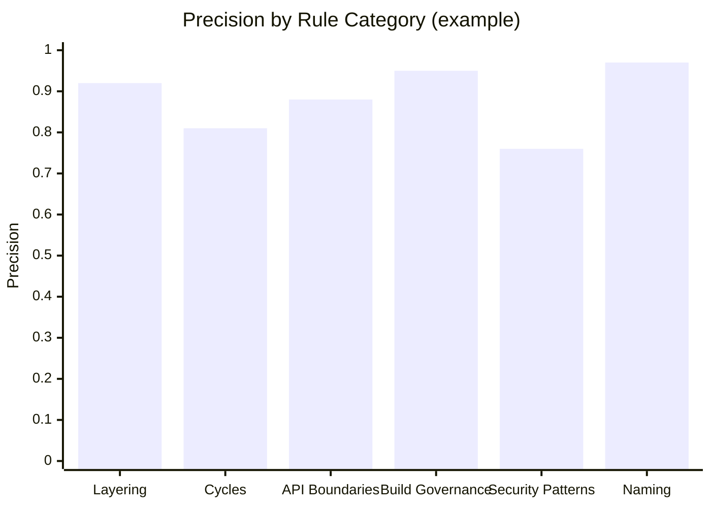

(When you publish, add CI error bars in your plotting tool; mermaid’s basic charts may not render CI bars consistently across renderers.)

## Language portability evaluation

### What to measure: portability is not just “does it run”

A credible portability evaluation has at least four measurable layers:

1. **Front-end correctness and robustness**: parser/AST stability, tolerance of incomplete code, generated code, and build variants.  
2. **Semantic alignment**: does the same conceptual rule mean the same thing in different languages/ecosystems?  
3. **Transfer performance**: if you reuse a rule spec across languages, how much does precision drop on the target language?  
4. **Tooling interoperability**: can you normalize results into a common schema (e.g., SARIF) and compare across languages? citeturn2search31turn20search0turn16search4

### Cross-language benchmarks and corpora to use (and what they’re good for)

- **NIST SARD**: explicitly multi-language (C/C++/Java/PHP/C#) with precisely located bugs and >150 weakness classes—excellent for multi-language true/false positive measurement for vulnerability-pattern rules and for validating per-language parsers. citeturn19search13turn19search5  
- **NIST Juliet**: multiple language tracks; CWE-organized; public domain—useful for “same weakness family across languages” experiments. citeturn19search4turn19search12  
- **QuixBugs**: parallel Java/Python versions of the same programs—useful for *transfer evaluation* because the tasks are aligned across languages, even if architecture realism is low. citeturn3search15  
- **CodeSearchNet**: very large multilingual function corpus (6 languages) with annotations for its own task; valuable specifically as a stress test for parsing + indexing + cross-language normalization. citeturn9search5turn9search29  
- **Project CodeNet**: extremely broad language coverage (14M samples, 55 languages) but not architecture-shaped; best used for parser fuzzing and token/AST normalization experiments, not for governance-rule usefulness. citeturn9search2turn9search6  
- **Software Heritage**: best for *unbiased sampling* across ecosystems and avoiding accusations of cherry-picking; it provides scale and reproducible identifiers, but not violation labels. citeturn9search16turn9search24  

### Tooling for parsing/AST differences: practical recommendations

- **Tree-sitter** provides an incremental parsing library producing concrete syntax trees and is designed for programming tools; it has broad adoption in developer tooling and supports language-grammar ecosystems via bindings. Use it when you need consistent syntactic structure across languages quickly. citeturn20search0turn20search1  
- **srcML** converts source code to an XML representation and has been used for multi-language source analysis (notably C/C++/Java/C#), useful when you want a uniform representation and lightweight structural extraction. citeturn2search33turn2search35  
- **CodeQL** provides database generation + query execution across supported languages, with an extremely mature ecosystem around reproducible extraction and analysis; it doubles as a baseline for security-style rules and as a scalable extraction substrate for large corpora. citeturn17search6turn2search26turn2search18  

### Transfer evaluation design (portable and honest)

A defensible portability study should predefine:

- A **language-agnostic rule spec** (even if only for a subset of rules: layering, cycles, forbidden imports).  
- The **mapping layer** per language (what constitutes “module,” “public API,” “dependency edge”).  
- A **holdout language** (e.g., design rules on Java and transfer to C# or Kotlin; or define in Go and transfer to Rust) and measure the drop in per-category precision.  

Report transfer results as “precision by category and language,” not as a single score. This is directly aligned with avoiding dogmatic conclusions and reflects evidence (in adjacent security ML work) that generalization to unseen projects/categories is hard and must be measured explicitly. citeturn19search6turn10search1

## Repository selection for credible real-world results

### Selection criteria for “respected repositories” that won’t embarrass you

To keep results insightful (not dogmatic or embarrassing), use **explicit inclusion criteria** and freeze them before running:

1. **Reputation and governance**: widely used, mature project with clear contribution processes.  
2. **Architectural richness**: multi-module structure, explicit layering conventions, or well-defined subsystem boundaries.  
3. **Build/test availability**: so you can align findings to “what breaks CI,” and avoid blaming projects for your environment.  
4. **License clarity**: ensure your evaluation artifacts can be published (at least metadata and anonymized findings).  
5. **Ecosystem diversity**: multiple languages and architectural styles to avoid overfitting to one community’s norms.  
6. **Pre-registered sampling**: choose the repo list and commit snapshots ahead of time; include “boring” and “hard” cases, not just the ones that make graphs pretty. citeturn10search1turn10search12turn9search16turn16search4  

### Recommended high-prestige repositories (with URLs and why relevant)

These 10 projects give strong coverage across C, C++, Go, Java, Python, and TypeScript/JavaScript—while being widely recognized and architecturally substantial.

| Repository | Primary language(s) | Why it’s relevant to architecture governance | URL |
|---|---|---|---|
| Linux kernel | C | Extreme-scale dependency structure; high modular boundaries; tests tool scalability and noise control | `https://github.com/torvalds/linux` |
| Kubernetes | Go | Large Go monorepo with strict contribution practices; tests package boundaries and layering conventions | `https://github.com/kubernetes/kubernetes` |
| LLVM | C++ | Modular toolchain monorepo; good for dependency cycles, layering, and subsystem boundaries | `https://github.com/llvm/llvm-project` |
| PostgreSQL | C | Mature system with clear subsystem code organization; tests architectural stability across decades | `https://github.com/postgres/postgres` |
| Apache Kafka | Java/Scala | Multi-module distributed system; good for JVM dependency governance and API boundary checks | `https://github.com/apache/kafka` |
| Spring Framework | Java | Highly modular “framework core”; excellent for package/module boundary rules and dependency conventions | `https://github.com/spring-projects/spring-framework` |
| Django | Python | Canonical large Python framework; good for Python import governance and architectural conventions | `https://github.com/django/django` |
| Visual Studio Code | TypeScript | Very large TS codebase with public roadmap/plans in-repo; tests monorepo conventions and TS tooling | `https://github.com/microsoft/vscode` |
| Node.js | C++, JavaScript | Mixed-language runtime; excellent for multi-language repo governance and boundary enforcement | `https://github.com/nodejs/node` |
| TensorFlow | C++, Python | Huge mixed-language project with complex build; stress-tests frontend parsing + policy suppression strategy | `https://github.com/tensorflow/tensorflow` |

Sources: official repository pages and/or official project pages describing scope and purpose. citeturn13search0turn13search1turn13search3turn14search4turn13search2turn14search0turn14search2turn14search3turn15search1turn15search2

### Ethical disclosure and how to publish without “naming and shaming”

If your tool might surface security-relevant issues, adopt an explicit triage and disclosure policy consistent with coordinated disclosure norms:

- Follow coordinated vulnerability disclosure guidance (process concepts and failure modes are documented by CERT). citeturn12search4  
- Reference or align to ISO/IEC 29147 for disclosure expectations (even if you do not reproduce the full standard text). citeturn12search1  
- Use private vulnerability reporting and repository security advisories when engaging maintainers on sensitive findings (GitHub documents private advisory workflows). citeturn12search6turn12search2  

For architecture-governance publications specifically:

- Prefer publishing **aggregate metrics**, anonymized exemplars, and reproducible scripts; avoid “Project X has Y violations” headlines.  
- Share “what the tool is good for” and “where it is noisy” by category and language; avoid blanket judgments.

### Community-accepted baselines to avoid dogmatism

You reduce embarrassment by comparing against **tools the community recognizes**, and by scoping claims to what is actually measured:

- Architecture conformance baselines:
  - ArchUnit (Java architecture test library) citeturn11search1turn11search13  
  - Deptrac (PHP architecture enforcement) citeturn11search3turn11search7  
  - jQAssistant (graph-based structural rules) citeturn11search38turn11search10  
  - Arcan (architectural smell detection tool) citeturn11search0turn11search8  
- Static analysis / security baselines (if your rules overlap security-style checks):
  - CodeQL code scanning workflow and query ecosystem citeturn17search6turn2search34  
  - Semgrep (fast, multi-language static analysis for bugs/standards) citeturn17search36turn17search0  
  - SonarQube (broad rule sets; quality gates; enterprise baseline) citeturn17search1turn17search33  
- Build/dependency governance baseline (particularly for JVM):
  - Maven Enforcer Plugin executes rules in multi-project builds citeturn17search3turn17search7  

## Comparative experimental designs, statistics, and visualizations

### Comparative evaluation methodologies and experimental designs

A credible experimental design should **separate calibration from evaluation** and avoid benchmark leakage—explicitly called out as a common benchmarking failure mode. citeturn10search1turn10search12

A practical design that scales:

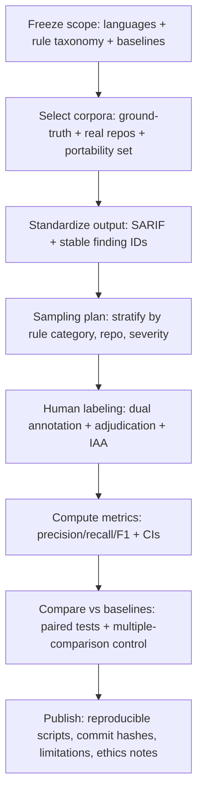

Standards and methodology anchors for this pipeline include SARIF for results interchange and NIST’s SATE emphasis on methodology-over-ranking. citeturn2search31turn16search4

A timeline structure (typical) that helps enforce discipline:

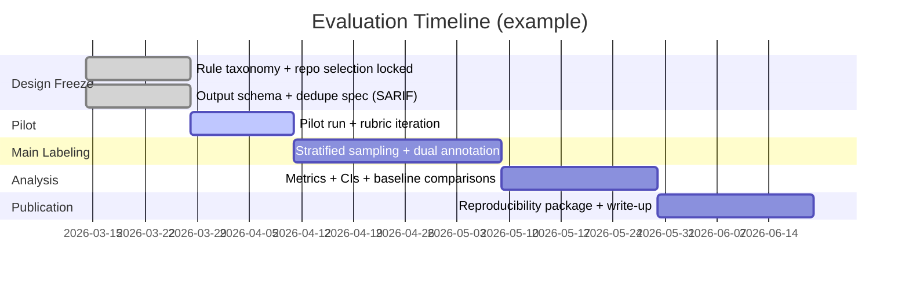

### Statistical tests to recommend (and when to use them)

**Single-tool performance estimation**
- Precision (and recall where definable): compute 95% **Wilson** or **Clopper–Pearson** CIs. citeturn7search16turn7search5  
- Use **bootstrap** CIs when clustering exists (warnings clustered by file/module/repo) or when you report macro-averages. citeturn7search3turn10search1  

**Comparing two tools on the same labeled items (paired design)**
- Use **McNemar-style paired tests** on the 2×2 table of disagreements (Tool A correct/incorrect vs Tool B correct/incorrect). This is more defensible than comparing two independent proportions when the same warnings are labeled for both tools. (Paired-testing guidance is widely documented; exact variants exist for small samples.) citeturn7search10turn7search2  

**Comparing more than two tools on the same labeled items**
- Use **Cochran’s Q test**, which is explicitly described as an extension of McNemar to >2 matched samples (useful if you compare your tool to multiple baselines). citeturn18search2turn18search10  

**Multiple comparisons across many rule categories**
If you test “Tool A beats Tool B” for many categories, control your false-positive rate:
- Prefer **Benjamini–Hochberg FDR control** when you expect many tests and want a balance of discovery and rigor. citeturn18search0  
- Consider **Holm-style family-wise control** if the number of categories is small and you want conservative claims. citeturn18search21turn18search17  

### Reproducibility protocols that prevent “benchmarks rotting” and embarrassing reruns

Reproducibility decay is real in defect datasets and benchmark infrastructures; studies have explicitly assessed and documented reproducibility challenges in such datasets over time. citeturn3search12turn19search11turn16search4

Concrete protocols:

- **Pin everything**: repository commit hashes, tool version, rule pack hash, language runtime versions, OS/container image digest.  
- **Containerize** the exact analysis environment, especially for multi-language and build-heavy repos.  
- **Record known environment constraints**: e.g., Defects4J documents specific Java versions and even timezone assumptions for reproducibility; mirror this level of explicitness in your evaluation artifacts. citeturn5view0  
- **Publish scoring scripts** and raw labeled samples (or hashed identifiers + adjudication logs if you cannot publish code snippets).  
- **Never publish only relative numbers**: provide absolute counts (n labeled per category, conflicts, exclusions). “Missing information” and “selective benchmarking” are explicitly identified as benchmarking flaws. citeturn10search1turn10search12  

### How to avoid cherry-picking and still tell a clear story

To avoid “insightful-but-not-dogmatic” failure modes:

- Pre-register your repository selection criteria and include the full list in the final report (even if some fail builds; report exclusions with reasons).  
- Separate results into: **(a) ground-truth benchmarks** (strong correctness claims), **(b) real repositories** (case-study conclusions), and **(c) portability stress tests** (frontend/tooling conclusions).  
- Use the language of scope: “on these repos / on these rule categories / under these versions.”  
- Explicitly enumerate what is *not evaluated* (e.g., if your tool does not model dynamic runtime wiring, say so).  

These practices align with both NIST’s methodology-first stance and the broader literature warning that selective benchmarking and missing baselines undermine validity. citeturn16search4turn10search1turn10search12
